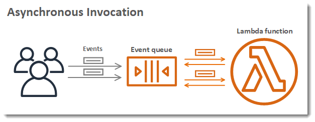
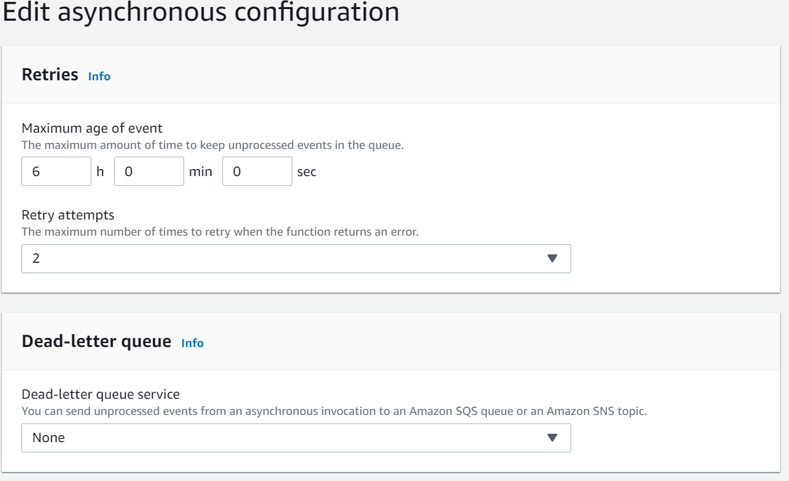
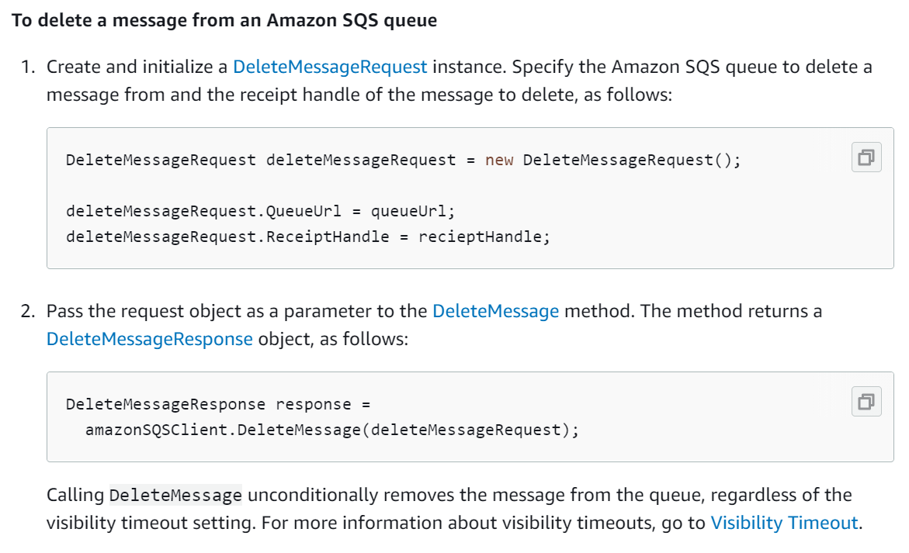
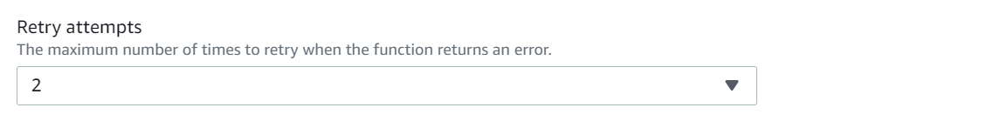
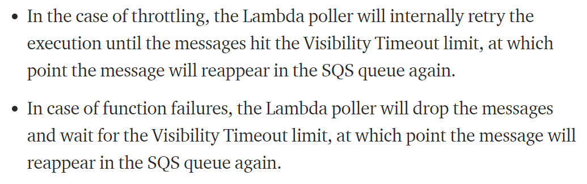
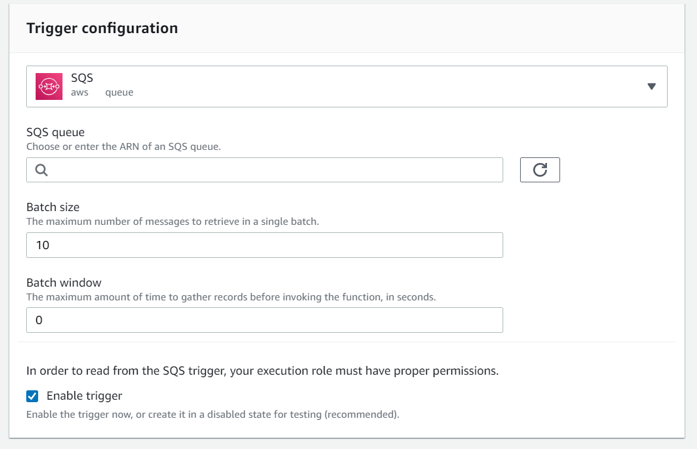

 11 Lessons I Learned from My Projects

 

 If you want to develop serverless event-driven applications using AWS, you probably heard two names: Lambda Functions and Simple Queue Service (SQS)!

 **AWS Lambda** is a serverless computing service. Using lambdas, you can define any type of application or backend logic. Lambda functions let you run your code without any need for provisioning or managing infrastructure.

 **AWS Simple Queue Service** (SQS) is a message queuing service. It lets you send, receive or store messages at scalable volumes. Think about microservices, distributed systems, or serverless applications! Each individual module in these architectures can communicate incoming/outgoing messages using SQS.

 Many developers are using (or considering) Lambda + SQS to build powerful event-driven solutions. The general idea is to put your backend logic in the lambda. Then you can define an SQS trigger event in the lambda to capture (and consume) the messages stored in the queue.

 This seems interesting at the beginning! Yet, there are lots of technical considerations when you start to implement such solutions.

 * How and with what frequency does SQS communicate with lambda?
 * Which parameters need to be configured in SQS and Lambda for stable performance?
 * What happens with processed and failed messages?

 I struggled a lot with these concerns (and more)! The documentations — even the official ones from Amazon — are seldom (and misleading sometimes)! On most occasions, you have to trial and error to understand how configurations work!

 In this article, I am going to share with you my most important findings.

## Lambda has an Internal Queue Implementation
 

    Lambda queues the events before sending them to the function. For asynchronous invocation, Lambda places the event in a queue and returns a success response without additional information. A separate process reads events from the queue and sends them to your function.
 
 

 

 You can even configure a dead letter queue for lambda, define retry policies, or setup the maximum age of events.

 

 This is interesting!

 After all, you may ask yourself why do I need to configure an external queue service such as SQS when lambda offers an embedded queue functionality?

 The truth is that lambda offers limited queue management functionality and configurations. You can configure a dead-letter queue, maximum 2 retries, and keep the event alive for maximum of 6 hours! That’s it!

 This may be enough for basic needs! However, for more complicated scenarios, you need a proper message broker and queuing system such as SQS!

 SQS offers lots of more advanced (and needed) features such as:

 - messages in batches
 - visibility timeout of messages
 - retries up to 1000
 - delayed delivery of messages
 - extended retention period of messages (up to 14 days)
 - short and long message polling

 and much more!

 It completely makes sense to use a combination of lambda + SQS for having a fully functional event-driven solution.

## Batch Messages Succeed Together and Fail Together (By Default)!
 By default, lambda processes the messages inside the batch, one by one.

 During this processing, two scenarios can happen:

 * Lambda processes ALL messages without any problem: in this case, lambda will automatically delete all the messages from the queue.
 * Lambda encounters an exception in one of the messages OR execution gives timeout: in this case, ALL the messages in the batch will be placed in the queue again and will be ready for consumption after their visibility timeout.

 This is the default behavior of lambdas and you have to be aware of it.

 For example imagine you have a lambda that inserts into a database some results, upon successful execution of a message.

 Now what could happen is that you process a message in this batch and insert the results into the database. Then another message fails and as a result, the WHOLE batch containing this message fails!

 This means that even the processed message will be placed back in the queue! With future calls, we may process the successful message again and we may insert duplicated data into the database! This loop continues until this message is getting processed in a fully processed batch! Be aware that this may never happen! The successful message can end up in the dead letter queue after it reaches its maximum retries!

 Another implication is about the cost of invocations. You will unnecessarily put processed messages in the queue and they will be unnecessarily picked up by lambda again. This increases the cost of invocations, both on SQS and Lambda sides.

## You Can Delete Messages Programmatically!
 You can avoid the problem mentioned in the last section by deleting messages from your code. Depending on the type of the programming language you use, there will be available methods facilitating this task for you. For example, this is a snippet of the code in C#/.NET for deleting messages manually.

 

 Using a code like the above one, once you are done with processing one message, you delete it from the queue! Then you proceed with the next message in the batch. Now, let's review the two scenarios from the last section:

 * **Lambda process all messages without any problem**: in this case, all the messages in the batch will be deleted from the queue. The message deletion occurs programmatically at the end of the processing of each individual message.
 * **Lambda encounters an exception in one of the messages OR execution gives timeout**: in this case, only the remained messages in the batch will be placed in SQS again! They will be ready for consumption (again) after their visibility timeout.

 Using this approach, you will not see a processed message over and over again! In other words, you ensure that you process each message (successfully) 1 and only 1 time! This also helps you to optimize the cost of invocations by avoiding unnecessary SQS and Lambda calls.

 
## Handled Exceptions Will NOT Throttle Lambda!
 There is a misconception here! Many believe that whatever error/exception we get in the lambda code will cause a throttle.

 WRONG!

 If you have a handled exception in your code (e.g: you are not throwing any exception in the catch part of your C# code), this will NOT cause a throttle!

 It simply means that you get an exception, you handle it and you move forward with other messages in the batch. Therefore, the lambda will not have any clue if a message failed or not. This may cause some unexpected results.

 For example, having a batch size of 5:

 Message 1: OK!

 Message2: Handled Exception, code continues!

 Message3: Handled Exception, code continues!

 Message4: OK!

 Message5: OK!

 In the above scenario, once the lambda finishes, all messages — included messages 2 and 3 with exceptions — will be deleted from the SQS! As a result, you will not be able to get and process failed messages again. You simply lose them!

 My recommendation is that once you encounter an exception in your code, you do whatever you need to do and then you terminate the code. For example, using my C# analogy, this is possible by putting “throw exception” in your “catch” section of the code.

## (Invisible) Throttled Messages will Have a Considerable Impact on Remaining SQS Retries!
 Once the lambda throttles, the number of SQS retries for the failing messages will be decreased by 1. More specifically, “_max receive count_” is the parameter defining the number of retries by the SQS. Therefore, this value is decreased for ALL the failing messages.

 What usually we do not take into consideration is what I call “Invisible Throttles”!

 Let's imagine we have a batch of size 10. Also, suppose we delete successfully processed messages programmatically. Now we process (and delete) messages 1, 2, and 3. Then, we encounter some exceptions in message 4. At this point, lambda throttles. This means that we will have a decrease in the “_max receive count_” of messages 4, 5, 6, 7, 8, 9, and 10 — and not just message 4!

## Lambda Retries and SQS Retries are Two Different Things!
 This is really a confusing one!

 Firstly, if you invoke lambda asynchronously and it fails, there is a possibility to retry its execution UP TO 2 times. This is configurable in the level of lambda itself.

 

 On the other hand, if you connect your lambda into SQS, the failed messages will be placed back into the queue and will be reprocessed again in the future. The related parameter for setting up this in the SQS is “max receive count”. Once you pass this threshold, the failed message will be placed in the dead-letter-queue (if you configured it).

 

 Now the question is that how these two types of retries are related? If a message fails, which retry will be triggered first? how we can ensure that they do not contradict each other?

 I could not find any official documentation addressing this issue. And my only clue was other developers findings like this:

 

 This indeed means that lambda will trigger some retries internally before we see SQS retries. However, here the assumption is that “maximum visibility timeout” is long enough so that the lambda can have some internal retries.

 To confirm this hypothesis, I did my own set of experiments.

 I used two set of configurations:

 **Configuration 1:**
 * Lambda Concurrency = 5
 * Lambda Retries = 2
 * Max Receive Count = 5
 * Lambda Timeout = 1 min
 * Maximum Visibility Timeout = 6 min

 What I observed was that if a message failed, it got 2 retries (with the interval of 2 minutes), then SQS retries happened.

 **Configuration 2:**
 * **Lambda Concurrency = 1**
 * Lambda Retries = 2
 * Max Receive Count = 5
 * Lambda Timeout = 1 min
 * Maximum Visibility Timeout = 6 min

 In the second configuration, as expected, there were no internal lambda retries! I confirmed this by monitoring the logs in the Cloudwatch. This is related to the fact that the lambda is not executed asynchronously now.

 Therefore, these experiments confirmed the initial assumptions about the lambda and SQS retries. However, if you do not want to see unexpected results, you have to be very careful about configuring your lambda timeout and maximum visibility timeout.

## You Will Not Get Batches of Similar Size All the Time!
 You configure your “_batch size_” to a fixed value (1, 5, 10, …) and you expect to ALWAYS receive batches of the messages with that size!

 It is not going to happen!

 Why?

 Simply put, lambda polls the messages from the queue! So, depending on your configuration and set of parameters, the pollers will extract batches with DIFFERENT sizes.

 Here are some parameters which somehow have effects on the polling process:

 * Delivery Delay (SQS)
 * Receive Message Wait Time (SQS)
 * Visibility Timeout (SQS)
 * Batch Window (Lambda)
 * Concurrency (Lambda)

 I am not going to explain and discuss in detail what each one of these parameters means. For that, please review the official documentation.

 My point here is that once you configure your “_batch size_”, do not expect to always receive batches of that size. You can play with different configurations like the above ones. But remember that at the end you should have some flexibility in your lambda logic to deal with batches of different sizes.

## You Have to be Super Careful with Batch Size 1 AND/OR low concurrency limits!
 I believe “_batch size_” and “_concurrency limit_” are the two most challenging parameters when you want to set up lambda and SQS together!

 Due to some limitations in one of my applications, I needed to limit my “_batch size_” to 1 and “_concurrency limit_” to 1. Reviewing the results, I observed two main problems with this:

 * some messages NEVER ended up in lambda for processing.
 * there were lots of throttles, retries, and messages ending up in Dead Letter Queue.

 There is a very nice medium article which explains in detail, the reasons behind this problem.

 

 In summary, what happens behind the scenes is that pollers deliver LOTS of messages (with “_batch size_” of 1) to the lambda and poor lambda is not capable of processing all of them. Therefore, it gives throttles for most of the messages and once these messages reach their retry limit (defined by the “_max receive count_” parameter), they end up in the dead letter queue.

 You can imagine this as a highly competitive race between batches of size 1 trying to win the limited instances of lambda. And it makes sense to assume that with a high load of messages, many will end up failed or even dead!

 While there are some people out there recommending to use a “_batch size_” of 1, I see this as very problematic. By default, messages fail or succeed together. This means that a failed message in a batch will cause retries for even succeeded ones. According to my observations, I think it is much better if you configure your batches with a size of more than 1! At the same time, try to delete processed messages programmatically (see previous sections).

 Regarding “_concurrency limit_”, you should also be careful! If you have the option to use the higher values, do not limit yourself to low concurrency! After all, having a low value for concurrency is like using a 6 lane highway to ride scooters! However, if this is not an option for you — and you have to limit your concurrency — try to adjust your other parameters better! More specifically, in this case, use a larger “_batch size_”! Configure a “_batch window_” to accumulate messages before handing them over to lambda. Finally, try to increase your “maximum receive count” in SQS, as well!

## Message Deletion and Dead Letter Queue are Handled by Lambda and SQS (By Default)!
 Suppose you do not use any SQS API calls programmatically. In this case, the message deletion and _SQS DLQ_ management will be handled automatically by lambda and SQS.
 
 * messages will be deleted from SQS immediately after the successful execution of a batch by lambda.
 * a message will be placed in SQS dead letter queue (if you configured it) right after it reaches the maximum number of retries (configured by the “_max receive count_” parameter).

 In some scenarios, this behavior may be enough! However, for more complicated applications, you need to have some control over this. There are already many things you can do using API calls in your code. This includes, and is not limited to:

 * delete individual message
 * delete message batch
 * delete messages in the queue (normal or dead letter queue)
 * change message visibility
 * set queue attributes

 Depending on your programming language of choice, you better review all these options. Once you do this, you will hopefully have better control over your queues and parameters.

## SQS Availability Timeout SHOULD BE greater than Lambda Timeout
 It makes sense! You process a message! Then it fails! It can fail before the timeout of lambda (e.g: throttle by exceptions) or lambda reaches its timeout and it returns back the message into the queue. In whatever case, this message SHOULD NOT be processed again before the lambda timeout! So we have the “_visibility timeout_” parameter in SQS! If a message fails in lambda and returns back into the queue, the pollers will not try to pass it again to the lambda — at least before “_visibility timeout_” terminates.
 
 If you review the official documentation from AWS — and most of the developers — you probably will find out that they recommend you to have “_visibility timeout_” at least six times greater than lambda timeout.

 To be honest, I never understood the logic behind the number 6! I completely understand why visibility timeout should be greater than lambda timeout — and I hope you understand it too after reading this section! However, I think this is an exaggerated configuration.

 Imagine you have a lambda with timeout of 15 minutes. Then according to this recommendation, the “_visibility timeout_” should be 1 hour and 30 minutes. Now if you have a real-time application, this means that you cannot process the failed messages in that failed batch AT LEAST in the next 90 minutes!

 My recommendation is to have “_visibility timeout_” **two times** greater than lambda timeout. At the same time, increase “maximum receive count” by some factor! That way, you can have some ease of mind! You will not have long intervals between your retries and you have enough retries, in case extreme cases happen.

## Batch Window — if Used Correctly — Optimizes Lambda Calls and Services Cost!
 “_Batch Window_” is one of the most useful — yet underestimated — parameters! It is also a little bit hidden! You can find it under the details of the SQS event trigger in your lambda.

 

 Using “Batch Window”, you can configure the maximum amount of time to gather records BEFORE invoking the function (in seconds). By default, it is set as 0! This means that the pollers actively fetch data from the queue. They do not wait for any message accumulation in the batch before passing them over to the lambda.

 If you configure “_batch window_” correctly, you will avoid unnecessary SQS and Lambda invocations! This will hopefully save you some money and resources. Moreover, if you have limited concurrency in your lambda, you will better try to communicate larger batches with lambda! This also means fewer throttles, SQS retries, and messages ending up in DLQ!

## Final Thoughts?
 Lambda and SQS are exceptional services! There are lots of things you can do with them! However, if you want to use both of them at the same time, you need to understand clearly how their mixture works.

 Here is the summary of the most important things you need to take into consideration:

 1. lambda has an internal queue implementation with limited features. If your application does not need heavy queue operations, you can consider using just lambda.
 2. By default, messages in the batch succeed together and fail together. A single failed message will place ALL the messages in the SQS again.
 3. You can delete any message in the batch programmatically. That way, the processed messages will not be placed in the queue, in case some other messages fail.
 4. Handled exceptions will not throttle the lambda. In other words, if you capture an exception and do not throw anything, lambda will not terminate! This can lead to incorrect message deletion from SQS!
 5. With throttled messages, the number of remaining SQS retries will be affected. You have to be careful with invisible throttles — the ones caused by a failing message in a large batch, for example.
 6. Lambda retry and SQS retry are two different concepts. You can have maximum of 2 retries with lambda for asynchronous invocations and up to 1000 SQS retries. To avoid unexpected results, you need to understand clearly the meaning of both parameters.
 7. “Batch Size” can be configured in the SQS trigger event. However, having a batch size does not mean you will all the time receive the batches with that size!
 8. Small batch size and small concurrency level may cause several problems. Try to avoid them! If not possible, try to minimize unwanted effects with other configurable parameters such as “max receive count” or “batch window”.
 9. By default, deleting messages and managing the dead letter queue is performed automatically by lambda. However, you have programmatic ways to change such behaviors.
 10. Always define “maximum visibility timeout” at least 2 times greater than your lambda timeout. Some recommend using 6 as multiplication factors! However, this can be exaggerated and slow down your processing.
 11. “Batch Window” parameter — if selected correctly — will decrease the number of throttles and optimize the cost and resource allocation.

In another post, I explained in more detail all the SQS parameters and configurations you need to know. Feel free to check it here:

 