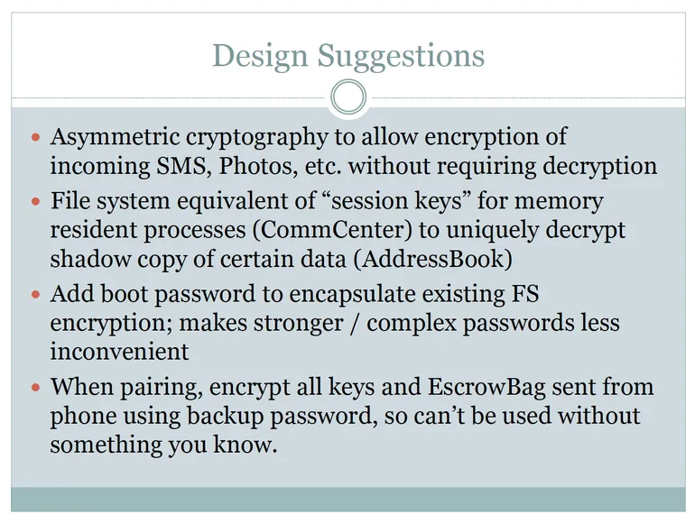


Looks like "awesome" security...


Yesterday I wrote about Forensic Scientist [Jonathan Zdziarski](https://twitter.com/JZdziarski)'s presentation at [HOPE/X](http://www.hope.net) where he demonstrated "a number of undocumented high-value forensic services running on every iOS device" and "suspicious design omissions in iOS that make collection easier." 

Apple today addressed some of his concerns with a new knowledgebase article called [iOS: About diagnostic capabilities](http://support.apple.com/kb/HT6331). In it Apple refers to the services identified by Zdziarski (including "pcapd," "file_relay," and "house_arrest") as "diagnostic capabilities to help enterprise IT departments, developers, and AppleCare troubleshoot issues."

The Apple kb article notes that the services require the iOS device to be unlocked and in trusting relationship with another computer. It also notes that data transmitted between the iOS device and trusted computer is encrypted with keys not shared with Apple.

The document justifies three of the services as follows:

1. com.apple.mobile.pcapd

pcapd supports diagnostic packet capture from an iOS device to a trusted computer. This is useful for troubleshooting and diagnosing issues with apps on the device as well as enterprise VPN connections.


2. com.apple.mobile.file_relay

file_relay supports limited copying of diagnostic data from a device. This service is separate from user-generated backups, does not have access to all data on the device, and respects iOS Data Protection. Apple engineering uses file_relay on internal devices to qualify customer configurations. AppleCare, with user consent, can also use this tool to gather relevant diagnostic data from users' devices.


3. com.apple.mobile.house_arrest

house_arrest is used by iTunes to transfer documents to and from an iOS device for apps that support this functionality. This is also used by Xcode to assist in the transfer of test data to a device while an app is in development.


In his "theories" slides about why Apple may have included these services in iOS, Zdziarski concludes that they're not for Genius Bar or Apple support:

...nor are they for Engineering/Debugging:

Zdziarski's HOPE/X presentation also provides a number of "design suggestions" that Apple should include in the next version of iOS:

[Jonathan Zdziarski](https://twitter.com/JZdziarski) has yet to respond to Apple's response.

