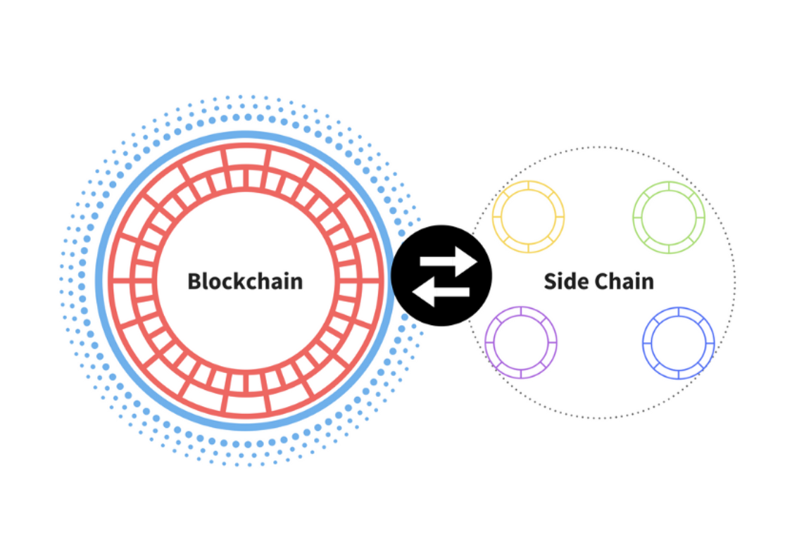

# The Architecture of a Web 3.0 application
 The architecture of Web 3.0 applications (or "DApps") are completely different from Web 2.0 applications.

 Take Medium, for example, a simple blogging site that lets users publish their own content and interact with content from others.

 As a web 2.0 application, it may sound simple, but there’s a lot that goes into Medium’s architecture to make it all possible:

  - **First**, there must be a place to store essential data, such as users, posts, tags, comments, likes, and so on. This requires a constantly updated database.

  - **Second**, backend code (written in a language like Node.js, Java, or Python) must define Medium’s business logic. For example, what happens when a new user signs up, publishes a new blog, or comments on someone else’s blog?

  - **Third**, frontend code (typically written in JavaScript, HTML, and CSS) must define Medium’s UI logic. For instance, what does the site look like, and what happens when a user interacts with each element on the page?

 Putting it all together, when you write a blog post on Medium, you interact with its frontend, which talks to its backend, which talks to its database. All of this code is hosted on centralized servers and sent to users through an internet browser. This is a good high-level summary of how most Web 2.0 applications work today.

 

 But all of that’s changing.

 Blockchain technology has unlocked an exciting new direction for Web 3.0 applications. In this article, we're going to focus on what the Ethereum blockchain brings to the table.

## What makes Web 3.0 different?
 Unlike Web 2.0 applications like Medium, Web 3.0 eliminates the middle man. There’s no centralized database that stores the application state, and there’s no centralized web server where the backend logic resides.

 Instead, you can leverage blockchain to build apps on a decentralized state machine that’s maintained by anonymous nodes on the internet.

 By “state machine,” I mean a machine that maintains some given program state and future states allowed on that machine. Blockchains are state machines that are instantiated with some genesis state and have very strict rules (i.e., consensus) that define how that state can transition.

 Better yet, no single entity controls this decentralized state machine — it is collectively maintained by everyone in the network.

 And what about a backend server? Instead of how Medium’s backend was controlled, in Web 3.0 you can write smart contracts that define the logic of your applications and deploy them onto the decentralized state machine. This means that every person who wants to build a blockchain application deploys their code on this shared state machine.

 And the front end? It pretty much stays the same, with some exceptions, which we will cover later.

 Here’s what the architecture looks like:

 


## ‍A Closer Look
 Now, let’s dive in a little deeper into what makes this possible.

### Blockchain
 The Ethereum blockchain is often touted as a “world computer.”  That’s because it’s a globally accessible, deterministic state machine maintained by a peer-to-peer network of nodes. State changes on this state machine are governed by the rules of consensus that the peers in the network follow.

 So, in other words, it’s literally designed to be a state machine that anyone in the world can access and write to. As a result, this machine isn’t owned by any single entity — but collectively by everyone in the network.

 One more thing to know: data can only be written to the Ethereum blockchain — you can never update existing data.

### Smart contracts
 A smart contract is a program that runs on the Ethereum blockchain and defines the logic behind the state changes happening on the blockchain. Smart contracts are written in high-level languages, such as Solidity or Vyper.

```C++ example_Smart_Contract
// SPDX-License-Identifer: GPL-3.0
pragma solidity >=0.7.0 <0.9.0>

//**
  * @title Storage
  * @dev Store & retrieve value in a variable
  */

contract Storage {
  uint256 number;
  struct Jon{
    uint[] arr;
  }

  Jon private x;

  function foo() public {
    x.arr.push(5);
  }

  /**
   * @dev Store value in variable
   * @param num value to store
   */
  function store(uint256 num) public {
    number = num;
  }
  /**
   * @dev Store value in variable
   * @param num value to store
   */
  function retrive() public view returns (uint256){
    return number;
  }
}
```

 Because smart contract code is stored on the Ethereum blockchain, anyone can inspect the application logic of all smart contracts on the network.

### Ethereum Virtual Machine (EVM)
 Up next, you have the Ethereum Virtual Machine, which executes the logic defined in the smart contracts and processes the state changes that happen on this globally accessible state machine.

 The EVM doesn’t understand high-level languages like Solidity and Vyper, which are used to write smart contracts. Instead, you have to compile the high-level language down into bytecode, which the EVM can then execute.

### Front-end
 Finally, we have the frontend. As we mentioned before, it defines the UI logic, but the frontend also communicates with the application logic defined in smart contracts.

 The communication between the frontend and smart contracts is a little more complicated than it appears in the diagram above. Let’s take a closer look at this next.


## How Does the Frontend Code Communicate with Smart Contracts on Ethereum?
 We want our frontend to communicate with our smart contracts so that they can invoke functions, but recall that Ethereum is a decentralized network. Every node in the Ethereum network keeps a copy of all states on the Ethereum state machine, including the code and data associated with every smart contract.

 When we want to interact with the data and code on a blockchain, we need to interact with one of these nodes. This is because any node can broadcast a request for a transaction to be executed on the EVM. A miner will then execute the transaction and propagate the resulting state change to the rest of the network.

 There are two ways to broadcast a new transaction:

 1. **Set up your own node which runs the Ethereum blockchain software**
 2. **Use nodes provided by third-party services like [Infura](https://infura.io), [Alchemy](https://www.alchemy.com), and [Quicknode](https://www.quicknode.com)**

 If you use a third-party service, you don’t have to deal with all the headaches of running a full node yourself. After all, setting up a new Ethereum node on your own server can take days. (There’s a lot of data to sync — It can even take up more bandwidth and storage than a typical laptop can handle.)

 Moreover, the cost of storing the full Ethereum blockchain goes up as your DApp scales, and you need to add more nodes to expand your infrastructure. That’s why, as your infrastructure becomes more complex, you’ll need full-time DevOps engineers. They’ll help you maintain the infrastructure to ensure reliable uptime and fast response times.

 All that to say, avoiding these headaches is why many DApps choose to use services like Infura or Alchemy to manage their node infrastructure for them. Of course, there’s a trade-off since this creates a centralized chokepoint, but let’s leave that rabbit hole for another day. ;)

 Moving on, let’s talk about providers. The nodes that you connect with when you need to interact with the blockchain (whether you set them up yourself or use existing ones from third-party services) are often called “providers.”

 

 Every Ethereum client (i.e. provider) implements a JSON-RPC specification. This ensures that there’s a uniform set of methods when frontend applications want to interact with the blockchain. If you need a primer on JSON-RPC, it’s a stateless, lightweight remote procedure call (RPC) protocol that defines several data structures and the rules for their processing. It’s transport-agnostic, so the concepts can be used within the same process, over sockets, over HTTP, or in many various message-passing environments. It uses JSON (RFC 4627) as a data format.

 Once you connect to the blockchain through a provider, you can read the state stored on the blockchain. But if you want to write to the state, there’s still one more thing you need to do before you can submit the transaction to the blockchain— “sign” the transaction using your private key.

 For instance, imagine we have a DApp that lets users read or publish blog posts to the blockchain. You might have a button on the frontend that allows anyone to query for the blog posts written by a particular user. (Recall that reading from the blockchain does not require a user to sign a transaction.)

 However, when a user wants to publish a new post onto the chain, our DApp would ask the user to “sign” the transaction using their private key — only then would the DApp relay the transaction to the blockchain. Otherwise, the nodes wouldn’t accept the transaction.

 This “signing” of transactions is where [Metamask](https://metamask.io) typically comes in.

 

 Metamask is a tool that makes it easy for applications to handle key management and transaction signing. It’s pretty simple: Metamask stores a user’s private keys in the browser, and whenever the frontend needs the user to sign a transaction, it calls on Metamask.

 Metamask also provides a connection to the blockchain (as a “provider”) since it already has a connection to the nodes provided by Infura since it needs it to sign transactions. In this way, Metamask is both a provider and a signer. 🤯


## Storage on the Blockchain
 Of course, this architecture makes sense if you’re building an app where all of the smart contracts and data live entirely on the Ethereum blockchain. But anyone who has built apps on Ethereum knows that storing everything on the blockchain gets really expensive, really fast.

 Keep in mind that, with Ethereum, the user pays every time they add new data to the blockchain. That’s because adding a state to the decentralized state machine increases the costs for nodes that are maintaining that state machine.

 Asking users to pay extra for using your DApp every time their transaction requires adding a new state is not the best user experience. One way to combat this is to use a decentralized off-chain storage solution, like [IPFS](https://ipfs.io) or [Swarm](https://www.ethswarm.org).

 IPFS is a distributed file system for storing and accessing data. So, rather than storing data in a centralized database, the IPFS system distributes and stores the data in a peer-to-peer network. This makes it easy for you to retrieve it when you need to.

 IPFS also has an incentive layer known as “Filecoin.” This layer incentivizes nodes around the world to store and retrieve this data. You can use a provider like Infura (which provides you with an IPFS node) or Pinata (which provides an easy-to-use service where you can “pin” your files to IPFS and take the IPFS hash and store that on the blockchain).

 Swarm is similar in that it’s a decentralized storage network, but there’s one notable difference. While Filecoin is a separate system, Swarm’s incentive system is built-in and enforced through smart contracts on the Ethereum blockchain for storing and retrieving data.

 So now, with IPFS or Swarm, our application architecture looks like this:

 

 Astute readers may also have noticed in the diagram below that the frontend code is *not* stored on the blockchain. We could host this code on AWS, as we normally would in Web 2.0, but that creates a centralization chokepoint for your DApp. What if AWS goes down? What if it censors your app?

 That’s why, if you want to build a truly decentralized app, you might choose to host your frontend on a decentralized storage solution, like IPFS or Swarm.

 So now your application architecture looks more like this:

 


## ‍Querying the Blockchain
 So far, we’ve talked about how to write to the blockchain by signing transactions and then sending them to the blockchain. But what about reading data from the smart contracts on the blockchain? There are two primary ways to do this:

### Smart Contract Events
 You can use the Web3.js library to query and listen for smart contract events. You can listen to specific events and specify a callback every time the event is fired. For instance, if you have a smart contract that sends a continuous payment stream from person A to person B every block, then you can emit an event every time a new payment is made to person B. Your frontend code can listen to events being fired by the smart contract and carry out specific actions based on it.

### The Graph
 The above approach works, but it has some limitations. For instance, what if you deploy a smart contract and later realize you need an event emitted that you didn’t originally include? Unfortunately, you’d have to redeploy a new smart contract with that event and data. Moreover, using callbacks to handle various UI logic gets very complex very quickly.

 This is where “[The Graph](https://thegraph.com)” comes in.

 The Graph is an off-chain indexing solution that makes it easier to query data on the Ethereum blockchain. The Graph allows you to define which smart contracts to index, which events and function calls to listen to, and how to transform incoming events into entities that your frontend logic (or whatever is using the API) can consume. It uses GraphQL as a query language, which many frontend engineers love because of how expressive it is compared to traditional REST APIs.

 By indexing blockchain data, The Graph lets us query on-chain data in our application logic with low latency.

 Now, your DApp architecture looks like this:

 

 We’re almost done, but we have one major topic left: scaling.


## Scaling Your DApp
 As you may have heard, Ethereum doesn’t scale — at least, not yet.

 

 

 

 Clearly, we have a problem here. Building a DApp on Ethereum with high gas fees and full blocks leads to a very bad UX. Thankfully, there are some solutions under development.

 One popular scaling solution is [Polygon](https://polygon.technology), an L2 scaling solution. Instead of executing transactions on the main blockchain, Polygon has “sidechains” that process and execute transactions. A sidechain is a secondary blockchain that interfaces with the main chain. Every so often, the sidechain submits an aggregation of its recent blocks back to the primary chain.

 

 Other examples of L2 solutions are [Optimistic Rollups and zkRollups](https://ethereum.org/en/developers/docs/scaling/layer-2-rollups). The idea here is similar: We batch transactions off-chain using a “rollup” smart contract and then periodically commit these transactions to the main chain.

 The take-home idea is this: L2 solutions do transaction execution (i.e., the slow part) off-chain, with only the transaction data stored on-chain. This lets us scale the blockchain because we don’t have to execute every single transaction on-chain. This also makes transactions faster and cheaper — and they can still communicate with the main Ethereum blockchain when necessary.

 


## ‍Cobbling It All Together
 If all of this is making your head spin, you’re not alone. Cobbling together all of these tools is complex and can lead to a painful developer experience. But don’t worry — we’re starting to see new developer frameworks which really improve the experience for developers.

For instance, [Hardhat](https://hardhat.org) is a developer framework that makes it easier for Ethereum developers to build, deploy, and test their smart contracts. Hardhat offers the “Hardhat Network,” which developers can use to deploy their smart contracts onto a local network — without having to deal with live environments. Better yet, it offers a great [plugin ecosystem](https://hardhat.org/plugins/) that makes developers’ lives much *easier*. Hardhat also provides console.log() functionality, similar to javascript, for debugging purposes.

Of course, this is just the beginning. I hope that we continue to see better developer tooling in the future.


## Conclusion
 Most people spend months figuring out how the tooling chain works, so if you’re a new DApp developer, I hope this article saved you some time. It’s time to get building!

 If building Web 3.0 applications is something you are interested in, then sign up for our next cohort of the [DappCamp](https://www.dappcamp.xyz), where you will learn how to build and deploy your first Dapp on Ethereum.

 As always, if you have any questions or found any errors in this blog post, please let me know in the comments! :)