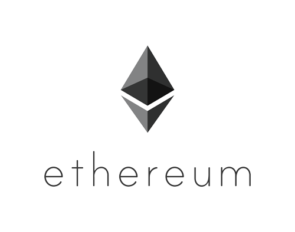
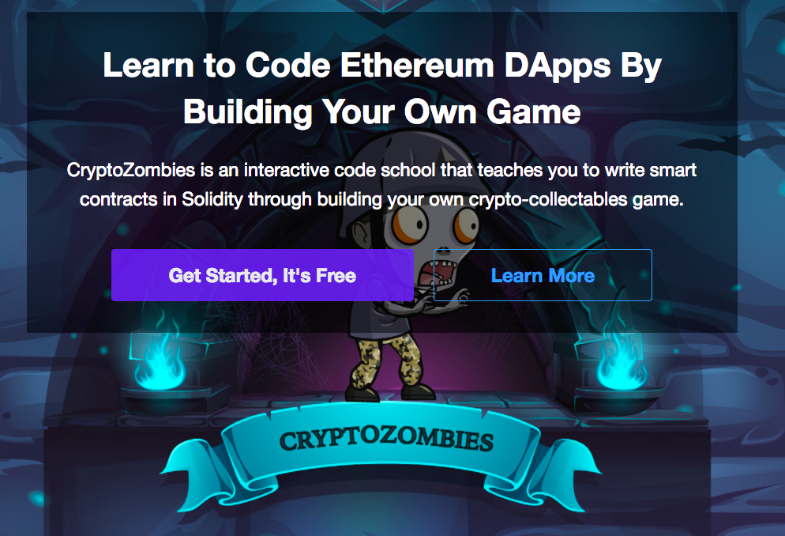

 

 Cryptocurrencies, ICOs, magic internet money — it’s all so damn exciting, and you, the eager developer, want to get in on the madness. Where do you start?

 I’m glad you’re excited about this space. I am too. But you’ll probably find it’s unclear where to begin. Blockchain is moving at breakneck speed, but there’s no clear onramp to learning this stuff.

 Since I left Airbnb to work full-time on blockchain, many people have reached out to me asking how to get into the blockchain space full-time. Consider this my authoritative (and *inevitably* incomplete) guide on how to get into blockchain engineering.

 This guide will proceed in ten parts:
 01. Why should you learn blockchain development?
 02. Prerequisites
 03. The theoretical foundations of Bitcoin
 04. Building a blockchain yourself
 05. Ethereum and smart contract programming
 06. Smart contract security
 07. Taking off the training wheels
 08. Building your own projects
 09. Navigating the blockchain community
 10. Getting a job

## Why should you learn blockchain development?
 Before I answer that question, let me first note: blockchain is a massively overvalued space right now. These prices are unsustainable, and a crash is definitely coming. This has all happened before, and will probably happen again. But if you work long-term in this space, you’ll learn to shrug off prices. In the words of Emin Gun Sirer — prices are the least interesting part of cryptocurrencies. These are massively important technologies, and they are going to irrevocably change the world.

 If you’re unsure, I can’t tell you whether or not you should jump in. But I can tell you five reasons that convinced me to take the leap:

### It’s still early.
 Bitcoin was invented 10 years ago, but the rate of innovation has only reached a fever pitch in the last couple of years, especially with the launch of Ethereum in 2015. Most of the new companies and ideas in this space have been built on top of Ethereum, which is still very immature.

 Even if you start now, you can realistically become a world-class expert within a few years. Most people just haven’t been doing this that long, and it won’t be that hard to catch up. Starting now would be analogous to deep learning experts who began studying the topic in the late 2000s.

### This space doesn’t have a strong talent funnel yet.
 Most of the best and brightest students at universities are focusing on machine learning, web programming, or game development. Sure, blockchains are getting more sexy in the public discourse, but they’re still a weird and subversive topic on which to stake your career.

 Early on, blockchain was exclusively the realm of cypherpunks, paranoids, and weirdos. That’s only recently begun to change. Just by being a curious and open-minded developer, you’ll bring a lot of value to the space.

### Much of the innovation is happening outside of academia.
 Satoshi Nakamoto was not an academic as far as we know. There’s no university or institution that offers a coherent blockchain concentration yet. Most of the innovation here has been led by aficionados, entrepreneurs, and independent researchers. Almost everything you need to know is in white papers, blog posts, public Slack channels, and open-source software. All it takes is rolling up your sleeves and jumping into the fray.

### The demand for talent far, far exceeds supply.
 There just aren’t enough developers in this space, and they can’t get trained fast enough. Everyone is competing to hire blockchain talent, and projects are feeling the talent crunch. Many of the best companies can’t pay their people enough to stay because they have too many opportunities. If you get some skills under your belt, it’ll be easy to land a job.

###  Cryptocurrencies are just really damn cool.
 Where else can you build sci-fi stuff like cryptographically secured, decentralized money? It’s the wild west right now—and this brings good and bad. The space could use more transparency, and regulation will eventually come. But without a doubt, cryptocurrencies are one of the most innovative areas you can be working in right now.

 Naval Ravikant [said in a recent interview](https://www.pscp.tv/w/1eaKbqrWloRxX): the key to success is to give society things that it wants, but doesn’t know how to get on its own. You can’t go to school for such things; if you could, the world would already have a steady supply of it.

 So build something no one else knows how to build. Right now, blockchains are brand new and there’s so much left to figure out. If you succeed in building the future of decentralized technology, the world will reward you handsomely.

 So say you want to throw in your hat. What do you need to know before you get into the ring?

## Prerequisites
 I’d recommend strengthening up your understanding of fundamentals before you dive further. Blockchains are built atop decades of research in computer science, cryptography, and economics. Satoshi Nakamoto was a renegade, but he also knew well the history that preceded him. In order to understand why blockchains work, you need to understand their building blocks — what came before blockchains, and why those things didn’t work.

 Here are some good prerequisites to be familiar with, in order of importance.

 Note, these links are just a starting point, you’ll probably want to dive deeper for many of these topics.

### Computer science
#### Data structures
 You’ll want to be familiar with the characteristics and complexity guarantees of the major data structures: [linked lists](https://en.wikipedia.org/wiki/Linked_list), [binary search trees](https://en.wikipedia.org/wiki/Binary_search_tree), [hash maps](https://en.wikipedia.org/wiki/Hash_table), and [graphs](https://en.wikipedia.org/wiki/Graph_(discrete_mathematics)) (specifically, [directed acyclic graphs](https://en.wikipedia.org/wiki/Directed_acyclic_graph) which feature prominently in blockchains). It helps to have built them from scratch to better understand how they work and their properties.

#### Cryptography
 Cryptography is the namesake and bedrock of cryptocurrencies. All cryptocurrencies use [public/private key cryptography](https://en.wikipedia.org/wiki/Public-key_cryptography) as the basis for identity and authentication. I’d recommend studying [RSA](https://www.youtube.com/watch?v=vgTtHV04xRI) (it’s easy to learn, and doesn’t require a very strong math background), then look at [ECDSA](https://blog.cloudflare.com/a-relatively-easy-to-understand-primer-on-elliptic-curve-cryptography/). Elliptic curve cryptography requires significantly more abstract math — it’s not important to understand all the details, but know that this is the cryptography that’s used in most cryptocurrencies, including Bitcoin.

 The other important cryptographic primitive is the [cryptographic hash function](https://en.wikipedia.org/wiki/Cryptographic_hash_function). These can be used to construct [commitment schemes](https://en.wikipedia.org/wiki/Commitment_scheme), and are the building block for [Merkle trees](https://en.wikipedia.org/wiki/Merkle_tree). Merkle trees enable [Merkle proofs](https://indigoframework.com/documentation/v0.1.0/references/proof-of-existence/), one of the key optimizations that blockchains use for scalability.

#### Distributed systems
 There are a few [good textbooks](https://dataintensive.net) on distributed systems, but it’s a sprawling and difficult area of study. Distributed systems are absolutely essential to reasoning about blockchains, so you must build a foundation here before tackling blockchain programming.

 Once you’re no longer living on a single machine, you have to start reasoning about [consistency](https://en.wikipedia.org/wiki/Consistency_model) and [consensus](https://en.wikipedia.org/wiki/Consensus_(computer_science)). You’ll want to know the difference between [linearizable](https://en.wikipedia.org/wiki/Linearizability) and [eventual consistency](https://en.wikipedia.org/wiki/Eventual_consistency) models. You’ll also want to learn the guarantees of [fault-tolerant](https://en.wikipedia.org/wiki/Fault_tolerance) consensus algorithms, such as [Paxos](https://en.wikipedia.org/wiki/Paxos_(computer_science)) and [RAFT](https://en.wikipedia.org/wiki/Raft_(computer_science)). [Know the difficulties of reasoning about time in a distributed system](https://www.youtube.com/watch?v=BRvj8PykSc4). Appreciate the tradeoffs between [safety and liveness](http://www.bailis.org/blog/safety-and-liveness-eventual-consistency-is-not-safe/).

 With that background, you’ll be able to understand the difficulties around [Byzantine fault-tolerant consensus](https://en.wikipedia.org/wiki/Byzantine_fault_tolerance), the primary security requirement of public blockchains. You’ll want to learn about [PBFT](https://blog.acolyer.org/2015/05/18/practical-byzantine-fault-tolerance/), one of the first scalable algorithms to deliver Byzantine fault-tolerant consensus. PBFT is the basis for many non-proof-of-work blockchain consensus algorithms. Once again, you don’t need to understand the details of how and why PBFT is correct, but get the general idea and its security guarantees.

 It’s also very useful to understand the [traditional methods of distributing databases](https://en.wikipedia.org/wiki/Distributed_database) (at its core, blockchains are databases after all). Learn about [sharding](https://en.wikipedia.org/wiki/Shard_(database_architecture)) (such as via [consistent hashing](https://en.wikipedia.org/wiki/Consistent_hashing)), [leader-follower replication](https://en.wikipedia.org/wiki/Replication_(computing)), and [quorum-based commits](https://en.wikipedia.org/wiki/Quorum_(distributed_computing)). Look into [distributed hash tables (DHTs)](https://en.wikipedia.org/wiki/Distributed_hash_table), such as [Chord](https://en.wikipedia.org/wiki/Chord_(peer-to-peer)) or [Kademlia](https://en.wikipedia.org/wiki/Kademlia).

#### Networking
 The decentralization of blockchains derives in large part from their peer-to-peer network topology. As such, blockchains are direct descendants of the past P2P networks.

 To understand the blockchain communication model, you need to understand the basics of [computer networking](https://en.wikipedia.org/wiki/Computer_network): this means understanding [TCP vs UDP](https://www.diffen.com/difference/TCP_vs_UDP), the [packet model](https://en.wikipedia.org/wiki/Network_packet), what IP packets look like, and roughly how [Internet routing](https://en.wikipedia.org/wiki/Routing) works.

 Public blockchains tend to spread messages via [gossip protocols](https://en.wikipedia.org/wiki/Gossip_protocol) using [flooding](https://en.wikipedia.org/wiki/Flooding_(computer_networking)). It’s instructive to learn the history of [P2P network design](https://en.wikipedia.org/wiki/Peer-to-peer), from [Napster to Gnutella](http://www.springer.com/cda/content/document/cda_downloaddocument/9783642035135-c2.pdf?SGWID=0-0-45-855488-p173920223), [BitTorrent](https://en.wikipedia.org/wiki/BitTorrent) and [Tor](https://en.wikipedia.org/wiki/Tor_(anonymity_network)). Blockchains have their own place, but they draw upon the lessons of these networks and how they were designed.

### Economics
 Cryptocurrencies are inherently multidisciplinary — this is part of what makes them so fascinating and radical. Besides computer science, cryptography, and networking, they are also deeply interwoven with economics. Cryptocurrencies can derive many security properties through their economic structures, which is often termed *cryptoeconomics*. As such, economics is essential to understanding cryptocurrencies.

#### Game theory
 The most important branch of economics that plays into cryptocurrencies is [game theory](https://en.wikipedia.org/wiki/Game_theory), the study of payoffs and incentives among multiple agents. You don’t need to go *extremely* deep here, but you do need to understand the basic tools of game theoretic analysis and how you can use them to analyze incentives in one-shot and iterated games.

 Two key concepts in your repertoire should be [Nash equilibria](https://en.wikipedia.org/wiki/Nash_equilibrium) and [Schelling points](https://en.wikipedia.org/wiki/Focal_point_(game_theory)), as they feature prominently in cryptoeconomic analysis.

#### Macroeconomics
 Cryptocurrencies are not just protocols, they are also forms of money. As such, they respond to the laws of [macroeconomics](https://en.wikipedia.org/wiki/Macroeconomics) (if they can be called laws). Cryptocurrencies are subject to different [monetary policies](https://en.wikipedia.org/wiki/Monetary_policy), and respond predictably to [inflation](https://en.wikipedia.org/wiki/Inflation) and [deflation](https://en.wikipedia.org/wiki/Deflation). You should understand these processes and the effects they have on spending, saving, etc.

 Another valuable economic concept is the [velocity of money](https://en.wikipedia.org/wiki/Velocity_of_money), especially as it corresponds to valuing a currency.

#### Microeconomics
 Cryptocurrencies are also deeply interwoven with markets, which requires an understanding of [microeconomics](https://en.wikipedia.org/wiki/Microeconomics). You’ll need a strong intuition for [supply and demand curves](https://en.wikipedia.org/wiki/Supply_and_demand). You should be able to reason about competition and [opportunity costs](https://en.wikipedia.org/wiki/Opportunity_cost) (they’ll apply frequently to cryptocurrency mining). For many coin distributions and cryptoeconomic systems, [auction theory](https://www.youtube.com/watch?v=4kWuxfVbIaU) features prominently.

 I expect you’ll be familiar with some of these topics already. If you are, feel free to skim or skip over them entirely.

 Okay, by now you’ve gone through and shored up your fundamentals (or maybe you skipped a bunch, who’s counting?), so now that you’ve got your theory in check, let’s get started on blockchain development.

## The theoretical foundations of Bitcoin
 In October of 2008, Satoshi Nakamoto published a white paper in which he described a protocol for a decentralized digital currency. He called this protocol Bitcoin.

 Before you can understand the big ideas behind blockchains, you have to start with Bitcoin and grasp Satoshi’s original insight.

 First, I recommend building your intuitions about proof-of-work and the fork choice rule (also known as Nakamoto consensus). Start here:

### Blockchain 101 - A Visual Demo (17:49 minutes)
 This is a very basic visual introduction to the concepts behind a blockchain. We introduce the idea of an immutable ledger using an interactive web demo.



    start: 0,
    allowfullscreen: 1,
    autoplay: 0,
    hl: en,
    cc_lang_pref: en,
    cc_load_policy: 1,
    color: white,
    controls: 1,
    disablekb: 0,
    enablejsapi: 1,
    fs: 0,
    iv_load_policy: 3,
    loop: 0,
    modestbranding: 1,
    playsinline: 0,
    privacy_mode: yes,
    rel: 0,
    showinfo: 0,
    origin: blog.richiebartlett.com,
    widget_referrer: blog.richiebartlett.com


### Blockchain 101 - Part 2 - Public / Private Keys and Signing (8:53 minutes)
 This is part two in my basic visual introduction to the concepts behind a blockchain. We build on the concepts from the previous video and introduce public / private key pairs and signing using an interactive web demo.





    start: 0,
    allowfullscreen: 1,
    autoplay: 0,
    hl: en,
    cc_lang_pref: en,
    cc_load_policy: 1,
    color: white,
    controls: 1,
    disablekb: 0,
    enablejsapi: 1,
    fs: 0,
    iv_load_policy: 3,
    loop: 0,
    modestbranding: 1,
    playsinline: 0,
    privacy_mode: yes,
    rel: 0,
    showinfo: 0,
    origin: blog.richiebartlett.com,
    widget_referrer: blog.richiebartlett.com


 I recommend watching more than one video explanation to get the idea seared into your head:

### But how does bitcoin actually work? (26:20 minutes)
 The math behind cryptocurrencies.
 Here are a few other resources I'd recommend:

 Original Bitcoin paper: https://bitcoin.org/bitcoin.pdf

 Block explorer: https://blockexplorer.com/



    start: 0,
    allowfullscreen: 1,
    autoplay: 0,
    hl: en,
    cc_lang_pref: en,
    cc_load_policy: 1,
    color: white,
    controls: 1,
    disablekb: 0,
    enablejsapi: 1,
    fs: 0,
    iv_load_policy: 3,
    loop: 0,
    modestbranding: 1,
    playsinline: 0,
    privacy_mode: yes,
    rel: 0,
    showinfo: 0,
    origin: blog.richiebartlett.com,
    widget_referrer: blog.richiebartlett.com


 Great. Now that you’ve built up your intuition, this article will provide a deeper end-to-end exposition of the critical components of how Bitcoin works.

## Building a blockchain yourself
 Now that you have the high-level intuition, it’s time to build your own proof-of-work based blockchain. Don’t worry, it’s easier than it sounds. Here are some good resources.

 First, I have a video lecture where I walk through exactly how to do this in Ruby (I recommend watching even if you’re not a Ruby programmer):

### Let's build a blockchain! — A mini-cryptocurrency in Ruby (Haseeb Qureshi) (2:30:14 hours)
 Ever wondered how cryptocurrencies like Bitcoin or Ethereum work? Well, what better way to find out than to build one! Come watch this lecture by Haseeb where he builds a blockchain from scratch in Ruby. By the end, we'll definitely all be rich with something resembling money.





    start: 1043,
    allowfullscreen: 1,
    autoplay: 0,
    hl: en,
    cc_lang_pref: en,
    cc_load_policy: 1,
    color: white,
    controls: 1,
    disablekb: 0,
    enablejsapi: 1,
    fs: 0,
    iv_load_policy: 3,
    loop: 0,
    modestbranding: 1,
    playsinline: 0,
    privacy_mode: yes,
    rel: 0,
    showinfo: 0,
    origin: blog.richiebartlett.com,
    widget_referrer: blog.richiebartlett.com


 [Source and slides here.](https://github.com/Haseeb-Qureshi/lets-build-a-blockchain)

 There are also other [blockchain implementations](https://github.com/openblockchains/awesome-blockchains) you can find, written in various programming languages. Go on and build your own, and satisfy yourself that it’s mostly functional.

 Once you’ve made it this far, you should have a good grasp of how to implement a simple payments application atop a blockchain (i.e., Bitcoin). You should also by now have enough background that you should be able to read and understand the original [Bitcoin whitepaper](https://bitcoin.org/bitcoin.pdf).

 To understand the economics and mechanics of Bitcoin mining, I recommend watching the [lecture on Bitcoin mining](https://www.youtube.com/watch?v=jXerV3f5jN8) in the Bitcoin and Cryptocurrencies Princeton course.

 If you’ve gotten this far, you should understand Bitcoin well enough to [walk through a Bitcoin block header](https://www.youtube.com/watch?v=gUwXCt1qkBU) and understand what each of its components mean. You should also be able to play around with a [Bitcoin block explorer](https://blockchain.info/) and navigate raw Bitcoin transactions.

 Now is a good time to study up on the history of Bitcoin and cryptocurrencies. The below video, offered by a UC Berkeley Decal, gives a good overview.

### Bitcoin History: From the Cypherpunk Movement to JPMorgan Chase (42:45 minutes)
 Cryptocurrency Decal Fall 2016
 Lecturers: Andrew Tu and Max Fang



    start: 0,
    allowfullscreen: 1,
    autoplay: 0,
    hl: en,
    cc_lang_pref: en,
    cc_load_policy: 1,
    color: white,
    controls: 1,
    disablekb: 0,
    enablejsapi: 1,
    fs: 0,
    iv_load_policy: 3,
    loop: 0,
    modestbranding: 1,
    playsinline: 0,
    privacy_mode: yes,
    rel: 0,
    showinfo: 0,
    origin: blog.richiebartlett.com,
    widget_referrer: blog.richiebartlett.com


### Some more extra credit resources
 * [Academic precursors to Bitcoin](https://queue.acm.org/detail.cfm?id=3136559)
 * Mechanics of Bitcoin: [UTXOs and Bitcoin script](https://www.youtube.com/watch?v=q5GWwTgRIT4) (Bitcoin script is not super important, just know roughly what it can do)
 * [Short guide to Bitcoin forks](https://www.coindesk.com/short-guide-bitcoin-forks-explained/)
 * [Soft forks and miner signaling](https://en.bitcoin.it/wiki/Softfork)
 * [Double spends, 51% attacks, and selfish mining](https://www.youtube.com/watch?v=UPxaCj8ZsEU)
 * [Replay attacks](https://bitcointechtalk.com/how-to-protect-against-replay-attacks-7a00bd2fe52f)
 * [Bitcoin scalability problems](https://en.wikipedia.org/wiki/Bitcoin_scalability_problem), which is the source of most of the contentiousness in the Bitcoin ecosystem. You should have an idea of why Bitcoin folks argue so much about the block size.
 * [Segregated witness, a.k.a. SegWit](https://en.wikipedia.org/wiki/SegWit), not essential but it comes up a lot.
 * [Lightning Network](https://lightning.network), one of the more important scaling solutions for Bitcoin, also generalizes to other blockchains
 * [Bitcoin full nodes](https://bitnodes.earn.com), [Bitcoin fee statistics](https://bitcoinfees.earn.com/), [charts](https://blockchain.info/charts), [charts](https://coin.dance/stats) and [more charts](https://bitcointicker.co/networkstats/)
 * [Bitcoin energy consumption index](https://digiconomist.net/bitcoin-energy-consumption) (at the time of publication, Bitcoin mining consumes as much energy as all of Peru)
 * [Insightful essay by Gwern](https://www.gwern.net/Bitcoin-is-Worse-is-Better) on the scrappy inelegance of Bitcoin
 * Jameson Lopp has a [wealth of other resources](https://lopp.net/bitcoin.html) on Bitcoin if you want to go deeper down the rabbit hole.

## Ethereum and smart contract programming
 Now that you’ve built a blockchain and understand the dynamics of Bitcoin, it’s time to delve into Ethereum.
 
 You understand how blockchains and proof-of-work can achieve distributed, Byzantine fault-tolerant consensus within a peer-to-peer network. But a payments network is just one application you can run atop such a blockchain. In 2013, Vitalik Buterin, the creator of Ethereum asked: what if you used a blockchain to implement a decentralized computer?

 

 In Ethereum, you pay miners to execute your programs on this distributed virtual machine. This means you can perform arbitrary computations, using a Turing-complete programming language (unlike Bitcoin script). Obviously that includes payments-related applications, so Ethereum enables a superset of Bitcoin’s functionality and has birthed a renaissance of innovation.

 This brings us to smart contracts — the name for programs that run on such a virtual machine. A smart contract can interact directly with the blockchain’s cryptocurrency in accordance with the execution of a program. In other words, you can create financial contracts that automatically enforce themselves. It’s a wild idea, and all sorts of sci-fi futuristic stuff you can do once you embrace this programming model.

 Ethereum has enabled the wave of ICOs and developers building atop the blockchain. It is the second largest cryptocurrency behind Bitcoin, it has [more than 10x](https://media.consensys.net/andrew-keys-ethereum-has-30-times-more-devs-than-the-next-blockchain-community-27980a5ddc09) the developers of the next most popular platform, it has the strongest developer team, the most mature tooling, and the majority of ICOs and projects atop it. It also has the most [industry support](https://entethalliance.org/members/), which goes a long way. In all likelihood, if you’re doing blockchain development, you’ll be writing code for Ethereum smart contracts. (Even if you’re not, it’s essential to understanding what’s going on in this space.)

 First, a more detailed high-level explanation of Ethereum:

### Ethereum in 25 Minutes, Version MMXVII (24:52 minutes)
 Visit the https://archive.devcon.org/ to gain access to the entire library of Devcon talks with the ease of filtering, playlists, personalized suggestions, decentralized access on IPFS and more.
 https://archive.devcon.org/archive/watch/3/ethereum-in-25-minutes-version-mmxvii/?tab=YouTube

 So what are all of the different moving parts of the Ethereum blockchain? What are uncles, how do contracts call other contracts, who runs them? What is the role of proof of work and proof of stake, and what exactly is gas? What will EIP86 do for you? Vitalik Buterin provides a 25-minute technical overview of the ethereum blockchain, start to finish, and explain many of these concepts in detail.

 Speaker(s): Vitalik Buterin
 Skill level: Intermediate
 Track: Execution layer



    start: 0,
    allowfullscreen: 1,
    autoplay: 0,
    hl: en,
    cc_lang_pref: en,
    cc_load_policy: 1,
    color: white,
    controls: 1,
    disablekb: 0,
    enablejsapi: 1,
    fs: 0,
    iv_load_policy: 3,
    loop: 0,
    modestbranding: 1,
    playsinline: 0,
    privacy_mode: yes,
    rel: 0,
    showinfo: 0,
    origin: blog.richiebartlett.com,
    widget_referrer: blog.richiebartlett.com


 The ideas behind Ethereum have also spawned a wave of innovation in [cryptoeconomics](https://www.youtube.com/watch?v=sbd4xe9OHJg). You should dip your toes into the ideas around [DAOs](https://en.wikipedia.org/wiki/Decentralized_autonomous_organization), and all of the sci-fi fever dreams that they hint at.
 
 Okay, that’s enough fantasy, let’s dig into the tech.
 
 Here’s [a good overview of the Ethereum yellow paper and its internals](https://medium.com/@preethikasireddy/how-does-ethereum-work-anyway-22d1df506369), by Preethi Kasireddy. Ethereum uses an [account model](https://ethereum.stackexchange.com/questions/326/what-are-the-pros-and-cons-of-ethereum-balances-vs-utxos) rather than Bitcoin’s UTXO model — you’ll soon see why this makes it easier to write smart contracts.

 As with any technology, the best way to get acquainted with Ethereum is by building a few small projects.

 The dominant programming language for Ethereum is Solidity, which is a statically typed JavaScript-esque language. It’s a language with [a lot of warts](https://news.ycombinator.com/item?id=14691212), and many questionable design choices. More robust languages like [Viper](https://github.com/ethereum/vyper) may replace it once they’re production-ready, but for now Solidity is the lingua franca of smart contract programming. It’s basically Ethereum’s JavaScript, so you’ll need to learn it (and [its pitfalls](https://medium.com/@aidobreen/how-and-why-developing-for-ethereum-sucks-1ff1a9873527)).

 To get your first exposure to Solidity development, I recommend working through all of the [CryptoZombies tutorial](https://cryptozombies.io). It’s a delightful and high-quality Codecademy-esque tutorial that will teach you the basics of Solidity programming.

 

 Now that you’ve whetted your appetite, it’s time to develop on your own.

 The “hello world” of Ethereum is building an [ERC-20 compliant token](https://medium.com/@james_3093/ethereum-erc20-tokens-explained-9f7f304055df). I recommend this guide as a first tutorial to walk you through the process.

 [Remix](https://remix.ethereum.org) is an in-browser Solidity editor and compiler — it’s basically the training wheels of Ethereum development, so I recommend working through the rest of your practice in Remix. But it’s also worth setting up a local blockchain and getting a sense of the Ethereum tooling. [This tutorial](https://codeburst.io/build-your-first-ethereum-smart-contract-with-solidity-tutorial-94171d6b1c4b) does a good job of walking you through an end-to-end blockchain stack and explaining the pieces as they go along.

 Next I’d recommend building a voting system. I’d call this the Todo App of Ethereum. Karl Floersch has a [great tutorial](https://karl.tech/learning-solidity-part-2-voting/) where he walks through how to build a secure commit-reveal voting system.

 Great, now for your mid-term exam: build a secure coin toss game, where two players can securely bet on the coin flip. No tutorial this time, do it on your own. Think about possible attacks — how can the players cheat? Can you ensure that they play honestly? [Here are some hints](https://gist.github.com/Haseeb-Qureshi/8261d70c4fb8ad8cdf1776f55bdcd4c2).

## Smart contract security
 Security is absolutely essential to blockchain development. Smart contracts have been plagued by disastrous hacks, including the [DAO hack](http://hackingdistributed.com/2016/06/18/analysis-of-the-dao-exploit/), the [Parity Wallet hack](https://medium.freecodecamp.org/a-hacker-stole-31m-of-ether-how-it-happened-and-what-it-means-for-ethereum-9e5dc29e33ce), and the affectionately named [Parity Wallet hack 2](https://hackernoon.com/parity-wallet-hack-2-electric-boogaloo-e493f2365303) (now with its own [T-shirt](https://cryptoshirt.io/products/devops199-quote-i-accidentally-killed-it-tee)). You absolutely must read analyses of all three of these hacks if you’re going to be writing production smart contracts.

 The truth is, **smart contracts are extremely hard to get right**. Though the programming toolchain will improve to make these exact attacks harder, they were ultimately all due to programmer error. There are also many subtler bugs that arise from smart contract programming, such as in [frontrunning](https://hackernoon.com/front-running-bancor-in-150-lines-of-python-with-ethereum-api-d5e2bfd0d798) or [secure generation of randomness](http://www.swende.se/blog/Breaking_the_house.html).

 As a smart contract developer, you must treat security as paramount. There’s no “move fast and break things” in smart contract programming. That means any code that handles significant flows of money should be run through static analyzers like [Oyente](https://github.com/melonproject/oyente) or [Securify](https://securify.ch), tested thoroughly, and then audited by an experienced smart contract auditor. You should also try to rely on pre-audited components, such as [OpenZeppelin’s open source contracts](https://github.com/OpenZeppelin/zeppelin-solidity).

 To strengthen your security chops, I recommend working through [The Ethernaut](https://ethernaut.zeppelin.solutions/) by OpenZeppelin, a game where you find and attack vulnerabilities in smart contracts. Many of them have you replicate real attacks against smart contracts that have occurred in the wild.

 Phil Daian also has an excellent set of smart contract hacking challenges called [Hack This Contract](http://hackthiscontract.io).

 Once you make it past that, I strongly recommend reading the entirety of [Smart Contract Best Practices](https://consensys.github.io/smart-contract-best-practices/), compiled by ConsenSys. Expect to revisit this document many times over in your smart contract programming career. The [bibliography](https://consensys.github.io/smart-contract-best-practices/bibliography/) is also worth exploring for further reading by security experts.

## Taking off the training wheels
 If you’ve made it this far, you should now be ready to move past Remix and start using a serious Solidity development stack.
  
 Most developers recommend VSCode or Atom for your text editor, since they have decent Solidity plugins. For interacting with a local blockchain, you’ll want to use [Ganache](https://github.com/trufflesuite/ganache-cli) (formerly TestRPC), and you’ll want to use the [Truffle framework](https://github.com/trufflesuite/truffle) for your (JS-based) tests and configuring your build pipeline.

 Now is a good time to look into [IPFS](https://ipfs.io), which you can use as a fully decentralized filestore at much cheaper cost than the Ethereum blockchain. Here’s a brief explainer by the creator, Juan Benet:

### IPFS Alpha | Why We Must Distribute The Web (25:06 minutes)


    start: 0,
    allowfullscreen: 1,
    autoplay: 0,
    hl: en,
    cc_lang_pref: en,
    cc_load_policy: 1,
    color: white,
    controls: 1,
    disablekb: 0,
    enablejsapi: 1,
    fs: 0,
    iv_load_policy: 3,
    loop: 0,
    modestbranding: 1,
    playsinline: 0,
    privacy_mode: yes,
    rel: 0,
    showinfo: 0,
    origin: blog.richiebartlett.com,
    widget_referrer: blog.richiebartlett.com


### IPFS Hands on Introduction (2:18:51 hours)
  This is a Hands on Introduction to IPFS.

  Includes:
  - Discussion on the problems IPFS solves
  - The basic model of IPFS
  - In-depth first steps with the IPFS commandline interface
  - Demos of adding files, downloading files, media streaming, booting VMs, and publishing names.

  ---

  Recorded on 2015-04-23
  Presented by Juan Benet
  Organized by Chris Peel
  Hosted by Silicon Valley Ethereum Meetup and Galvanize SF



    start: 0,
    allowfullscreen: 1,
    autoplay: 0,
    hl: en,
    cc_lang_pref: en,
    cc_load_policy: 1,
    color: white,
    controls: 1,
    disablekb: 0,
    enablejsapi: 1,
    fs: 0,
    iv_load_policy: 3,
    loop: 0,
    modestbranding: 1,
    playsinline: 0,
    privacy_mode: yes,
    rel: 0,
    showinfo: 0,
    origin: blog.richiebartlett.com,
    widget_referrer: blog.richiebartlett.com


 For interacting with Ethereum and [IPFS](https://ipfs.io) full nodes, [Infura](https://infura.io) is what most devs recommend. [Etherscan](https://etherscan.io/charts) and [ETH Gas Station](https://ethgasstation.info) provide useful real-time stats on the Ethereum network.

 Once you have your full [Web3](https://blockchainhub.net/web3-decentralized-web/) stack set up, try deploying an end-to-end Dapp (decentralized application). [This tutorial](https://happyfuncorp.com/whitepapers/webthereum) provides a nice full-stack overview using Node and Postgres for the backend, and [this tutorial](https://medium.com/@merunasgrincalaitis/the-ultimate-end-to-end-tutorial-to-create-and-deploy-a-fully-descentralized-dapp-in-ethereum-18f0cf6d7e0e) will show you how to create a fully decentralized application, using IPFS as your persistence layer.

## Building your own projects
 You should now be comfortable with most of the tech — what’s left is to start building stuff and going deeper into the blockchain community.

 First, start building your own projects. If there’s some great idea that you’re excited about, go build it, and convince others to hack on it with you! If you don’t have an idea yet or aren’t comfortable getting your hands dirty, there are many high-quality open source projects that welcome contributions. [OpenZeppelin](https://github.com/OpenZeppelin/zeppelin-solidity/issues) might be a good place to start for smart contracts.

 Better yet, I’d recommend starting by finding an actively developed project that you’re a fan of. Get on their Slack or Rocketchat — the devs are usually readily accessible. Tell them you’d like to contribute and ask for some small tasks (or find unresolved issues on their Github).

 Note that while I’ve been focusing on protocols and smart contract development, blockchain companies need web developers to build their core functionality. These roles will often require interacting with blockchains, so it’s essential to have a good mental model of how blockchains work — but for many engineers at blockchain startups, most of your work will be in building a Python webserver, or designing a React frontend, and interacting with the blockchain may be a small part of that job. You don’t have to specialize in smart contract development — in reality, that’s only one part of a working blockchain stack.

 Beyond open source contributions, there are also [many blockchain hackathons](https://www.hackathon.com/theme/blockchain) constantly popping up. Most projects have a free public Slack you can join, and there’s a very active [Gitter channel](https://gitter.im/ethereum/home) for Ethereum itself where lots of devs hang out. As you go deeper into the space, you’ll eventually find your peer group, whether it be in a Slack channel, Telegram group, or Gitter channel. Wherever it is, find your people and continue learning.

## Navigating the blockchain community
 The best way to really understand the blockchain world is to immerse yourself in it. Read and listen to the smartest people, especially stuff they’ve written in the past. This has always been my strategy when trying to learn a new domain, and it’s paid dividends for me.

 There’s lots of good blockchain content out there, but there’s also a lot of crap. Here’s the information diet I recommend.

### Media
 The three fantastic podcasts I recommend are the [Software Engineering Daily Blockchain interviews](https://itunes.apple.com/us/podcast/blockchain-software-engineering-daily/id1230807219?mt=2), which provide good technical intros to many topics and cryptocurrencies. From there I recommend [Epicenter](https://itunes.apple.com/us/podcast/epicenter-podcast-on-blockchain-ethereum-bitcoin-distributed/id792338939?mt=2) and [Unchained](https://itunes.apple.com/us/podcast/unchained-big-ideas-from-worlds-blockchain-cryptocurrency/id1123922160?mt=2) — you’ll want to go back and listen to many of the older episodes. Another interesting up-and-coming technical podcast is [Conspiratus](https://itunes.apple.com/us/podcast/conspiratus/id1335928646?mt=2). I’d recommend subscribing to each of these.

 There are a few good Youtube channels (though there’s tons of trash on Youtube). Subscribe to the [Ethereum Foundation](https://www.youtube.com/channel/UCNOfzGXD_C9YMYmnefmPH0g/videos) and watch Devcon3 presentations. [Blockchain at Berkeley](https://www.youtube.com/channel/UC5sgoRfoSp3jeX4DEqKLwKg/videos) records many of their lectures, most of which are excellent technical overviews. [Decypher Media](https://www.youtube.com/channel/UC8CB0ZkvogP7tnCTDR-zV7g/videos) also posts talks, whitepaper reviews, and tutorials. [Jackson Palmer](https://www.youtube.com/channel/UCTOzxu_HvuJfZtTJ6AZ7rkA) has engaging weekly overviews, these are on the less technical side but very evenly presented.

### Online reading
 For realtime blockchain chatter, it lives mostly in two places: Reddit, and Twitter. For Reddit, most subreddits are very low quality and dominated by noise. r/Ethereum is consistently decent quality (and there are a few okay subreddits for specific cryptocurrencies). Most subreddits though are primarily dominated by speculators, and are not a good use of your attention. Stay away from Bitcoin-related subreddits. Bitcoin notoriously has one of the most toxic communities, and Reddit only magnifies that.

 Twitter is more of a mixed bag. For better or for worse, most blockchain people live on Twitter. Blockchain Twitter was somewhat of a mystery to me at first, but eventually I developed an informal ontology of Twitter blockchain people. From my experience, there are five types of blockchain personalities: the builders, the entrepreneurs, the journalists, the traders, and the “thought leaders.”

 Avoid “thought leaders” like the plague. Entrepreneurs can be okay, though they mostly act as hype men or tweet about their own projects. Investors mostly tweet about prices and hype-y projects, so if that’s your thing, that’s your thing. Journalists tend to tweet about major news items of the day—I recommend staying away unless you need real-time analysis, which you probably don’t. If you’re an active trader it might be important, but if you’re trying to build on the blockchain, most real-time stuff is a distraction.

 Pay the most attention to the builders. They’re the people who matter most right now, and who are pushing the technology forward.

 A few representatives from each category (do a breadth-first search of who these people follow if you want to fill out your Twitter feed):

#### Builders
 * [Vitalik Buterin](https://twitter.com/VitalikButerin), Ethereum
 * [Zooko Wilcox](https://twitter.com/zooko), ZCash
 * [Nick Szabo](https://twitter.com/NickSzabo4), inventor of smart contracts
 * [Vlad Zamfir](https://twitter.com/VladZamfir), Ethereum
 * [Marco Santori](https://twitter.com/msantoriESQ), Cooley LLP
 * [Riccardo “fluffypony” Spagni](https://twitter.com/fluffypony), Monero
 * [Matt Liston](https://twitter.com/malloc8), Gnosis
#### Entrepreneurs
 * [Balaji Srinivasan](https://twitter.com/balajis), Earn.com
 * [Erik Voorhees](https://twitter.com/ErikVoorhees), Shapeshift
#### Investors
 * [Naval Ravikant](https://twitter.com/naval), MetaStable
 * [Ari Paul](https://twitter.com/AriDavidPaul), Blocktower Capital
 * [Linda Xie](https://twitter.com/ljxie), Scalar Capital
 * [Chris Burniske](https://twitter.com/cburniske), Placeholder
#### Journalists
 * [Tuur Demeester](https://twitter.com/TuurDemeester), Adamant Research
 * [Laura Shin](https://twitter.com/laurashin), Forbes

 All that said, I recommend minimizing your exposure to Twitter and Reddit. If you’re not a journalist or a daytrader, chances are, you don’t need a firehose of realtime chatter. Important information will bubble up to you asynchronously. There are several good news digests that will summarize the most important news of the day/week that you can consume on your own time without being at the mercy of attention markets.

 I recommend subscribing to [Inside Bitcoin](https://inside.com/bitcoin) for daily digests of the most important crypto news pieces (it covers more than just Bitcoin). For token projects, [Token Economy](https://tokeneconomy.co/tagged/token-economy-weekly?gi=2b9bd960ffe3) has excellent weekly writeups, and [Week in Ethereum](http://www.weekinethereum.com) has good digests of developer-focused happenings in the Ethereum ecosystem.

 Beyond this, you probably don’t need to be monitoring for real-time news. Focus on building stuff and learning.

 You’ll want to follow the best blogs. Long-form content tends to be the best bang for the buck. I recommend following these:

 * [Vitalik Buterin](http://vitalik.ca) for excellent blockchain and cryptoeconomic analysis (read all of his [older blog posts](https://blog.ethereum.org/author/vitalik-buterin/) as well, Vitalik is widely regarded as a once-in-a-generation thinker)
 * [Hacking, Distributed](http://hackingdistributed.com) for blockchain security analyses by Cornell researchers
 * [Unenumerated](http://unenumerated.blogspot.com), Nick Szabo’s luminary blog with challenging and eclectic essays about the role of cryptocurrencies in society
 * [Money Stuff](https://www.bloomberg.com/view/topics/money-stuff), Matt Levine’s Bloomberg syndication, with cutting and insightful analysis that touches on the intersection of markets, finance, and blockchain news
 * [Vlad Zamfir](https://medium.com/@Vlad_Zamfir) for tempered and cautious perspectives on the state and public blockchains
 * [Chris Burniske](https://medium.com/@cburniske) for a string of excellent blog posts on how to value crypto assets
 * [Jameson Lopp](https://lopp.net/articles.html) for his great technical posts from the perspective of a software engineer building for the blockchain ecosystem
 * [Great Wall of Numbers](http://www.ofnumbers.com/) by Tim Swanson, for his sober and unflinching deconstruction of blockchain mania, especially in the enterprise space

### Books and courses
 If you want a more structured approach to learning this material, there are a few high-quality books and courses out there (and a lot of low-quality ones).

 The best overall textbook for blockchains is [Bitcoin and Cryptocurrency Technologies](https://www.amazon.com/Bitcoin-Cryptocurrency-Technologies-Comprehensive-Introduction-ebook/dp/B01GGQJ2XW) (which accompanies the Princeton Coursera course). The only other books I’d recommend in this space are [Mastering Bitcoin](https://www.amazon.com/Mastering-Bitcoin-Unlocking-Digital-Cryptocurrencies/dp/1449374042) by Andreas Antonopoulos, and his upcoming [Mastering Ethereum](https://www.amazon.com/dp/1491971940/), co-authored by Ethereum cofounder Gavin Wood (both published by O’Reilly). The one nontechnical book I’d recommend is [Digital Gold](https://www.amazon.com/Digital-Gold-Bitcoin-Millionaires-Reinvent/dp/B00UVY508W) by Nathaniel Popper. Pretty much everything else worth reading will be in blogs, not books — this space is moving so fast that the most important figures seldom have the time to write books, and books are often outdated by the time they’re released.

 If you want a more structured approach to learning this material, there are a few high-quality courses out there (and a lot of low-quality ones). I’ve already linked to a couple lectures from the [Princeton Coursera Course](https://www.coursera.org/learn/cryptocurrency) (the videos are [on Youtube](https://www.youtube.com/channel/UCNcSSleedtfyDuhBvOQzFzQ) as well), and the [UC Berkeley Decal](https://www.youtube.com/watch?v=ZWE3qFnSbMc&list=PLSONl1AVlZNX_JBggqZV40rDIGGB0FNHW). I’ve also heard good things about [Consensys Academy](https://consensys.net/academy/) for folks who want to get into smart contract development.

## Getting a job
 As I said before, blockchain startups are hiring like crazy. If you’ve actually gotten this far and have done even half the things I suggested, you are probably already employable in this space. AngelList did a [great writeup](https://angel.co/talent-hacks/how-to-get-a-job-at-a-crypto-startup) on how to get a job in the crypto space.

 There are several good aggregators for blockchain-related job postings:
 
 * [AngelList crypto startups](https://angel.co/bitcoin/jobs)
 * [BlockchainJobz](http://blockchainjobz.com)
 * [Ethereum Jobs](https://jobs.ethercasts.com)
 * [Be in Crypto](https://beincrypto.com)
 * [Blockchain Job Board](http://www.blockchainjobboard.org)
 * [Crypto Jobs List](https://cryptojobslist.com)
 * [Google jobs](https://www.google.com/search?q=blockchain+jobs&ibp=htl;jobs#fpstate=tldetail) (blockchain search query)
 * [ConsenSys jobs](https://new.consensys.net/careers/) (Ethereum venture studio with many projects under their umbrella)

 Some particularly promising blockchain startups that I know are hiring devs:

 * [0x](https://angel.co/0xproject/jobs)
 * [Dharma Labs](https://angel.co/dharma-labs)
 * [Civic](https://angel.co/civic/jobs)

 There are also a number of larger companies in the market for crypto devs:

 * [Coinbase](https://www.coinbase.com/careers), the Google of crypto, is always hiring like crazy
 * [Stellar](https://jobs.lever.co/stellar) and [Ripple](https://ripple.com/company/careers/all-jobs/) if you want to work directly on more enterprise-friendly cryptocurrencies
 * [Square](https://squareup.com/careers/jobs) has integrated some blockchain, though not sure if they’re hiring externally
 * [IBM](https://www.glassdoor.com/Jobs/IBM-blockchain-Jobs-EI_IE354.0,3_KO4,14.htm), [Visa](https://jobs.smartrecruiters.com/Visa/743999653819658-blockchain-engineer), or [JP Morgan](https://lensa.com/software-engineer-for-blockchain-distributed-ledger-technology-jobs/jersey-city/jd/7280746400698a76062d0e6f31e57256) if you want to kick it old school

 (Note that this specific company list is *super* Bay Area-centric but your mileage may vary. The job aggregators are more global though.)

 But to my mind, the best way to get involved in a company is to find a project you’re excited about and reach out to them directly. Most blockchain teams are willing to hire remote for the right talent. Many devs are readily accessible on Twitter, Github, or on their public Slack channels. If you have a solid portfolio and can demonstrate technical chops, most people will be impressed if you show some initiative.

 And that’s as far as I’ve got for you. If you’ve done all of the above, you should be set, and you’ll probably be even farther along than me before long.

## The rabbit wormhole
 What I’ve shown you is just the beginning. Cryptocurrencies are still in their infancy, and I really believe the is the most rapidly evolving space you can be working in. I’m sure this guide will be out of date within a year, and there are so many amazing projects I haven’t had the opportunity to talk about. But if you get into this space, you’ll find them in due time.

 Keep exploring. Keep getting better. Keep learning.

 And I hope to see you come join us.
