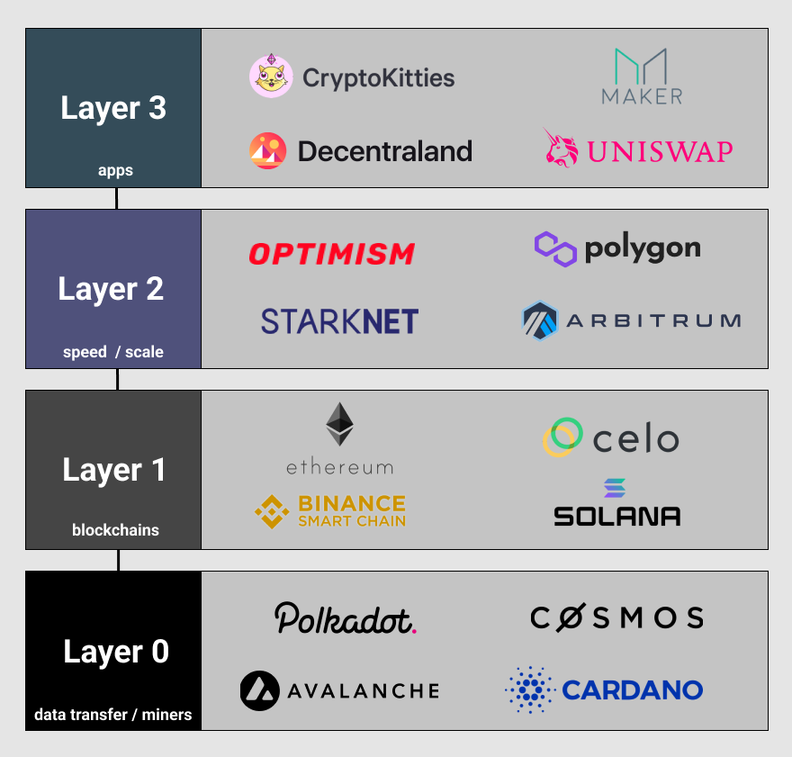
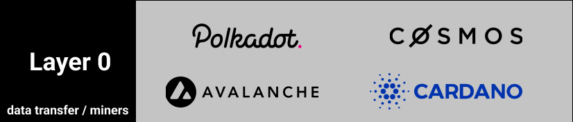
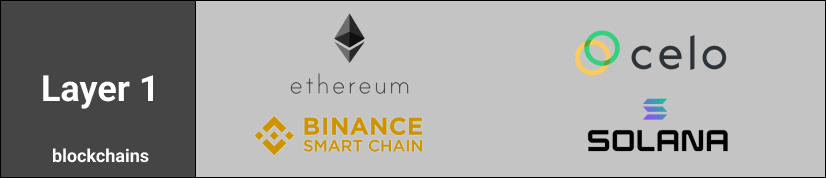
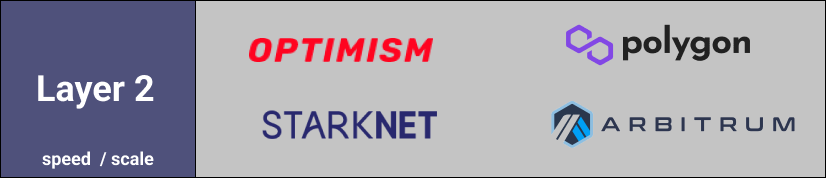
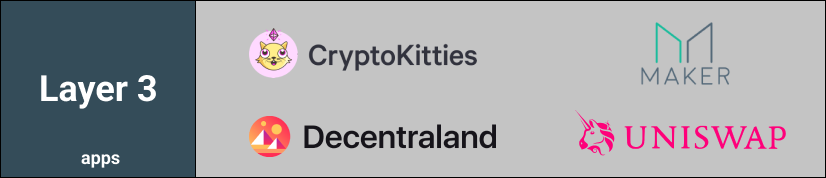
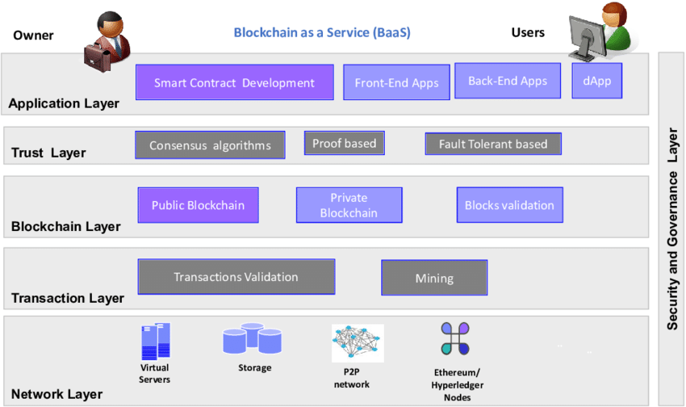
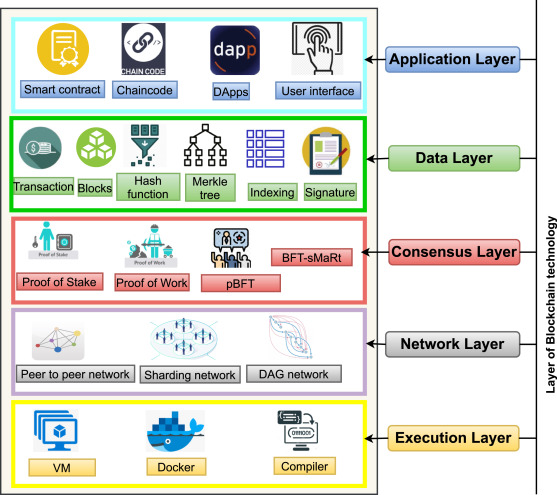
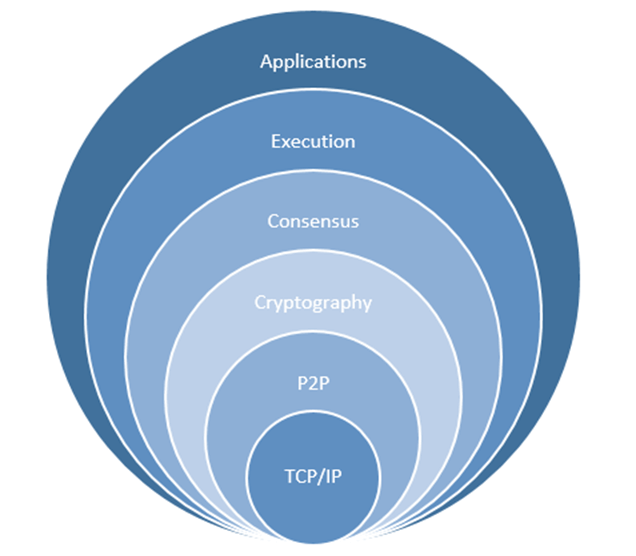

 Similar to the [OSI Model](https://en.wikipedia.org/wiki/OSI_model) from which the internet operates, the Blockchain has operational layers.

## The entire stack
 

## Layer by layer
### Layer 0
 

 The ground floor. This is where the internet, hardware, and connections exist that allow layer 1s like Bitcoin to run smoothly. Layer 0s are allowing several things to happen:

#### Allow blockchains to interact with each other
 * A great example is Cosmos, which creates an ecosystem of interoperable blockchains thanks to its ‘[Tendermint IBC](https://tendermint.com/ibc/)’ (Inter-blockchain communication protocol).
 * For developers, this is massive. If a Dapp can function on one blockchain, it can function automatically on other blockchains so long as they’re built using the same layer 0. No need to invest more time and resources to build the same app on another chain.

#### Faster and cheaper transactions
 With IBC, PoS consensus can be achieved across multiple chains resulting in finality times happening almost instantaneously (finality = when a block is approved, can’t be rolled back, and is considered irreversible). The result is faster and cheaper transactions on cross-chain exchanges.

#### Infrastructure for developers
 Developers don’t need to start from scratch and build their blockchains from the ground up. Many features are pre-built and ready to be implemented immediately.

### Layer 1
 

 Layer 1s are blockchains (Bitcoin and Ethereum) that process and finalize transactions on their own blockchain. This is where things like consensus (PoW, PoS) and all the technical details like block time and dispute resolution take place.

 The most important three aspects of blockchains are conquering the blockchain trilemma: 
  * decentralization
  * security
  * scalability. 
  
  Still no single blockchain has nailed all three.

### Layer 2
 

 Layer 2s are third-party integrations used in conjunction with layer ones to increase scalability and transactions per second (system throughput).

 When you hear zero-knowledge rollups (zk rollups), side chains, or anything to do with speeding up transaction throughput, it’s likely layer 2.

### Layer 3
 

 Layer 3 is the application layer. This is the UI that we as consumers actually interact.

## Related
 
 
 
 

## References
1. Nakamoto, S. (2018) Bitcoin: A Peer-to-Peer Electronic Cash System. 
   https://bitcoin.org/bitcoin.pdf
2. https://ethereum.org/en/whitepaper/
3. [Blockchain design a smart contract for real estate](./Blockchain-layers-Diagram/JournalofInformationSecurity-DesignoftheBCSmartContract-Ausecaseforrealestate-JIS_2018062815280747.pdf)
4. [Blockchain tech layers](./Blockchain-layers-Diagram/Web3_stack.pdf)
5. https://101blockchains.com/consensus-algorithms-blockchain/