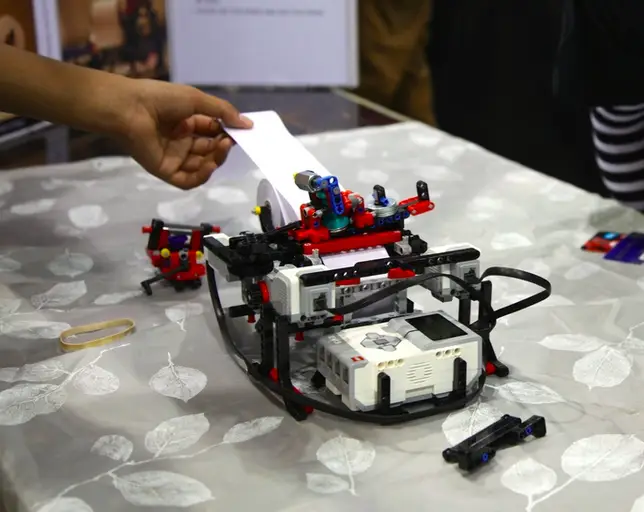


I love LEGO!


# This 13-Year-Old Is So Impressive, Intel Is Investing Hundreds Of Thousands In His Startup

Shubham Banerjee, the 13-year old CEO of the Braille printer-maker Braigo Labs, had no idea what Braille was until last year. 
It was only when he came across a fundraising flyer for the visually impaired that he started to wonder how blind people read. So, like any other seventh grader would do, he asked his parents. His father’s response: Go Google it.

As Banerjee searched the web, he discovered the high cost of Braille printers, which usually cost upward of $2,000. He also learned more about Braille, the tactile writing system used by the visually impaired.

"When I found out the cost of a Braille printer, I was shocked," Banerjee told Business Insider. "I just wanted to help the visually impaired. I had a Lego Robotics kit, so I asked, 'Why not just try that?'"

Built out of [Lego’s Mindstorms EV3](https://brickset.com/sets/31313-1/Mindstorms-EV3) blocks and little pieces from Home Depot (Braigo stands for Braille and Lego), Braigo Lab's printer turned out to function quite well. It earned Banerjee a lot of recognition, too, including [The Tech Awards 2014](https://www.braigolabs.com/the-tech-awards-2014/) and an invitation to the [White House Maker Faire](https://www.whitehouse.gov/maker-faire), an event that awards student entrepreneurs and innovators.

But most importantly, Banerjee believes it could solve a decades-long problem that has been holding back so many visually impaired people around the world: the high cost of Braille printers.

Banerjee says his printer could significantly cut down the price of Braille printers, to less than $500. According to his website, there are 285 million visually impaired people worldwide, and 90% of them live in developing countries. It is not easy to drop a couple grand on a printer, even by a developed country’s standards.

"I want to tell (big company manufacturers) to stop taking advantage of blind people," he says.

Impressed by his product and vision, Intel came calling last September and told him it would invest in his company. And last week, the investment was made official [at the Intel Capital Global Summit](http://newsroom.intel.com/community/intel_newsroom/blog/2014/11/04/16-new-investments-announced-at-intel-capital-global-summit), when Braigo Labs was mentioned as one of the 16 tech startups Intel was investing in this year. Although the exact amount of the investment was not disclosed, it is reported to be [a few hundred thousand dollars](https://www.reuters.com/news/picture/2014/11/09/us-tech-kidentrepreneur?articleId=USKCN0IT0YN20141109&slide=1). That makes Banerjee the youngest tech entrepreneur ever funded by a VC firm.

“I didn’t think such a big company would ever invest in my company; that was pretty amazing,” Banerjee says.

With Intel’s funding, Braigo Labs plans to build a new prototype that better resembles a regular printer and bring it to market by next year. Banerjee says he has no plans to expand into other product categories at this point, but Braille printers seem to be just a part of a bigger dream he has in mind. 

“I want to do engineering in the medical area when I grow up,” he says. “And I want to finish college.”





## Braigo Labs Inc. Shubham Banerjee @ Intel Capital Summit 2014 | Video (6:30 minutes)

 

    start: 0,
    allowfullscreen: 1,
    autoplay: 0,
    hl: en,
    cc_lang_pref: en,
    cc_load_policy: 1,
    color: white,
    controls: 1,
    disablekb: 0,
    enablejsapi: 1,
    fs: 0,
    iv_load_policy: 3,
    loop: 0,
    modestbranding: 1,
    playsinline: 0,
    privacy_mode: yes,
    rel: 0,
    showinfo: 0,
    origin: blog.richiebartlett.com,
    widget_referrer: blog.richiebartlett.com


Shubham Banerjee becomes the youngest Entrepreneur to receive Venture Capital Funding (2014) - Video Credit Intel Capital
BRAIGO LABS INC. RECEIVES INVESTMENT FROM INTEL CAPITAL (www.braigolabs.com)
Funding accelerates development of new braille printer/embosser technology “Braigo” to help the 50 million legally blind individuals worldwide with low cost, silent, portable and IOT-enabled products.

Palo Alto, California, USA – Nov 4, 2014 – Braigo Labs Inc. announced that it has received a seed round investment from Intel Capital, Intel's global investment organization. The funds will be used to further expand the company’s R&D capabilities around the Braigo line of low-cost, portable Braille printer/embosser devices and other products catering to the accessibility markets.

Braigo Labs Inc. was founded by Shubham Banerjee, a middle school student from Santa Clara, California, who invented the open source DIY Braille printer Braigo v1.0 in February 2014 using Lego Mindstorms. He subsequently released a new prototype, BraigoTM v2.0, at Intel Developer Forum (IDF 2014). This consumer-focused braille printer, which uses new technology and an Intel Edison chip, is portable, silent, IOT-enabled and will be offered at a price point well below currently available products for the visually impaired.

Banerjee said: “I have been working with bootstrapped funds from my parents since February 2014. I am ecstatic that Intel Capital is investing early in our effort to disrupt the braille printer/embosser industry."

“It all started with a science fair project idea, but the shocking price of braille printers -- at $2,000 or more – motivated me to start a journey to help the visually impaired,” he added. “Intel Capital’s investment will help open up opportunities for me to work with professionals and eventually bring the product to more than 50 million blind people worldwide.”

The investment was announced at the Intel Capital Global Summit, where investments across a wide range of technology sectors were disclosed – from wearables and the Internet of Things to cloud infrastructure and big data analytics.

“With Intel Capital’s stewardship, Intel continues to invest in pioneering companies that are developing the latest innovations,” said Mike Bell, corporate vice president and general manager of the New Devices Group at Intel.

Terms of the investment, which was led by Intel Capital Managing Director Rob Rueckert, were not disclosed.

About Braigo Labs

Founded by middle school student Shubham Banerjee, Braigo Labs Inc. is committed to creating, researching, designing and developing new technology innovations and services. The mission of the company is to bring "Humanely Optimized" technologies that are innovative, affordable and cater to solving life's problems. Visit www.braigolabs.com, Facebook:/braigoprinter, or follow @braigolabs on Twitter. 

About Intel Capital

Intel Capital, Intel's global investment organization, makes equity investments in innovative technology start-ups and companies worldwide. Intel Capital invests in a broad range of companies offering hardware, software, and services targeting enterprise, mobility, consumer Internet, digital media and semiconductor manufacturing. Since 1991, Intel Capital has invested more than US$11 billion in over 1,400 companies in 57 countries. In that timeframe, 209 portfolio companies have gone public on various exchanges around the world and 363 were acquired or participated in a merger. In 2013, Intel Capital invested US$333 million in 146 investments with approximately 49 percent of funds invested outside North America. For  more information on Intel Capital and its differentiated advantages, visit www.intelcapital.com or follow @Intelcapital.

Email: press@braigolabs.com
