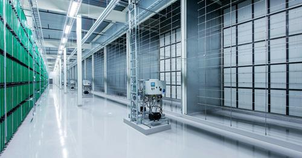


Check out the NODE Pole... Where FB has it's newest DataCenter.


Ever since we humans gave up the nomadic life and started building homes, architecture had one goal: To make life better for humans. But now, a new architecture is taking shape in remote, frozen corners of the world. And it's not designed for humans. It's for machines. In this case, for the remote machines that keep Facebook churning.

In northern Sweden, just below the Arctic Circle, a new form of modular design is being pioneered by architects based more than 5,000 miles away in the heart of Silicon Valley. They're being led by architects like Marco Magarelli, the Datacenter Design Engineering Manager at Facebook, where he's led the company's unusual approach to data centers for the past five years.

As tech companies compete to build smarter, faster, and cheaper, they're sparking a renaissance in modular, prefabricated architecture, and Facebook is leading the pack. I got the chance to chat with Magarelli to find out what it's like to be an architect building houses for most the world's online identities.

## Your Selfies Are Energy-Hogs
Most of us think of the internet as something intangible, a floating, invisible, ectoplasmic world. In reality, the internet is tethered to the physical world by data centers—thousands of them—that handle all of the bits and bytes delivered to your computer.

Magarelli uses the term "magic box" to describe these spaces: the masses know they exist, but they don't quite know how or where. And his job as the architect is "trying to make that box as elegant and effective as possible," he explains.

In my mind, Facebook's magic boxes seemed like they should be pretty straightforward buildings. Slap some servers into a box, throw on some mechanical systems to cool them, make sure it's secure, and you're good to go, right?

Not exactly. As Magarelli explained to me, these are far from normal buildings: Some data centers use more than 100 times the power of a typical office building. They need to be ultra-secure and ultra-stable against hackers, natural disasters, and all kinds of environmental ills. These are the buildings that hold the world's data—if they go, so does our internet. So unsurprisingly, they're booming: the market for modular data centers is [expected to reach $40 billion](http://www.marketsandmarkets.com/PressReleases/modular-data-centers.asp) over the next four years.

Facebook, as the second most-visited site in the world after Google, needs a lot of them. According to Facebook, its users like six billion things per day, and have shared 400 billion photos in total—and all that activity adds up to a whole lot of data. In 2012, Facebook reported that its users took up around 7 petabytes of photo storage from one of its data centers every month.

To handle this exponential increase in demand, two years ago Facebook assigned three engineers to tackle the challenge of "how to scale our computing infrastructure in the most efficient and economical way possible." As it grew, it became known as the [Open Compute Project](http://www.opencompute.org), an initiative to completely overhaul the hardware and network infrastructure of Facebook's data centers. Most importantly, they would put all their work online, making it free for any other company to follow Facebook's lead.

The team at OCP completely redesigned every detail: From more efficient server racks to backup batteries that mean the centers don't need an uninterruptible power source. And just as important as all that network architecture? Actual architecture.

## Making Buildings Like Ikea Furniture
Magarelli joined Facebook in 2009, and as part of the Open Computing Project, he staged a charrette (the architectural equivalent of a hackathon) to bring industry experts in lean construction—a theory of construction efficiency borrowed from manufacturing—into the fold at Facebook.

Out of the event grew [two basic design concepts](http://www.opencompute.org/blog/faster-leaner-smarter-better-data-centers). You could call them Ford and Ikea. The first strategy would be like "assembling a car on a chassis." You build your structural frame, then attach all of the actual components, from lighting to cables, using an assembly line in a factory. The whole shebang would then be driven to the building site on the back of a flatbed truck.

The second scheme—the Ikea concept—was all about flatpack. Rather than assemble the modules in a factory, the pieces of the finished building would be tightly packed into a flat box. Just like your bookcase hardware, the building components were vastly simplified and universalized to avoid mistakes during assembly. By breaking down the building into simple, universal bits, the concept would make building cheaper, faster, and easier—just like Ikea.

Out of these two ideas grew the Rapid Deployment Data Center, or RDDC: What Facebook calls the design of its data centers. A series of pre-assembled modules are shipped to the site and snapped into place at incredible speeds, taking the best of what Ford and Ikea had pioneered.

## Strange Things Done in the Midnight Sun
This year, Facebook will get a chance to test the idea of RDDC. And it seems only appropriate that a design inspired by Ikea will go up in that company's home country: Facebook has [announced a new construction project](https://www.facebook.com/notes/luleå-data-center/starting-work-on-luleå-building-2/587772454624780?id=209648912437138) in Luleå, Sweden, next door to its most recent data center.

Luleå, a city of 46,600 people and several well-known black metal bands, sits far up on the coast of the Baltic, so far it's almost in Finland. Temperatures in Luleå never get very high: The warmest month, July, has an average temperature of 61 degrees Fahrenheit. In February, 6 degrees is the norm. Those subarctic temperatures are a major boon for data center companies, which spend millions of dollars keeping their hard-working servers cool.

But it's not just the cold that brings Facebook here: It's also Sweden's energy infrastructure, which is some of most dependable in the world. It also comes from renewable sources, a major plus for Facebook, which has bought up multiple wind farms here in the US to power its stateside data centers. Other companies are getting in on the action here, too, and some local entrepreneurs have even coined a slick term for the region: [The Node Pole](http://thenodepole.com).

Luleå 2 will be the company's first data center built using Magarelli's flat-pack RDDC concept. It'll be an experiment of sorts—a way to test the ideas that OCP and Magarelli's team have been developing since their charrette. And when it's up and running, the team will take stock and apply what they learned to the next project.

## The Magic Box
Believe it or not, the work Magarelli and the team at Facebook are doing has a precedent from over a century ago. "I think back to the Industrial Revolution and how the buildings adapted to nascent industries," he says. "What does a power plant, or a paper mill, look like? All of these archetypes that have evolved to meet industrial needs."

At the turn of the last century, as the Industrial Revolution gripped Europe and the US, a new type of building emerged: The factory. It became an archetypical symbol amongst architects looking for a new approach to building. Factories were cheap, strong, fast to build, and sometimes even beautiful. Above all, though, they were built based on function, not form. Some factories even became sensations amongst designers: Berlin's [AEG Turbine Factory](http://en.wikipedia.org/wiki/AEG_turbine_factory) is still taught to young architects today. Eventually, there was a free flow of ideas between industrial and avant-garde design. Even today's prefab homes can trace their conceptual roots back to the industrial revolution.

It's hard not to see the parallels between factories and data centers. Each type of building is designed for very specific commercial activities, and each has to adhere to strict budgets and schedules. They are both perfectly utilitarian.

Yet something about the rules and requirements of commercial architecture tends to make invention blossom amongst designers. The data center, just like the factory of the 19th century, is "a whole new type of building," Magarelli adds.

To most of us, the internet cleans up the messiness of the physical world and translates it into something intangible, something neat, something with zero real-world footprint. So it's strange to think that as billions of us sat hunched around our computers focused on an entirely invisible world, we were also feeding the flames of something very tangible.

All of our clicks, uploads, and likes were was forcing Facebook to invent its own archetypical building: A magic box that few of us will ever see, but nearly all of us use all the time.

