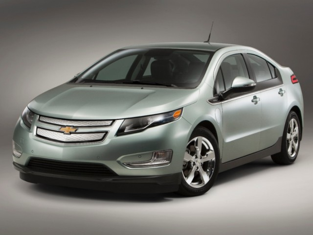

In response to: http://www.chevrolet.com/volt-electric-car/specs/trims.html

> Mom, here's a hybrid car that you can get for about $15,000 after government and GM coupons applied! Think of the gas you can save in a hybrid.

