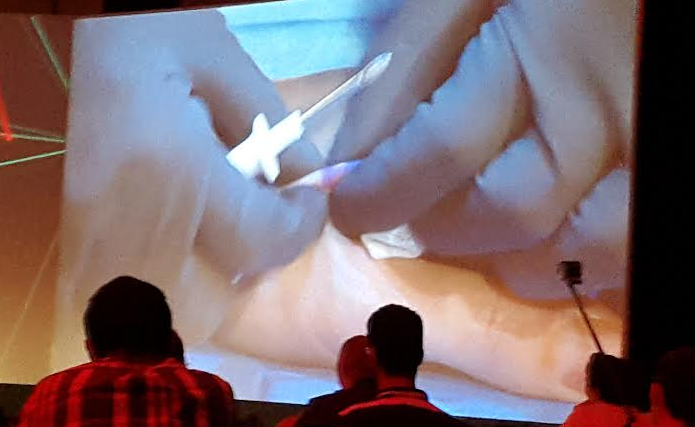


One step closer to "Ghost in the Shell" type of world.


# Chips under the skin: Biohacking, the connected body is 'here to stay'
*Would you be comfortable with a chip in your hand replacing your smartphone and credit card? This is the future, according to a biohacking specialist.*

CANCUN, MEXICO: If you could replace your car keys, website login data, credit cards and bus passes with a chip embedded under your skin, would you?

This is a question addressed this week at the Kaspersky Labs Security Analyst Summit by biohacker Hannes Sjoblad from [BioNyfiken](http://www.bionyfiken.se). A pioneer in what has been deemed 'biohacking," Sjoblad is the leader of a group of biohackers in Sweden who took the first step in experimenting with embedded NFC chips -- by having them implanted into their own hands.

Speaking to attendees at the event, Sjoblad said the controversial technology is in "early stages," but the future is ripe for us to become cyborgs in one way or another.

BioNyfiken, a grassroot open network based in Sweden, is a breeding ground for advancement in the field of biohacking. While it began with a small group of people willing to experiment with everything from "biology to cells to plants to Homo sapiens," in the last few months, over 300 people in the country have now volunteered to have NFC chips embedded in the skin between thumb and forefinger in their hands.

The first step was a successful crowdfunded [Indiegogo campaign](https://www.indiegogo.com/projects/the-xnt-implantable-nfc-chip). The xNT NFC chip implant captured the attention not only of the media but the interest of the general public, and now the network is in full swing. Sjoblad himself has the implant, which he says he has developed in the last few months to replace not only his house keys, but also a bike lock, shop memberships around Sweden and his business card.

However, the biohacker says chips under the skin have the potential to do much more -- and we can expect use to become commonplace in the future.

While the idea of chips embedded under the skin brings to mind the idea of cyborgs, Sjoblad was quick to point out at the conference that they are "already among us" -- thanks to pacemakers, medical implants, insulin pumps and neurally controlled prosthetics. Over time, the development and cost of materials to produce such technology becomes cheaper -- only 10 years ago mapping the human genome costed over $100,000, now it is closer to $10,000 -- and in the same way, rapid miniaturization of technology, lower production costs and demand for increased connectivity will propel under-the-skin smart technology forward.

For those concerned with privacy, the biohacker noted how wearable devices and mobile technology are already collecting and sharing our personal data. Where embedded NFC chips come in, however, is that we can achieve the same results but with "less clutter."

"The weakness in wearables is that people get bored," Sjoblad said. "It is simply another thing that clutters people's lives [..] but we want something which is always on, always there and does not disturb your life."

The biohacker believes that the future of implants can be found in ways to de-clutter your daily life. Keys, credit cards and smartphones are all things we carry around to identify ourselves, but one day, simply swiping your hand could replace these items.

Sjoblad told attendees that by giving his body "the same language" as a computer system via the embedded NFC chip, life can be made more seamless and efficient. This may then open the way for a variety of uses and potentially an ecosystem around the platform -- especially as the Internet of Things (IoT) emerges.

As the launch of Microsoft's Windows desktop changed the face of technology, NFC chip implants have the potential to do the same, according to the biohacker.

What uses could smart implants have in the future? According to Sjoblad, identification and information are the main categories where embedded chips can perform. In terms of identification, embedded NFC chips could be used to access buildings, activate devices -- such as guns locked to one owner -- and could also be used to personalize your daily activities. For example, if you share a car with your significant other, swiping the steering wheel with your NFC-embedded hand could trigger the vehicle to adjust everything from seat position to radio channel based on the preference of the user.

NFC chips under the skin could also be used to authenticate a bank or financial account. Sjoblad says it "makes more sense to have an implant as part of two-factor authentication," perhaps one day replacing smartphone PIN codes sent to verify transactions. In addition, the biohacker believes implants could also be used for activity logging, health, and for information retrieval -- including public encryption keys, your business card, virtual currency wallet or even your shopping list.
So what does the future hold for biohacking? According to Sjoblad, biotechnology and embedded NFC chips will eventually become a quick digital identification process used for everyday purposes. The biohacker says we are likely to see an uptake in chip use if the system is implemented in ways which make everyday life less cluttered and complicated -- such as a way to access and pay for public transport.

Sjoblad also believes health monitoring will eventually move under the skin -- which will result in better data capture and intrusion, insofar that wearable devices designed for health will no longer be necessary.

Finally, the biohacker says that in the future we are likely to see embedded NFC chips improve security and privacy by replacing the traditional password and account login systems.

While Sjoblad says the "connected body is here to stay," whether members of the general public will be willing to undergo implants for such causes, however, remains up for debate.