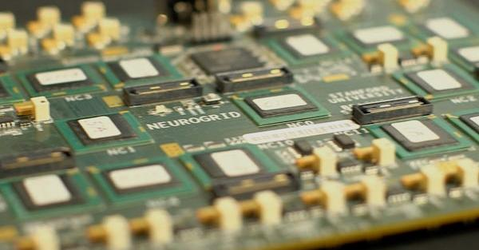



Won't be too long before I can get a brain upgrade too! ;)


# Stanford bioengineers create circuit board modeled on the human brain
Stanford bioengineers have developed faster, more energy-efficient microchips based on the human brain – 9,000 times faster and using significantly less power than a typical PC. This offers greater possibilities for advances in robotics and a new way of understanding the brain. For instance, a chip as fast and efficient as the human brain could drive prosthetic limbs with the speed and complexity of our own actions.

Stanford bioengineers have developed a new circuit board modeled on the human brain, possibly opening up new frontiers in robotics and computing.

For all their sophistication, computers pale in comparison to the brain. The modest cortex of the mouse, for instance, operates 9,000 times faster than a personal computer simulation of its functions.

Not only is the PC slower, it takes 40,000 times more power to run, writes [Kwabena Boahen](http://bioengineering.stanford.edu/faculty/boahen.html), associate professor of bioengineering at Stanford, in an article for the [Proceedings of the IEEE](https://ieeexplore.ieee.org/xpl/RecentIssue.jsp?punumber=5).

"From a pure energy perspective, the brain is hard to match," says Boahen, whose article surveys how "neuromorphic" researchers in the United States and Europe are using silicon and software to build electronic systems that mimic neurons and synapses.

Boahen and his team have developed Neurogrid, a circuit board consisting of 16 custom-designed "Neurocore" chips. Together these 16 chips can simulate 1 million neurons and billions of synaptic connections. The team designed these chips with power efficiency in mind. Their strategy was to enable certain synapses to share hardware circuits. The result was Neurogrid – a device about the size of an iPad that can simulate orders of magnitude more neurons and synapses than other brain mimics on the power it takes to run a tablet computer.

The National Institutes of Health funded development of this million-neuron prototype with a five-year Pioneer Award. Now Boahen stands ready for the next steps – lowering costs and creating compiler software that would enable engineers and computer scientists with no knowledge of neuroscience to solve problems – such as controlling a humanoid robot – using Neurogrid.

Its speed and low power characteristics make Neurogrid ideal for more than just modeling the human brain. Boahen is working with other Stanford scientists to develop prosthetic limbs for paralyzed people that would be controlled by a Neurocore-like chip.

"Right now, you have to know how the brain works to program one of these," said Boahen, gesturing at the $40,000 prototype board on the desk of his Stanford office. "We want to create a neurocompiler so that you would not need to know anything about synapses and neurons to able to use one of these."

## Brain ferment
In his article, Boahen notes the larger context of neuromorphic research, including the European Union's Human Brain Project, which aims to simulate a human brain on a supercomputer. By contrast, the U.S. BRAIN Project – short for Brain Research through Advancing Innovative Neurotechnologies – has taken a tool-building approach by challenging scientists, including many at Stanford, to develop new kinds of tools that can read out the activity of thousands or even millions of neurons in the brain as well as write in complex patterns of activity.

Zooming from the big picture, Boahen's article focuses on two projects comparable to Neurogrid that attempt to model brain functions in silicon and/or software.

One of these efforts is IBM's SyNAPSE Project – short for Systems of Neuromorphic Adaptive Plastic Scalable Electronics. As the name implies, SyNAPSE involves a bid to redesign chips, code-named Golden Gate, to emulate the ability of neurons to make a great many synaptic connections – a feature that helps the brain solve problems on the fly. At present a Golden Gate chip consists of 256 digital neurons each equipped with 1,024 digital synaptic circuits, with IBM on track to greatly increase the numbers of neurons in the system.

Heidelberg University's BrainScales project has the ambitious goal of developing analog chips to mimic the behaviors of neurons and synapses. Their HICANN chip – short for High Input Count Analog Neural Network – would be the core of a system designed to accelerate brain simulations, to enable researchers to model drug interactions that might take months to play out in a compressed time frame. At present, the HICANN system can emulate 512 neurons each equipped with 224 synaptic circuits, with a roadmap to greatly expand that hardware base.

Each of these research teams has made different technical choices, such as whether to dedicate each hardware circuit to modeling a single neural element (e.g., a single synapse) or several (e.g., by activating the hardware circuit twice to model the effect of two active synapses). These choices have resulted in different trade-offs in terms of capability and performance.

In his analysis, Boahen creates a single metric to account for total system cost – including the size of the chip, how many neurons it simulates and the power it consumes.

Neurogrid was by far the most cost-effective way to simulate neurons, in keeping with Boahen's goal of creating a system affordable enough to be widely used in research.

## Speed and efficiency

But much work lies ahead. Each of the current million-neuron Neurogrid circuit boards cost about $40,000. Boahen believes dramatic cost reductions are possible. Neurogrid is based on 16 Neurocores, each of which supports 65,536 neurons. Those chips were made using 15-year-old fabrication technologies.

By switching to modern manufacturing processes and fabricating the chips in large volumes, he could cut a Neurocore's cost 100-fold – suggesting a million-neuron board for $400 a copy. With that cheaper hardware and compiler software to make it easy to configure, these neuromorphic systems could find numerous applications.

For instance, a chip as fast and efficient as the human brain could drive prosthetic limbs with the speed and complexity of our own actions – but without being tethered to a power source. [Krishna Shenoy](http://www.stanford.edu/~shenoy/), an electrical engineering professor at Stanford and Boahen's neighbor at the interdisciplinary [Bio-X](http://biox.stanford.edu/) center, is developing ways of reading brain signals to understand movement. Boahen envisions a Neurocore-like chip that could be implanted in a paralyzed person's brain, interpreting those intended movements and translating them to commands for prosthetic limbs without overheating the brain.

A small prosthetic arm in Boahen's lab is currently controlled by Neurogrid to execute movement commands in real time. For now it doesn't look like much, but its simple levers and joints hold hope for robotic limbs of the future.

Of course, all of these neuromorphic efforts are beggared by the complexity and efficiency of the human brain.

In his article, Boahen notes that Neurogrid is about 100,000 times more energy efficient than a personal computer simulation of 1 million neurons. Yet it is an energy hog compared to our biological CPU.

"The human brain, with 80,000 times more neurons than Neurogrid, consumes only three times as much power," Boahen writes. "Achieving this level of energy efficiency while offering greater configurability and scale is the ultimate challenge neuromorphic engineers face."

*Tom Abate writes about the students, faculty and research of the School of Engineering. Amy Adams of Stanford University Communications contributed to this report.*

*For more Stanford experts in bioengineering and other topics, visit [Stanford Experts](https://experts.stanford.edu/).*

