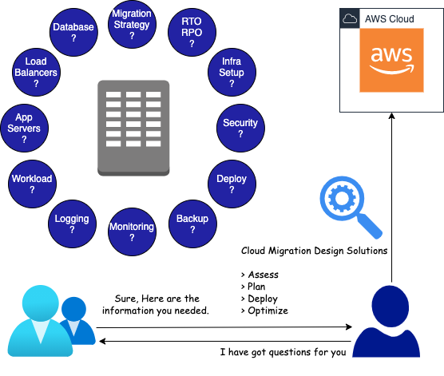

 *The questions you must ask your customers before migrating their on-premise workload to AWS Cloud*

 

## Context
 Many companies operating from their own data centers started migrating their applications to the cloud, and it has become an obvious choice for many startups to create cloud-native applications. This is most important because of the speed of time to market and cost-efficiency in addition to many other benefits of the cloud.

 Many companies operating from their own data centers started migrating their applications to the cloud, and it has become an obvious choice for many startups to create cloud-native applications. This is most important because of the speed of time to market and cost-efficiency in addition to many other benefits of the cloud.

## Scope
 This article covers questions (and the reasons behind them) that you must ask your customers so it makes sense why those questions are important to ask before planning migration to the cloud.

 I have tried to map customer requirements in response to questions asked with major AWS services that can be used while migrating to the AWS cloud.

## Questions You Must Ask Your Customers
 This list is not exhaustive, but it is generic enough to be applied to any public cloud migration.

 * [Why do you want to migrate to the cloud?](#Why-do-you-want-to-migrate-to-the-cloud)
 * [How many code changes can you afford as part of migration?](#How-many-code-changes-can-you-afford-as-part-of-migration)
 * [What type of database are you using?](#What-type-of-database-are-you-using)
 * [What type of load balancers are you using?](#What-type-of-load-balancers-are-you-using)
 * [What application servers and versions are you using?](#What-application-servers-and-versions-are-you-using)
 * [What operating system are you using?](#What-operating-system-are-you-using)
 * [Is your application public facing?](#Is-your-application-public-facing)
 * [Is your application stateful or stateless?](#Is-your-application-stateful-or-stateless)
 * [Is your application containerized?](#Is-your-application-containerized)
 * [What are the current resource requirements of the servers?](#What-are-the-current-resource-requirements-of-the-servers)
 * [How is your workload variation?](#How-is-your-workload-variation)
 * [What are your logging and monitoring requirements?](#What-are-your-logging-and-monitoring-requirements)
 * [What is your current backup strategy?](#What-is-your-current-backup-strategy)
 * [How do you build, package and deploy your application?](#How-do-you-build-package-and-deploy-your-application)
 * [What type of security services are you using?](#What-type-of-security-services-are-you-using)
 * [Where do you store application configuration details?](#Where-do-you-store-application-configuration-details)
 * [How do you manage your infrastructure?](#How-do-you-manage-your-infrastructure)
 * [What are your RTO and RPO requirements?](#What-are-your-RTO-and-RPO-requirements)

 **Note:** You would have thought of many answers and available cloud solutions for the migration by going through all these questions. If not, please brainstorm possible answers before reading further so it will make a lot of sense, and you will be able to relate it with your solutions.

## Why do you want to migrate to the cloud?
### Possible Answers
 * Latency or performance issues in on-premise setup.
 * Issues with aging hardware or license expiry or data center exit.
 * Requirement of managed services which is difficult to set up on on-premises.
 * Need for setting up high availability applications.

### Reasoning and Solutions
 By asking these types of relevant questions, you understand their exact needs, and based on it you can offer different solutions.

 * Design VPC and talk to network people for their networking requirements.
 * Design Multi-AZ solutions for their high availability requirements.
 * Offer different managed services like SNS, SQS, RDS, etc.
 * Deploy applications to regions closer to the users to reduce latency.
 * Offer on-premise to cloud connectivity solutions like Site-to-Site VPN, AWS Direct.

## How many code changes can you afford as part of migration?
### Possible Answers
 * No Code Changes
 * Minor Configuration Changes
 * Redevelopment

### Reasoning and Solutions
 This question helps us to identify the efforts, time, and cost involved in migration.

 I have mentioned different migration strategies in the order of their complexity. It means time and cost will increase proportionally but it will give better flexibility and opportunity for optimization.

 Each migration strategy is mapped with the customer requirements and AWS services that can be used to address it.

### Six R’s as Migration Strategies
 1. Retire — Unprovision legacy systems that don’t require much.
 2. Retain — You can retain some of the services on-premise due to legal/compliance issues.
 3. Rehost (Lift and Shift) — No Code Changes — Use AWS EC2, Elastic Beanstalk
 4. Repurchase (Drop and Shop) — Drop old services and repurchase licenses for third-party services.
 5. Replatform (Lift, Tinker, and Shift) — Minor Configuration Changes — Offer services like RDS, Elasticache, etc.
 6. Refactor/Rearchitect — Redevelopment — Develop cloud-native applications using SQS, SNS, SES, S3, Aurora, DynamoDB, etc.

## What type of database are you using?
 This question helps you understand the features of specific databases used by customers and compare them with cloud-managed services like RDS, Aurora for Relational DB, and Elasticache and DynamoDB for NoSQL.

 * There are some feature parity mismatches for MsSQL and Oracle with RDS that do not allow you to use managed DB services.
 * If you require access to the underlying DB host, then AWS managed services will not work.

 So in these scenarios, you can install the required DB on the EC2 instance; otherwise, you can directly use RDS for migrating your database workload.

 In addition, you can use many other AWS services for Data Migration like AWS DMS, AWS Snowball, AWS Snowmobile, etc.

## What type of load balancers are you using?
### Possible Answers
 * Hardware load balancers
 * Software load balancers like HaProxy, Nginx

### Reasoning and Solutions
 This helps to understand the type of workload customers are running and the performance requirements for load balancers.

 Most web applications running on-premise use hardware load balancers operating at L7 for more flexibility and rich features.

 You can offer equivalent AWS services for their requirement.

 * AWS ALB — Application load balancer operates at L7. Best suited for web applications routing traffic at the application level.
 * AWS NLB — Network load balancer operates at L4. Best suited for real-time high-performance applications.

## What application servers and versions are you using?
 Again this question helps to understand what application servers and versions you are using on-premise. How compatible is its availability on the cloud?

 You can use AWS Beanstalk to deploy Java, Python, Ruby, Nodejs applications, but it may be possible that the version you are using on-premise may not be available. Or, it may be that the version you are using is pretty old, so it is not supported on Beanstalk. Before deciding on anything, do a proper assessment.

## What operating system are you using?
 You need to know if your application is too old to work on the latest operating system. If you have deployed your application to the latest operating system, then there are more chances that it will work on the cloud.

 Most operating systems on the cloud include licensing costs, but there are options where you can bring on your existing on-premise license to the cloud.

 Most operating systems on the cloud include licensing costs, but there are options where you can bring on your existing on-premise license to the cloud.
 

## Is your application public facing?
 This question helps you brainstorms answers for different solutions that may need DNS resolution, caching, latency, authentication, and security.

 This question helps you brainstorms answers for different solutions that may need DNS resolution, caching, latency, authentication, and security.

 It’s important to understand how DNS and CDN are used currently, and which firewall and other security services are being used on-premises to keep malicious traffic out to avoid major DDOS attacks.

 Always try to use managed services for public-facing web applications, as there are fewer chances for going it down.

 * **Route53** — high-performance managed service for public DNS queries to your web applications.
 * **CloudFront** — Low latency and high-performance CDN network for your static resources which reduces overall latency for public-facing applications. You can deploy CloudFront in the regions closer to customers if your customers are spread across regions.
 * **Cognito** — Let’s you add user sign-up, sign-in, and access control to your web and mobile apps quickly and easily using IAM. It scales to millions of users and supports federated identities for all major identity providers.
 * **WAF** — AWS web application firewall. Can be deployed at load balancer, CloudFront, and API Gateway.
 * **API Gateway** — If you are distributing your APIs to your partners and want to have quick measures in place using API keys, rate limiting, and usage plans.

 ## Is your application stateful or stateless?
 It brings out many anti-patterns people are using — like storing session information on the physical machine where the application is running or enabling sticky sessions in load balancers.

 You can offer RDS, DynamoDB, or Elasticache to store sessions externally. Doing this will make applications truly stateless, which is very important for scaling applications.

## Is your application containerized?
 


  Containerized application requires less resources then VMs and starts up in fraction of seconds. Containers package applications into a small, lightweight execution environment which shares host operating systems. Containers help isolate different micro services running in the same host operating system.
  Containerized applications can be deployed using orchestration platforms like Kubernetes which helps in container management, application deployment, scaling which has become standard for cloud application deployment.



 * EC2, Elastic Beanstalk — To deploy non-containerized applications.
 * AWS ECS, AWS EKS — To deploy containerized applications.

## What are the current resource requirements of the servers?
 What are the current resource requirements of the servers?

 You can use memory- and CPU-optimized resources based on the nature of your application but there is no formula to calculate it correctly.

 You need to iterate over multiple times using load test and monitoring performance to find out the correct resource requirement in the cloud.

 * AWS Application Discovery Service — It helps to collect and present configuration, usage and behavior data from your on-premise servers to map capacity on cloud.
 * AWS CloudWatch Metrics — Use it to monitor your application metrics as part of load tests.

## How is your workload variation?
 You need to ask how much traffic variation customers are observing and if there are any specific patterns available.

 * **AWS ASG** — Auto Scaling Group helps applications scale in/out dynamically based on workloads and pattern.
 * **Elastic Beanstalk** — Automatically provisions ASG as opposed to manual provisioning.
 * **ECS/EKS** — You can use containers/pod autoscaling features if your application is dockerized and orchestrated using Kubernetes.

 You can configure different scaling behaviors like simple scaling, target and tracking scaling, and step scaling.

## What are your logging and monitoring requirements?
 You need to get answers about how the different types of logs like operating systems, DB, and application logs are getting stored on-premises. What is their retention period?

 Application pushes metrics to monitoring pipeline and sometimes metrics are created out of logs and pushed to monitoring systems.

### Possible Answers
 * Logs get stored on on-premise servers where the application is running.
 * They get rotated and archived in the same server or other backup servers.
 * Then, they get deleted after a configured retention period.
 * Retention period for metrics is more than a year to get historical data.

### Reasoning and Solutions
 Logs give much more insight about what is going on, so they are very helpful for application debugging, auditing, and tracing the issues.

 Monitoring is an important aspect of an observability platform, which gives information about your application health and how it is performing to take corrective actions before it gets too late.

 * AWS CloudWatch Logs — Store all your logs in Cloudwatch logs, then you can redirect to different logging solutions like ELK, Splunk or S3.
 * AWS Athena — Load logs from S3 and analyze them.
 * CloudWatch Alarm — Create alarms based on search criteria on Cloudwatch logs.
 * AWS S3 — Set S3 lifecycle rules to archive logs in IA Tier or Glacier based on requirement.
 * AWS CloudTrail — Store auditing information and redirect to S3.
 * AWS X-Rays — Use them for tracing requests and responses in microservice based applications.
 * CloudWatch Agents — Applications can be instrumented to create custom metrics, or the metrics can be created out of Cloudwatch logs and pushed to monitoring applications like Wavefront or Prometheus.

## What is your current backup strategy?
### Possible Answers
 * Script creates backup of DB and stores it in backup servers.
 * Need to manually recover DB from backups in case of a disaster.
 * Backups are taken hourly, daily and weekly.
 * Retention period may vary based on type of data.

### Reasoning and Solutions
 Backup plays a very important role in disaster recovery, so you need to plan your backup strategy well in advance as it impacts your customers and business heavily.

 Applications should not store anything on disk, and they should be stateless to have effective backup policies in place for the application and its data.

 * Enable automatic snapshots of RDS backup for a limited retention of 35 days.
 * Script to create manual snapshots with infinite retention periods.
 * Create a regular AMI out of application setup when it gets changed.
 * Use all-in-one service, AWS backup, to address all backup-related needs.

## How do you build, package and deploy your application?
 Jenkins is a standard pipeline for building and packaging applications to address CI needs. People may use different open source or custom tools for their CI/CD needs.
 
 There are different deployment strategies used like blue-green, rolling, and canary deployment based on type of applications and environment where the application is being deployed.

 You can offer AWS Codepipeline, Code Deploy, Code Build, Code Commit, or AWS ECR for all CI/CD related requirements. These integrate well with each other. There are many Jenkins plugins available if you want to use any AWS-native services from Jenkins.

## What type of security services are you using?
 You can get information about current security services being used on-premises — like firewalls and other customer third party tools.

 There are many equivalent AWS services offered.

 * **AWS Guard Duty** — Monitors and analyzes all types of logs; identifies any malicious IP address or domains.
 * **AWS Config** — Continuously monitors AWS resource configuration and takes defined reactive actions on violations.
 * **AWS Shield** — DDOS protection service against malicious web traffic.
 * **AWS WAF** — Protects applications and API behind load balancer, CloudFront, API gateway to block access based on IP address, request origin, request header, and request body.

## Where do you store application configuration details?
 Storing an environment-specific configuration with the main application is an anti-pattern. There may be secret credentials which will be different for each environment, and these should be managed separately for the application’s deployment.

 * Application configuration can be stored in a private git repository.
 * AWS Parameter Store can be used to store configuration information or secret credentials.
 * If there is a requirement of rotating credentials, then you can use AWS Secret Manager for storing credentials.

## How do you manage your infrastructure?
### Possible Answers
 * Custom scripts to provision VMs on-premises.
 * Provisioning tools like Chef, Puppet or Ansible.

### Reasoning and Solutions
 It’s a pain for developers when they must set up applications on new servers or scale up applications during peak periods. Generally, Sysadmin used to manage infrastructure tasks like VM or DB provisioning. What if developers can address their infrastructure needs? That’s Infrastructure as Code (IaC).

 * AWS Cloudformation is the native tool available for provisioning infrastructure resources.
 * Terraform is another cloud-agnostic tool that can be used for infrastructure provisioning.

## What are your RTO and RPO requirements?
 This questions is last, but it is very important for disaster recovery.



  RTO defines the maximum application downtime you can bear case of disaster. If defined RTO is 30 minutes, then the system should be recovered by 3:30 p.m. for a disaster that happened at 3 p.m.

  RPO defines how much data loss (measured in time) you can bear in case of disaster. If the defined RPO is 10 minutes, then you should have all data available until 2:50 p.m. after recovery for a disaster that happened at 3 p.m.



 You can offer the following different disaster recovery solutions based on the increasing order of cost in proportion to better RTO and RPO.

 * Backup and Recovery — Stores backup in S3 and recover from it.
 * Pilot Light — Keeps core components of the application running at low capacity.
 * Active-Passive — Keeps scaled down version of fully running application as standby.
 * Active-Active — Keeps a fully functional application taking traffic in both regions.

 Customers may ask for the best RTO and RPO solution, which comes at different costs, so you should ask customers about costs associated with each of the solutions.

## Conclusion
 I have covered many important questions to gather the required information which you will need before planning any cloud migration. I hope it’s useful.

 Thanks for reading!
