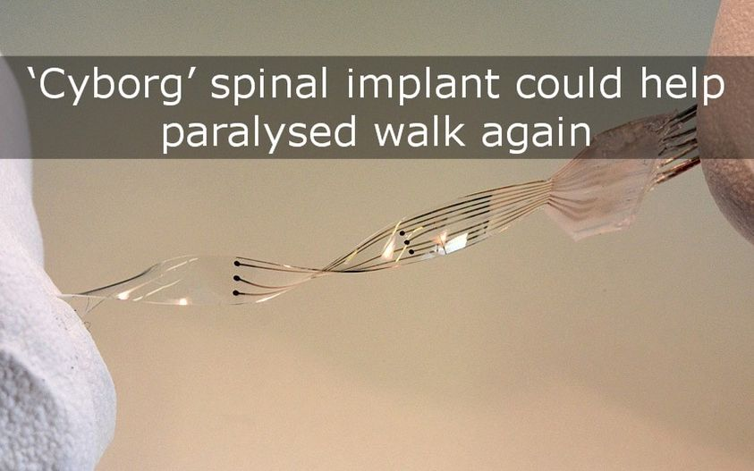


January 16, 2015

Paralyzed patients have been given new hope of recovery after rats with severe spinal injuries walked again through a ‘groundbreaking’ new *cyborg*-style implant.
Read more: http://ow.ly/Hk7Pf

