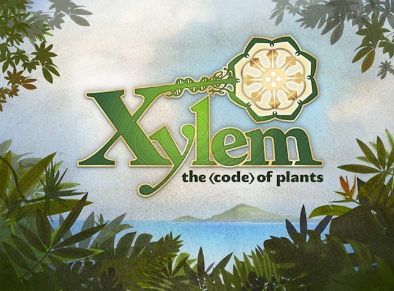


Play the GOV's games for free (labor)...


 DARPA is crowd-sourcing its software testing with a series of online games aimed at seeking out bugs and vulnerabilities.

 

 _The Last Starfighter_ it ain't, but if you ever wanted to get in good with the military without getting out of your chair, the Defense Advanced Research Projects Agency (better known as DARPA) has the job for you. It has created five games as part of what it is calling the Crowd Sourced Formal Verification (CSFV) program, aimed at locating software vulnerabilities in the commercial off-the-shelf IT systems used by military, governmental and commercial bodies.

 Called [Verigames](http://www.verigames.com/home), they allow DARPA to crowdsource formal verification — a time-consuming process whereby engineers usually scour the software manually to find the bugs.

 "The CSFV games translate players' actions into program annotations and generate mathematical proofs to verify the absence of important classes of flaws in software written in the C and Java programming languages," DARPA [explained](http://www.darpa.mil/NewsEvents/Releases/2013/12/04.aspx). "CSFV aims to investigate whether large numbers of non-experts playing formal verification games can perform formal verification faster and more cost-effectively than conventional processes."

 The five games can all be played online for free, and include: [CircuitBot](http://circuitbot.verigames.com/), which sees you linking up a team of robots to complete an objective; [Flow Jam](http://flowjam.verigames.com/), which sees you analysing and adjusting an electrical circuit to maximise the flow of electricity; [StormBound](http://stormbound.verigames.com/), in which you have to unwind streams of symbols and organise them into the most valuable configurations; [Ghost Map](http://ghostmap.verigames.com/), in which you have to navigate a one-way neural network; and [Xylem](http://xylem.verigames.com/), in which you have to classify plants using mathematical formulae.

 "We're seeing if we can take really hard math problems and map them onto interesting, attractive puzzle games that online players will solve for fun," said Drew Dean, DARPA program manager. "By leveraging players' intelligence and ingenuity on a broad scale, we hope to reduce security analysts' workloads and fundamentally improve the availability of formal verification."

 Given that trust in the military is currently at an all-time low — and that the NSA was recently revealed to have been [spying on World of Warcraft](http://news.cnet.com/8301-1001_3-57614940-92/nsa-spycraft-mixes-it-up-with-world-of-warcraft/) players — DARPA may not get quite the level of help it would like. If you would like to check it out, though, head over to the [Verigames website](http://www.verigames.com/home).


