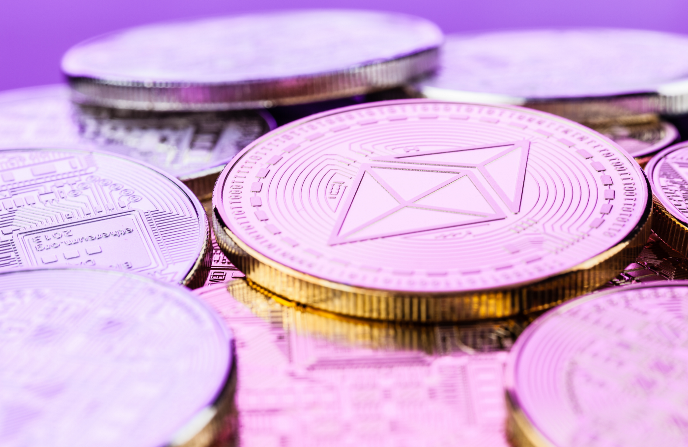

# Now That Ethereum 2.0 Objectively Doesn’t Scale, It’s Dead

 *Arguments against Eth2.0, debunked*

 

 Dead? Ethereum is not dead! “*It just doesn’t scale*.”

 At least that’s what the critics keep yelling at me. “*Ethereum is like a big, juicy bowl of pasta. It’s pure spaghetti code*,” they say.

 I read somewhere recently that the “eventual” move away from Eth is like the 50 years it took to move to gasoline after it was invented. In this regard, “Ethereum killers” like [Avalanche](https://mccallisaiah.medium.com/c573f34a46c0) and [Near Protocol](https://mccallisaiah.medium.com/my-top-3-crypto-projects-to-buy-now-20e7dafe0c7) only need another 2 or 3 years of stability and growth before everyone goes “okay these are better.”

 While there might be a grain of truth to that, the real Ethereum killer is called “Ethereum 2.0.”

 Here’s why.

## Where has ETH 2.0 gone?
 Eth2 is like my dad promising to come home after he left for milk when I was 8. It could happen. But I’m starting to get skeptical.

 Ethereum 2.0 is forever “*2 weeks away*.” It was 2 weeks away in 2020 and in 2021. The same can be said for 2022 as well.

 Well… Eth2 is **finally** happening. In about 2 weeks.

 Ethereum developer Tim Beiko [announced](https://cointelegraph.com/news/3-reasons-why-ethereum-price-can-still-retest-3k-this-month) on Tuesday that they had successfully tested the “Merge.” This is an upgrade to Ethereum that will integrate “Proof of Stake” making transactions greener and more efficient.

 
  
 Proof of Stake gets very technical, but the upshot is Ethereum holders can lock up their tokens (*i.e.* stake them) to provide liquidity to the network. Users are automatically paid more Ethereum as a reward when they do this. And all the users can continue to use Ethereum for those smart contracts without most of the network’s previous detriments.

 However, Eth2.0 _isn’t_ perfect. Here are the pros and cons:

## Things I like about Eth2
 * There will be a [90%](https://medium.com/intotheblock/diving-into-ethereum-2-0-part-ii-altair-the-merge-beyond-874273ae1f8a) issuance reduction for 4 months, meaning the supply of Eth will peak around 120 million and slowly decrease henceforth.
 * Staking yield potentially going up to [10%+](https://www.cityam.com/ethereum-2-0-staking-a-worthwhile-investment/).
 * The total Eth supply will become deflationary (off and on), resulting in the price shooting up like a heroin addict underneath an Oklahoma City underpass.
 * We might see a ProShares or Fidelity ETF pop up as Ethereum continues to “Wow” environmentalists, Soy boys, and [Fortune 500 companies](https://www.cnbc.com/2022/03/15/consensys-doubles-valuation-to-7-billion-with-microsoft-backing.html).
 * Multiple layer 2 solutions are being rapidly developed on Ethereum like Polygon, Immutable X, and Loopring, causing transactions to be dirt cheap

## What I don’t like about Eth2
 * Eth Stakers *cannot* withdraw their staked Eth or rewards until after “the merge” upgrade. There’s still no concrete date.
 * We’re going to have a single-sided market for probably the better part of the next year as the developers continue to roll in Eth2 updates
 * Ethereum 2.0 is not coming in “two weeks.” It’s coming in three months. And in a [recent interview](https://www.youtube.com/watch?v=vh-eAzFUxMo), Ethereum founder Vitalik Buterin seems unsure.
 * The “Environmental Social Governance” (ESG) narrative is catching on for Ethereum. ESG is how Wall St. judges how green an investment is. Of course, this should be a good thing, but seeing as crony capitalist corporation [Black Rock](https://mccallisaiah.medium.com/49664b7001e9) is the one spearheading ESG narratives it’s something to keep a close eye on.

## Did Vitalik Buterin create Frankenstein with Ethereum?

   Vitalik knows there’s a better way to implement a distributed ledger for Smart Contracts than Ethereum2.0, but by the time he figured it out… Well you know how these things go.


Is there any truth to that claim?
Instead of starting over, did Vitalik decide to salvage Ethereum by trying to fix more and more (hard fork after hard fork) turning it into Frankenstein?

 ***NO.***

 Ethereum is becoming increasingly more secure thanks to PoS and Eth2. While all forks (updates) were introduced by the Ethereum developers, these upgrades cannot work without the individual nodes agreeing to the changes.

 Ethereum was created precisely for what we see today — a neutral ground for [revolution](https://mccallisaiah.medium.com/343f31f2b69d) and disruption against big tech and internet applications.

 If given the chance, Vitalik probably wants to do many things over, but we’re in a good spot as it is!

## Bitcoin vs Ethereum 2.0

*Which one is more decentralized?*
*Which will be the better store of value?*
*Which will offer more utility?*


 Here’s something I don’t hear anyone offering in the “[flippening](https://mccallisaiah.medium.com/f51942f90c7e)” debate: Bitcoins' price is forced to fall without new money because miners are expensive to run — so the miners have to sell off their Bitcoin. Ethereum is in the same place.

 However, with Eth2 the selling pressure drops tremendously since PoS validators cost less to operate. (You only need a laptop)

 And although these two projects differ in purpose, they equal out when it comes to advantages as cryptocurrencies.

 Bitcoin is more decentralized while Ethereum can become a better store of value as it continues to burn its total supply (an Eth2 upgrade). And both offer utility in different, yet fascinating ways!

 Ethereum doesn’t have to beat out Bitcoin as a store of value to flip it.

## Final thought
 I get a lot of requests to review low-cap hidden gem cryptocurrencies with 30XXX potential.

 God, writing it feels so cringe. ([@BitBoy Crypto](https://medium.com/u/53c42841efe6))

 I prefer a comfy 3–5x gain with Ethereum or Bitcoin over an unlikely and stressful 30x any day of the week. Even if you have little capital, going to the shitcoin casino is like shoveling money into a California wildfire.

 One final point.

 The time spent debunking bullshit “Bitcoin or Ethereum is dead” articles is a lot more compared to writing them.

 I can write up a good FUD post in minutes — [I’ve done it many times](https://mccallisaiah.medium.com/now-that-crypto-is-objectively-dead-this-is-the-next-big-thing-87bbc7ff55bb) — but trying to explain the full picture from start to finish, and linking the sources, takes serious effort.

 In other words, don’t fall for bullshit. And, you’re a fool if you can’t picture Ethereum reaching 5-figures within the next few years.

---
*Ever since I was a child it was my dream to become a financial advisor. Unfortunately, it never came true. Therefore I am not a financial advisor and you should do your own research and not just listen to random people on the internet. Nothing contained in this publication should be construed as investment advice.*
