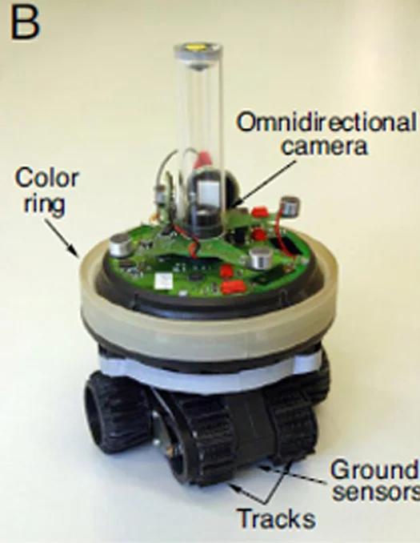


They may not be a T-800, but these little bots have learned "self preservation!" Next, we may find ourselves competing with not other Humans, but the offspring of these bastards.



 *With the development of killer drones, it seems like everyone is worrying about killer robots. Now, as if that wasn’t bad enough, we need to start worrying about lying, cheating robots as well.*

 

 In an experiment run at the Laboratory of Intelligent Systems in the Ecole Polytechnique Fédérale of Lausanne, Switzerland*, robots that were designed to cooperate in searching out a beneficial resource and avoiding a poisonous one learned to lie to each other in an attempt to hoard the resource. Picture a robo-*Treasure of the Sierra Madre*.

 The experiment involved 1,000 robots divided into 10 different groups. Each robot had a sensor, a blue light, and its own 264-bit binary code “genome” that governed how it reacted to different stimuli. The first generation robots were programmed to turn the light on when they found the good resource, helping the other robots in the group find it.

 The robots got higher marks for finding and sitting on the good resource, and negative points for hanging around the poisoned resource. The 200 highest-scoring genomes were then randomly “mated” and mutated to produce a new generation of programming. Within nine generations, the robots became excellent at finding the positive resource, and communicating with each other to direct other robots to the good resource.

 However, there was a catch. A limited amount of access to the good resource meant that not every robot could benefit when it was found, and overcrowding could drive away the robot that originally found it.

 After 500 generations, 60 percent of the robots had evolved to keep their light off when they found the good resource, hogging it all for themselves. Even more telling, a third of the robots evolved to actually look for the liars by developing an aversion to the light; the exact opposite of their original programming!

 So far, the research has more application in explaining the evolution of behaviors in the natural world than in developing new programming for robots. But if you think that means I’m one step closer to trusting robots, then you’re probably the sort who’s attracted to the blue light.

 *The article previously misidentified Lausanne as being in France.