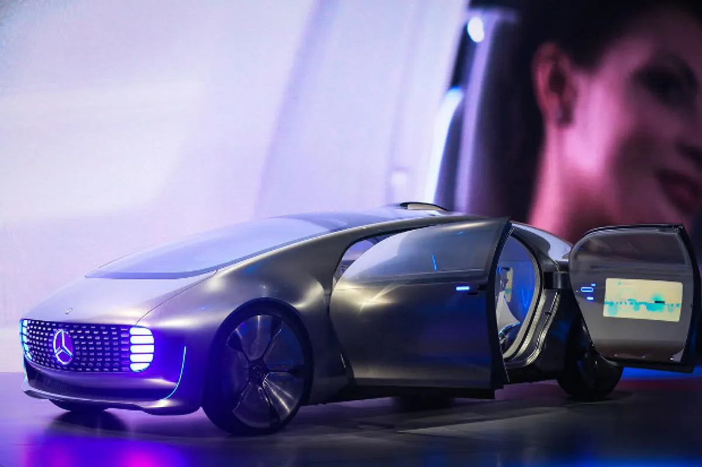
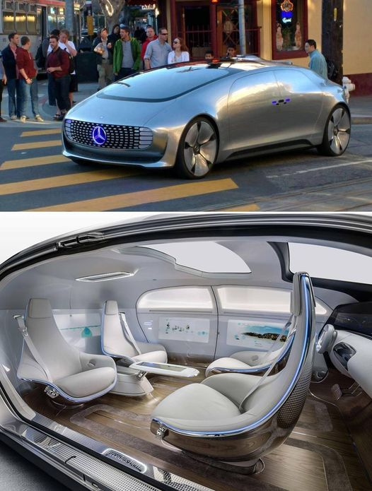


Light-speed ahead HAL9000!


# Germany to digitize autobahn, ready for self-driving car tests
The German Ministry of Transport is paving the way for autonomous cars to hit one freeway with both dedicated and mixed lanes.





A section of the A9 autobahn in Bavaria will soon be opened up for tests of self-driving vehicles, according to the German Ministry of Transport.

But don't expect a [fully autonomous Mercedes-Benz](http://www.cnet.com/news/mercedes-benz-unveils-luxury-concept-self-driving-car/) to be speeding from Munich to Berlin anytime soon. The project is in its early stages, and the ministry is planning to put in place the necessary technology to allow German automakers to test vehicles with autonomous features in real-world driving situations this year.

"The main idea is to digitize the autobahn to make it possible for cars to communicate with other cars and with the street - with the infrastructure itself," a ministry spokesperson told ZDNet.

The digitized autobahn test strip would enable such features as sending in-car alerts to drivers who've entered a ramp in the wrong direction. The system could also alert the police as well as other drivers of the impending danger.

Car makers will be allowed to test some vehicles during normal traffic conditions while others may be given a separate dedicated lane.

An Audi spokesperson said the company did not yet know the details of the ministry's plan, however the company welcomes the possibility to test all kinds of assisted driving functions on Germany's public roads.

Audi and other major German auto brands including Mercedes-Benz, BMW, and Volkswagen have all developed connected cars with various levels of autonomy, from models that have some assisted driving features to completely driver-less concept cars.

The German automakers debuted some of their future visions for the [self-driving cars at this year's CES trade show](http://www.cnet.com/news/self-driving-cars-apple-carplay-and-android-auto-take-over-ces-2015/). Audi sent its self-driving A7 car on a 550-mile journey from San Francisco to the Las Vegas event without any driver interference. BMW showed off a car that could find its own parking space, and VW had a car that could park itself. Also on show at CES was the Mercedes-Benz F015 Luxury in Motion, a concept car designed to be so autonomous that the driver's seat faces the other passengers.

While these cars are visions of the future, some autonomous driving features are already available in cars currently on the market. For instance, Mercedes E- and S-Class models feature partially automated driving that can negotiate traffic jams, and some Volkswagen cars come with 'park assist', a semi-autonomous system which helps drivers enter and exit parking spaces - not quite to the level of a self-parking car but a step in that direction.

In the US, Google has been working on developing commercially-viable, completely autonomous cars within the next five years, [but it has struggled to find an automotive partner for the project](https://www.zdnet.com/article/google-hunts-for-self-driving-car-partners/).

German carmakers seem eager to make progress in the field as well, and in addition to tests in Germany, they have even taken their research and testing to Google's home turf. In September, both Mercedes-Benz and Audi were licensed to test their self-driving cars on the streets of California.

