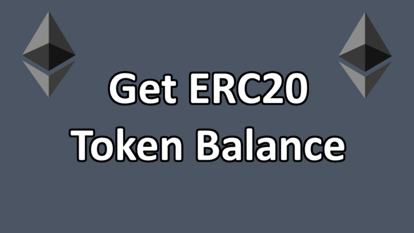
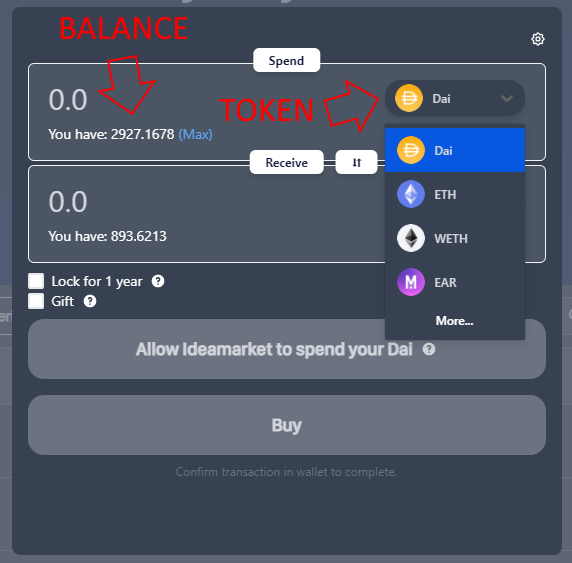
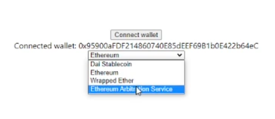
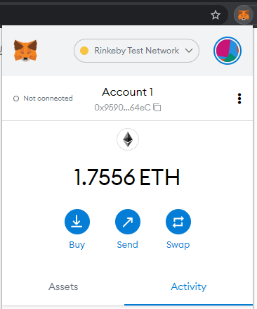
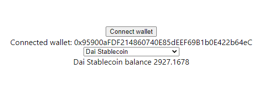

 Hello, in this tutorial I will show you the simplest example possible for how to get any ERC20 token balance for any Ethereum address.

 

 

 During this process, you will also learn how to use smart contracts in your frontend code since they are required to get ERC20 token balances.


## Resources
 * Click here if you’d prefer [video version of this tutorial](https://www.youtube.com/watch?v=n-KdOhe60Yg)
 * [GitHub repo here](https://github.com/Shmoji/token-balance-example)
 
 

 
 ## Project Setup
 To get started, create a [basic Next.JS app](https://nextjs.org/docs/api-reference/create-next-app). Create a src folder at the top of the project and move the `pages` and `styles` folders into it. Then, we’ll just continue creating everything in this `src` folder.

 Go ahead and install all the required dependences. [NPM](https://www.npmjs.com) works fine, but I use [yarn](https://yarnpkg.com), so the command to install everything is `yarn add web3 @web3-react/core @web3-react/injected-connector bignumber.js`

 **Just a note**: you should probably clone the repo or copy/paste from it in order to follow along because I will not cover every single line of code in this tutorial, that would make it way too complicated and lengthy. I will use … to show places where code is missing.

 Next, we need to make it so users can connect to a wallet. Once you can connect to a wallet, then you can start using smart contracts. To keep this tutorial short and simple as possible, I will not show the code for this part because I already made a tutorial on how to do that here:

 
  
 You must understand how to connect users to a wallet before continuing. However, since the template code is slightly different, I’ll explain a bit of that now. Inside `pages/index.js`, you see this:

```javascript
import { useWeb3React } from '@web3-react/core'
import { injected } from '../components/wallet/connectors'
//...
const { activate, account } = useWeb3React()
//...
<button onClick={() => activate(injected)}>Connect wallet</button>
{account ? `Connected wallet: ${account}` : 'Wallet not connected'}
//...
```

 This is just a button that when clicked, connects the user to their MetaMask wallet and then displays visually if they are connected or not.

 To get the most simple example, the next thing we need is a `<select>` to show a list of tokens and some text showing the balance of the selected token. So, in order to show a list of tokens, we need that list to be in data. There will be a bit of data needed for each token, so create a new folder inside `src` that is called *assets*. Inside `assets`, create a file called `token-list-rinkeby.json` . Rinkeby is a test network for the Ethereum blockchain. If you open up this file, you will see an array of objects like this:

```json
{
  "name": "Dai Stablecoin",
  "address": "0x5592EC0cfb4dbc12D3aB100b257153436a1f0FEa",
  "symbol": "DAI",
  "decimals": 18
}
```

 Each object in the array is a token. It has a *name*. It has an *address* which is used with the smart contract in order to get the specific token you want. It has a *symbol* and it has *decimals*, which I’ll explain later.

 If you want to show *mainnet* token balances too, then you will need to create `token-list-mainnet.json` . The reason you need a different list of tokens for rinkeby and mainnet is because the *address* will be different between the same tokens. For example, the DAI address on rinkeby is `0x5592EC0cfb4dbc12D3aB100b257153436a1f0FEa` and on mainnet it is `0x6B175474E89094C44Da98b954EedeAC495271d0F` — this is because they are different smart contract deployments on different networks.

 Now that we have that, we can use these lists on `pages/index.js` like so:

```javascript
import TokenListRinkeby from '../assets/token-list-rinkeby.json'
...
const [selectedToken, setSelectedToken] = useState(TokenListRinkeby[0])
...
<select onChange={(e) => setSelectedToken(TokenListRinkeby[e.target.value])}>
  {TokenListRinkeby.map((token, index) => (
    <option value={index} key={token.address}>{token.name}</option>
  ))}
</select>
```

 At this point, your browser should look like this when you run the local server:

 


## Getting Token Balances
 Now we can dive deeper and actually get that token balance. Inside of the src folder, create a new folder called store. Inside that create a file called contractStore.js. This is where we will actually pull the smart contract into the frontend so it can be used. The code looks like this:

```javascript
import ERC20ABI from '../assets/abi-erc20.json'
export function getERC20Contract(tokenAddress, web3) {
  return web3 ? new web3.eth.Contract(ERC20ABI, tokenAddress, {
    from: web3.eth.defaultAccount,
  })
  : null
}

```

 It uses the web3 library in order to create a new Contract object using ERC20ABI, tokenAddress, and the last argument there.

 ERC20ABI is a key piece of this that comes from `abi-erc20.json`, so go ahead and copy/paste that file at this point. Anytime you are using a smart contract, there will be an **ABI** (Application Binary Interface). It is generated whenever a smart contract is deployed. You really don’t need to completely understand it, but do know that if you’re using some smart contract that you did not create, you can find the ABI online if the creator made it public. For example, to find the one I used in `abi-erc20.json` you can just google “ERC20 ABI”. You can usually just find these on [Etherscan](https://etherscan.io) too.

 The *tokenAddress* comes from the JSON files we created. It tells the smart contract which token we are looking for. Then, the last argument may not be needed, but I always use it. It just provides the connected wallet.

 The next part is probably the most complicated part.


## Using React Hook to Get Token Balance Dynamically
 Inside `src` folder create a new folder called `actions`. Inside it create a file called `useBalance.js` .

 First off, a valid question may be: “why even use a React hook?” — basically because anytime the selected token changes, we want the token balance to change dynamically. This is a perfect use-case for a hook.

 `useBalance` will take in 2 props: *tokenAddress* and *decimals*. When these values change, it will trigger the hook to run again. I’ll talk about that again a little bit later.

 The actual balance is stored at the top and starts with a default of 0:

```javascript
const [balance, setBalance] = useState('0')
```

Then, we get the user’s connected address (account) and the web3 object (library):

```javascript
const { account, library } = useWeb3React()
```

 The rest of this hook is made up of a `useEffect` hook. You see there are 2 functions defined inside: `getBalance` and `run`. So, let’s look at this from a linear perspective. What happens step by step?

 1. The run function is called. Inside `run`, the first thing it does is call the `getBalance` function.
 2. `getBalance` will return 0 if *library* or *tokenAddress* are null and if an error is thrown while calling the smart contract.
 3. If the *tokenAddress* is the zero address, then this means the selected token is the ETH coin. It has an address of 0 because it is not actually an ERC20 token. In this case, we use the `web3.eth.getBalance` function to get the address’ ETH balance.
 4. If *tokenAddress* is not the zero address, then we are dealing with an ERC20 token. So, we use the `getERC20Contract` to get the correct contract based on the selected token. Then, we call its `balanceOf` function and that’s about it.
 5. `getBalance` returns a big number and that is converted to a regular decimal number and we set the balance state. Then, our hook returns the value: `return [balance]`

 I need to take a slight tangent to explain two things I skipped over, which is `ZERO_ADDRESS` and `web3BNToFloatString`. These are both defined in `src/utils/index.js` .

 `ZERO_ADDRESS` is just a string holding the zero address.

 `web3BNToFloatString` takes a web3 big number and converts it into a decimal number. The reason this is needed is because smart contracts will often return a hexadecimal string of a very large number. Then, you have to convert that to a big number using the `BN` class. Then, you need to convert that BN to decimal. I’m not really qualified to explain this in detail, but I just know anytime I’ve used smart contracts in the past, I’ve had to repeat this pattern.

 Also, you’ll notice this is the one place that *decimals* is used:

```javascript
const pow = new BigNumber('10').pow(new BigNumber(decimals))
```

 This is super important because each token uses a different number of decimals. Most use 18, but if you look at USDC, it uses 6 decimals. You can find this value out for any token on Etherscan. I know that explanation wasn’t the best, but hopefully helps.

 Last thing I want to note for this part is the dependency array for the `useEffect`:

```javascript
[tokenAddress, library, decimals, account]
```

 Since *tokenAddress* is in here, this means anytime that prop changes, it will rerun the whole process we just went over and get the newly selected token balance.
 
 That’s pretty much the meat of it, now we just need to hook it up.


## Using the useBalance Hook
 We can use our hook inside `pages/index.js` like this:

```javascript
const [balance] = useBalance(
  selectedToken.address,
  selectedToken.decimals
)
```

 Then, in the template code we can display the balance with this:

```javascript
{selectedToken.name} balance {balance}
```

 and now everything should work! Switch to the browser and make sure you have MetaMask set to rinkeby:

 

 If you want to see token balances for mainnet, then you need to switch the code inside `pages/index.js` to use `token-list-mainnet.json` . Most real applications will have this work conditionally and detect the correct network.

 Now your browser should look something like this:

 

 That’s about it. You now know how to use smart contracts in order to retrieve token balances for any Ethereum address!

 If you have any questions, feel free to ask.
