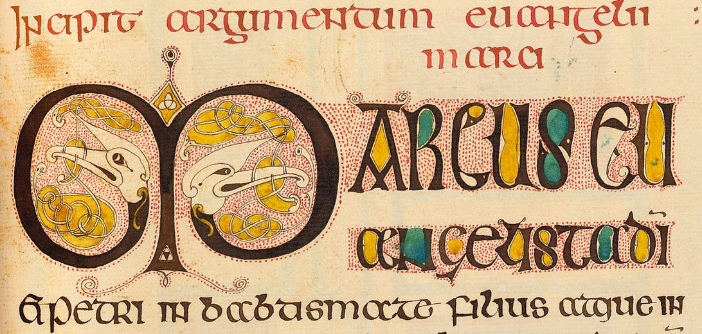
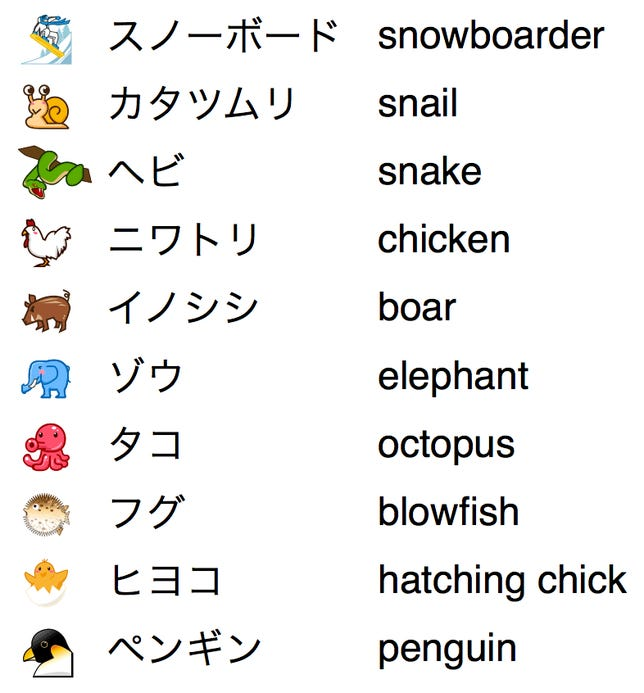
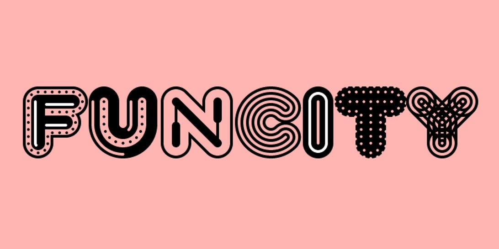



cool


# Get ready for multicolor fonts -- maybe in motion, too

 Impelled by a need to support emoji characters, Mozilla, Adobe, Microsoft, and Google are working to standardize technology for showing fonts that aren't just black and white.

 

 For a few decades now, fonts have been monochromatic -- just the thing for putting black ink on white paper. But publishing has gone digital, and the era of the multicolored font is beginning.

 The [Motion Pictures Experts Group (MPEG)](http://mpeg.chiariglione.org/standards/mpeg-4/open-font-format) standards group last week began a project to standardize chromatic fonts -- those with multiple colors. Vladimir Levantovsky, a Monotype Imaging employee who serves as chairman of the group's font work, said he expects to merge technology from Mozilla, Adobe, Google, and Microsoft into a standard.

 The impetus for the work was the need to support emoji, the colorful emoticons, icons, and pictures that gradually are expanding in use. But the work will expand to traditional typography, too, Levantovsky said.

 "I am sure this technology will bring us a whole new era of polychromatic fonts," he said. "Emoji is just one of the use cases and it is certainly a significant one because it was the catalyst for color font creation, but I am sure there is much more to come."

 Today, it's possible to use multicolored fonts, called chromatic fonts, but it's awkward. Typically, a designer will combine two or more fonts that are designed to work together in layers to form, in effect, a single typeface. To do so, the designer must overlay the different layers of text in exactly the same place, something that can make editing and repositioning awkward.

 With color-font support, the hassles of alignment, editing, and other changes disappear. But there's more, too: instead of just using different blocks of a single color, as with current chromatic fonts, the new standard will let people define gradients that gradually change from one color to another or that become gradually transparent.

 And then there's animated motion.

 "The 'traditional' chromatic fonts have been available for quite some time," Levantovsky said. "This new technology will make it much easier to create new fonts that utilize the same concept of multiple colored layers plus additional capabilities for color and opacity gradients and animation."

 

 Animation could be very handy for things like winking emoticons, but also could be as annoying as the blink tag that made 1990s Web pages flicker and distracting animated-gif avatars that won't hold still.

 MPEG, which has created standards like the widely used AVC/H.264 video compression technology and its newer HEVC/H.265 successor, might seem an unusual forum for standardizing fonts. But it's actually been involved already in standardizing the [Open Font Format](http://mpeg.chiariglione.org/standards/mpeg-4/open-font-format). That's the technology that's better known by Microsoft's trademarked name, OpenType.

 MPEG has issued two OFF standards. The chromatic font work is part of a new revision in the works.

 How soon will it be done?

 "The initial development work required to harmonize the proposals may take up to three to six months," Levantovsky said. " I'd guess that the final approval and publication of the new version of the OFF standard may most likely happen in mid-2015"

 [Mozilla and Adobe worked together](http://blogs.adobe.com/typblography/2013/10/svg-opentype-genesis.html) on the font technology and settled on another standard called Scalable Vector Graphics (SVG) to handle the underlying drawing duties. SVG support is built into browsers, so the choice wasn't difficult for scenarios where Web rendering is possible, and indeed Adobe and Mozilla began their work in a World Wide Web Consortium community group.

 

 But chromatic fonts need to be shown beyond just the Web, and and SVG can't be counted on to exist beyond browsers.

 Consequently, MPEG asked for ideas, and it got three proposals: a color bitmap approach from Google, a layered color outline approach from Microsoft, and the SVG approach from Adobe and Mozilla.

 "After reviewing and discussing the proposals and in an attempt to balance the features vs. implementation complexity, the decision was made to harmonize all three proposals as part of the future version of the OFF standard," Levantovsky said.

 

 