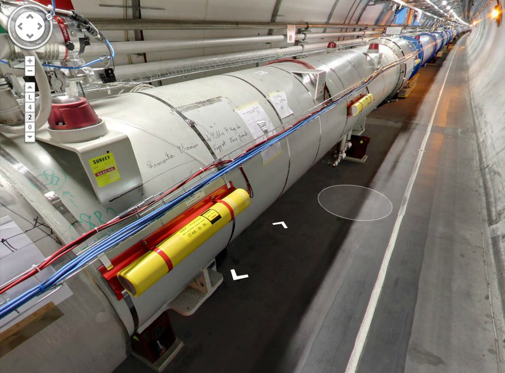



A "Smashing" street view through the Hadron collider!


 Explore the tunnels and control rooms of the world's biggest particle collider from the comfort of your own home using Google Street View.

 

 Perhaps Google Street View should be renamed "Google Anything View." Google's wandering cameras have now made their way into [CERN's Large Hadron Collider](http://googlepolicyeurope.blogspot.co.uk/2013/09/street-view-arrives-at-cern.html), the atom-smashing wonder located under the Franco-Swiss border.

 Since it wasn't feasible to send a Google Street View car into the Large Hadron Collider facility, a specially equipped trike was employed instead. The Street View explorations are now available online for the public to peruse. You can follow along [through the tunnels](https://www.google.com/maps/preview#!data=!1m8!1m3!1d3!2d6.018558!3d46.253913!2m2!1f306.08!2f78.49!4f75!2m4!1e1!2m2!1sPwHC1mn7oBMAAAQJODm7Kw!2e0&fid=5) of the particle collider and pretend you're on the staff at CERN.

 CERN issued a [notice to employees](http://home.web.cern.ch/cern-people/updates/2013/06/google-street-view-begins-imaging-cern) to go about business as usual when the Street View team showed up, and to not display any banners or signs. Employees visible in the Street View images have all had their faces blurred out for privacy.

 You can easily get lost in the details of this Street View, panning around, checking out the signs and equipment. There's a helium-release point caution sign, an emergency-stop button, and tons of mysterious bits of hardware and scientific graffiti on the walls and tubes in the tunnel.

 The control rooms are a fascinating stop as well. The ALICE experiment, a project dedicating to finding answers about the beginning of the universe, has a busy control room full of workstations and scientists. It's a fascinating tour through one the biggest and boldest science projects ever created.

 