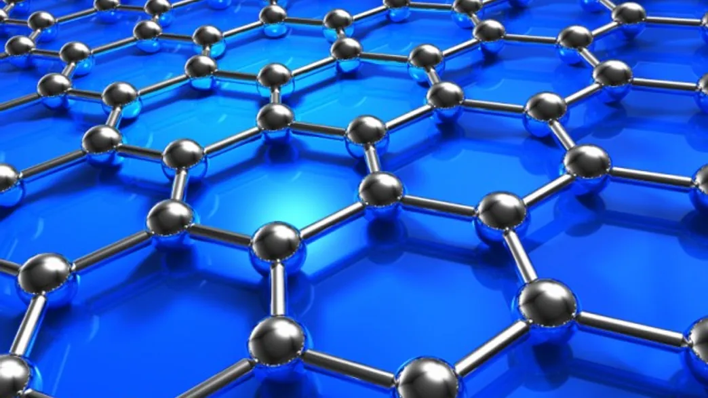

The amount of sunlight that hits the Earth [every 40 minutes](http://www.txses.org/solar/content/solar-energy-facts-you-should-know) is enough to meet global energy demands for an entire year. The trick, of course, is harnessing it and converting it into useful electricity. A new study has revealed that tweaking graphene allows it to generate two electrons for every photon of light it receives. This could double the amount of electricity currently converted in photovoltaic devices. Marco Grioni from École Polytechnique Fédérale de Lausanne (EPFL) in Switzerland is one of the senior authors on the paper, which was published in [Nano Letters](http://actu.epfl.ch/news/graphene-multiplies-the-power-of-light/). 

Graphene is a monolayer of carbon atoms arranged in a honeycomb pattern. It is incredibly light, flexible, exponentially stronger than steel, and capable of conducting electricity even better than copper. In order to make it useful in photovoltaic devices, the researchers needed to have a better idea of graphene’s mechanism for converting light into electricity. This process takes only a femto-second (10-15 sec), which is too quick to easily study. 

To learn more about how this energy conversion takes place, the graphene was subjected to a treatment called “ultrafast time- and angle-resolved photoemission spectroscopy” (trARPES). The material was placed in an ultra-high vacuum chamber and blasted with ultrafast laser light, which excited the electrons and made them more capable of carrying an electrical current. A second laser emitted pulses of light, recording the current energy level of each electron in each pulse. These images were then put together, kind of like a flip book, to portray the action that happens on such a short timescale.

The researchers facilitated the conversion process by [‘doping’ the graphene](http://actu.epfl.ch/news/graphene-multiplies-the-power-of-light/). That is, they improved the material’s photovoltaic prowess by chemically altering the number of electrons, thereby exciting them. When a photon comes and knocks an electron back to the ground state, that one electron is able to excite two more, generating the electric current.


This indicates that a photovoltaic device using doped graphene could show significant efficiency in converting light to electricity


Doped graphene appears to be a great material to easily release the electrons and use extra energy to excite other electrons, rather than waste the energy as heat. Unfortunately, the material needs a little help in absorbing light; a key requirement for photovoltaic devices. Graphene will need to be combined with other ultra-thin materials, such as tungsten diselenide or molybednium disulphide, like has been attempted in previous studies. This could possibly be the key in bumping solar energy conversion from its assumed plateau of 32% up to an astonishing 60%; an increase that could revolutionize solar energy. Moving forward, the researchers are planning to use similar measures to investigate the photovoltaic properties of other ultra-thin materials, including molybednium disulphide.

