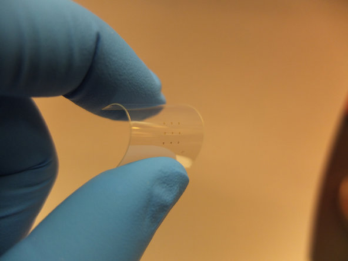
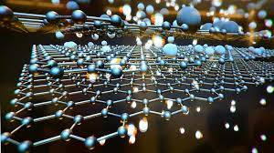



Who needs plastic made from oil products when you have tons of carbon to make something far better?!


 

 I just want to say one word to you. Just one word.

 No, fans of “The Graduate,” the word isn’t “plastics.”

 It’s “graphene.”

 Graphene is the strongest, thinnest material known to exist. A form of carbon, it can conduct electricity and heat better than anything else. And get ready for this: It is not only the hardest material in the world, but also one of the most pliable.

 Only a single atom thick, it has been called the wonder material.

 Graphene could change the electronics industry, ushering in flexible devices, supercharged quantum computers, electronic clothing and computers that can interface with the cells in your body.

 While the material was discovered a decade ago, it started to gain attention in 2010 when two physicists at the University of Manchester [were awarded](https://www.nytimes.com/2010/10/06/science/06nobel.html) the Nobel Prize for their experiments with it. More recently, researchers have zeroed in on how to commercially produce graphene.

 The [American Chemical Society](https://phys.org/wire-news/111238967/wonder-material-graphene-could-revolutionize-cell-phones-solar-p.html) said in 2012 that graphene was discovered to be 200 times stronger than steel and so thin that a single ounce of it could cover 28 football fields. Chinese scientists have created a graphene aerogel, an ultralight material derived from a gel, that is one-seventh the weight of air. A [cubic inch](https://www.extremetech.com/extreme/153063-graphene-aerogel-is-seven-times-lighter-than-air-can-balance-on-a-blade-of-grass) of the material could balance on one blade of grass.

 “*Graphene is one of the few materials in the world that is transparent, conductive and flexible — all at the same time*,” said [Dr. Aravind Vijayaraghavan](https://www.manchester.ac.uk/research/aravind/personaldetails), a lecturer at the University of Manchester. “*All of these properties together are extremely rare to find in one material.*”

 So what do you do with graphene? Physicists and researchers say that we will soon be able to make electronics that are thinner, faster and cheaper than anything based on silicon, with the option of making them clear and flexible. Long-lasting batteries that can be submerged in water are another possibility.

 In 2011, researchers at Northwestern University [built a battery](https://www.northwestern.edu/newscenter/stories/2011/11/batteries-energy-kung.html) that incorporated graphene and silicon, which the [university said could lead](https://onlinelibrary.wiley.com/journal/10.1002/%28ISSN%291614-6840) to a cellphone that “stayed charged for more than a week and recharged in just 15 minutes.” In 2012, the American Chemical Society said that advancements in graphene were leading to touch-screen electronics that “could make cellphones as thin as a piece of paper and foldable enough to slip into a pocket.”

 Dr. Vijayaraghavan is building an array of sensors out of graphene — including gas sensors, biosensors and light sensors — that are far smaller than what has come before.

 And last week, researchers at the Samsung Advanced Institute of Technology, working with Sungkyunkwan University in South Korea, said that Samsung had figured out how to create high-quality graphene on silicon wafers, which could be used for the production of graphene transistors. Samsung said in a statement that these advancements meant it could start making “flexible displays, wearables and other next-generation electronic devices.”

 Sebastian Anthony, a reporter at Extreme Tech, said that Samsung’s breakthrough could [end up being](https://www.extremetech.com/extreme/179874-samsungs-graphene-breakthrough-could-finally-put-the-wonder-material-into-real-world-devices) the “holy grail of commercial graphene production.”

 Samsung is not the only company working to develop graphene. Researchers at IBM, Nokia and SanDisk have been experimenting with the material to create sensors, transistors and memory storage.

 When these electronics finally hit store shelves, they could look and feel like nothing we’ve ever seen.

 [James Hone](https://hone.mech.columbia.edu/), a professor of mechanical engineering at Columbia University, said research in his lab led to the discovery that graphene could stretch by 20 percent while still remaining able to conduct electricity. “You know what else you can stretch by 20 percent? Rubber,” he said. “In comparison, silicon, which is in today’s electronics, can only stretch by 1 percent before it cracks.”

 He continued: “That’s just one of the crazy things about this material — there’s really nothing else quite like it.”

 The real kicker? Graphene is inexpensive.

 If you think of something in today’s electronics industry, it can most likely be made better, smaller and cheaper with graphene.

 Scientists at the University of California, Berkeley [made graphene speakers](https://www.technologyreview.com/view/512496/first-graphene-audio-speaker-easily-outperforms-traditional-designs/) last year that delivered sound at quality equal to or better than a pair of commercial Sennheiser earphones. And they were much smaller.

 Another fascinating aspect of graphene is its ability to be [submerged in liquids](https://www.sciencedaily.com/releases/2012/01/120126100639.htm) without oxidizing, unlike other conductive materials.

 As a result, Dr. Vijayaraghavan said, graphene research is leading to experiments where electronics can integrate with biological systems. In other words, you could have a graphene gadget implanted in you that could read your nervous system or talk to your cells.

  
 
 But while researchers believe graphene will be used in next-generation gadgets, there are entire industries that build electronics using traditional silicon chips and transistors, and they could be slow to adopt graphene counterparts.

 If that is the case, graphene might end up being used in other industries before it becomes part of electronics. Last year, the Bill and Melinda Gates Foundation [paid for the development](https://www.extremetech.com/extreme/171417-bill-gates-funds-creation-of-thin-light-impenetrable-graphene-condoms) of a graphene-based condom that is thin, light and impenetrable. Carmakers are exploring building electronic cars with bodies made of graphene that are not only protective, but act as solar panels that charge the car’s battery. Airline makers also hope to build planes out of graphene.

 If all that isn’t enough, an international team of researchers based at M.I.T. has [performed tests](https://cleantechnica.com/2013/12/23/mit-team-shows-how-graphene-could-work-in-quantum-computer/) that could lead to the creation of quantum computers, which would be a big market of computing in the future.

 So forget plastics. There’s a great future in graphene. Think about it.

 ---
 RELATED LINK:
 https://www.forbes.com/sites/tomkonrad/2013/09/18/graphene-stock-investing-what-the-pros-think