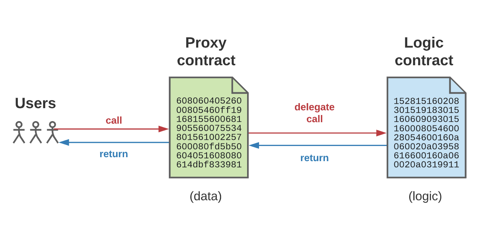
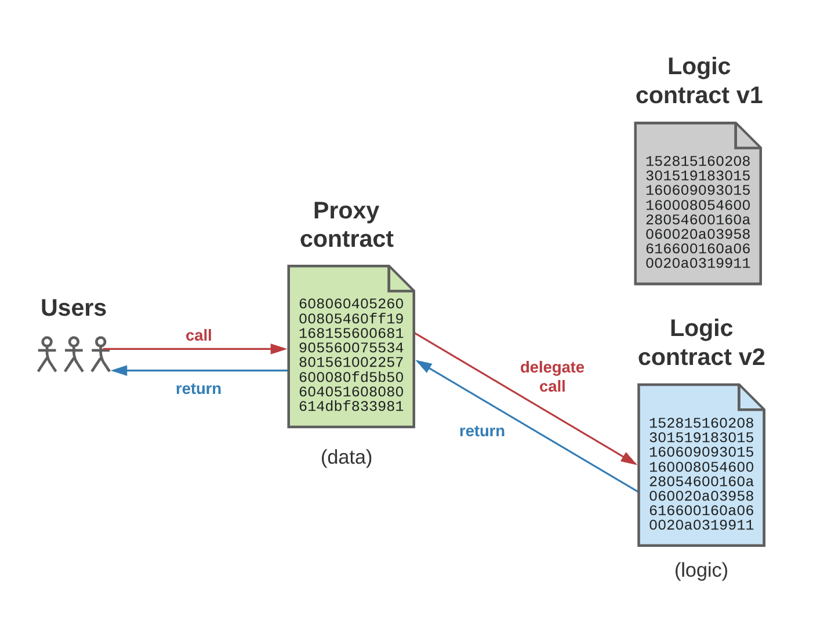
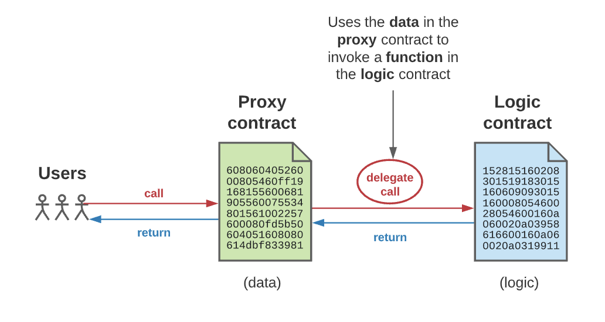
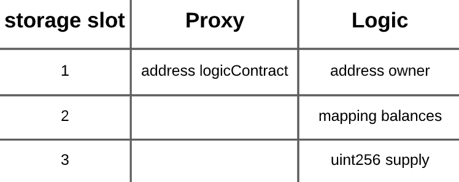
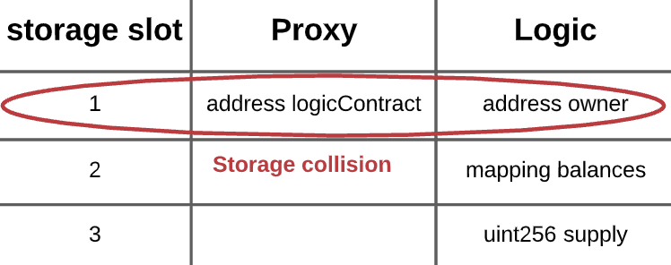
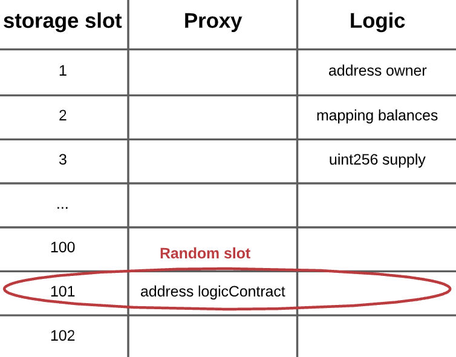

 Here’s something most new Web 3.0 developers have trouble understanding: when you ship code, it can’t be patched and updated later. This is a big departure from the iterative development method that we all know and love — where we break development into smaller parts and build it up over many iterations. By adding features one-by-one, we can improve app functionality over time — all while growing a user base. In Web3.0, this just cannot be done.


## Iterative development lets us build in stages
 We’ll talk about Web3’s *waterfall* method in a moment. But first, a primer on iterative development is in order. There are a few advantages to building applications this way:

 1. **Detect Errors Early**

    By building software in stages, we can build, test, and ship code piece-by-piece. This lets us find errors in the early stages and fix them as we go, avoiding downstream consequences, such as a few small errors impacting the full application.

 2. **Faster User Feedback**

    Since we ship the app in iterations, iterative development lets us get feedback quickly and cyclically. Not only does this let us make necessary bug fixes, but it also helps us shape the future roadmap based on real-time feedback from users.

 3. **Less Time Planning**

    Iterative development saves us time on writing elaborate documentation, so we can spend more time building and testing and less time writing and theorizing.


## But this changes in Web3
 Of course, blockchain changes everything — including the possibility for iterative development. Most new software developers are shocked to learn this, but it makes sense once you get a handle on how smart contracts work.

 Let’s use the Ethereum blockchain as an example. 
 
  
  
  
  
 


Ethereum is a globally accessible state machine that can only be updated via consensus. As an immutable state machine, we can write state (*i.e.*, data) to it, but we can’t update the state. That means:

 * Everything we write to the blockchain is permanent.
 * Ethereum smart contracts are immutable; they can’t be altered once created.

 There’s a good reason for this: smart contracts let us create an unbreakable contract among participants. But it also means we’re stuck with the contracts forever. So, bug fixes and improvements just aren’t possible.

 If you're coming from Web 2.0, you might be wondering why anyone would develop something that can't be updated. It might even be scary to think about. This is why many crypto projects take months and sometimes years before deploying their app onto the blockchain — any bug or vulnerability in the smart contract could cost millions of dollars.

 There are countless examples of such hacks, which you can read about [here](https://medium.com/firmonetwork/3-famous-smart-contract-hacks-you-should-know-dffa6b934750), [here](https://www.reuters.com/technology/how-hackers-stole-613-million-crypto-tokens-poly-network-2021-08-12/), [here](https://www.coindesk.com/tech/2020/09/17/the-55m-hack-that-almost-brought-ethereum-down/), [here](https://consensys.github.io/smart-contract-best-practices/known_attacks/)... and many more which you will find with a simple Google search.


## What if we absolutely need to make an update?
 That brings us to our next question: what if we absolutely need to make an update?

 Let’s say a developer made a million-dollar mistake; someone hacked their smart contracts and drained a lot of money. Of course, something must be done to stop other users from using those smart contracts — but this is a very tedious process.

 Here’s what typically happens in this scenario:

### Step 1
 ‍The second you discover the vulnerability, you must immediately tell your users and pause your smart contracts (of course, this assumes you built in logic that lets you do this). By pausing the smart contacts, you do two things: first, make it explicit that users shouldn’t use them, and second, prevent attackers from taking advantage of users unaware of the vulnerability.


### Step 2‍
 Next, you need to recover your data so you can migrate to the new smart contracts. Remember that in Web3, your smart contracts store both the logic and data for your application. When you deploy a new smart contract with updated logic (that fixes your vulnerability), you need to recover that data; otherwise, everything would be erased. Examples of data you would recover are:

 * account balances of your users
 * public variables stored in the smart contract
 * private variables stored in the smart contracts‍

### ‍Step 3‍
 Next, you write and initiate your new contracts with the recovered data. If you have very little data, this process can be done in one transaction. However, if you have a lot of data, then it must be broken up into many smaller transactions. Recall that writing data to the Ethereum blockchain costs money, which is paid in “Gas.”  Ethereum has a “GasLimit” for each transaction; if the gas cost of a transaction exceeds this limit, miners won’t include it in a block.


### Step 4‍
Deploying a new contract means that the contract address has changed. So, you now need to update all contracts that interacted with the old contract with the new address. Moreover, you need to let your users know that this is the new contract they should use. This requires a lot of social coordination, and it’s not always straightforward, but it’s very possible.

The benefit of this tedious approach is that we aren’t sacrificing immutability, which is a fundamental property of smart contracts. However, there’s no denying the tedium of migrating data and convincing users to move over. That’s why anyone deploying smart contracts onto the blockchain must create a migration plan *before* deployment — that way, they have a backup plan if they discover a vulnerability down the line.


## Building upgradeable smart contracts: A backdoor approach
 While the manual approach we just discussed works, it still isn’t ideal. There are a lot of examples in which millions of dollars worth of Ether were stolen or hacked which could have been saved if we could update the smart contracts. Having the ability to upgrade contracts is useful not only for iterative development, but also for fixing serious bugs that could wipe away people’s savings.

 This is why the Ethereum community (specifically, OpenZeppelin) came up with the concept of an **“upgradeable smart contract**.”
 

 The concept is simple. We have a “proxy contract” and a “logic contract.”  The proxy contract ***delegates*** to the logic contract. Your end-users always interact with your proxy contract, which stores all of your application data. However, the actual logic for the method is stored in the logic contract.

 When users interact with the proxy contract, it forwards those transactions to the logic contract and retrieves the return data from the function call. The data is then forwarded back to the caller.

 

 So, when you need to update logic, you simply update the logic contract and re-deploy it.

 

 Note that both smart contracts are still immutable. You’re simply swapping out which logic contract the proxy contract calls. Since users are only interacting with the proxy contract, you would not have to do an elaborate song and dance to get everyone to switch over to new contract.


## How does a proxy contract work under the hood
 The proxy contract has only one method defined on it: the [fallback function](https://solidity.readthedocs.io/en/v0.8.14/contracts.html#fallback-function). This is executed on a call to the contract if none of the other functions match the given function signature. So, when the proxy contract is called, since no other methods are defined, the fallback function is invoked. The fallback function has logic that tells the contract to forward the call to the logic contract. It can do this without knowing anything in particular about the logic contract’s interface.

 If you are unfamiliar with [Solidity](https://solidity.readthedocs.io), you might be wondering how a smart contract can forward a function call to another contract. Solidity had a concept called [“delegatecall](https://docs.soliditylang.org/en/v0.8.14/introduction-to-smart-contracts.html),” which is similar to a contract call, except with a slight twist.

 Let’s say we have Contract A that executes `delegatecall` to Contract B, then Contract B's code is executed with Contract A's `storage`, `msg.sender`, and `msg.value`.

 We’ll use the example provided in the [Solidity by Example](https://solidity-by-example.org) website to demonstrate how delegatecall works.

```javascript
// SPDX-License-Identifier: MIT
pragma solidity ^0.8.3;

// NOTE: Deploy the contract first
contract B {
  // NOTE: storage layout must be the same as contract A
  uint public num;
  address public sender;
  uint public value;

  function setVars(uint _num) public payable {
    num = _num;
    sender = msg.sender;
    value = msg.value;
  }
}

contract A {
  uint public num;
  address public sender;
  uint public value;

  function setVars(address _contract, uint _num) public payable {
    // A's storage is set, B is not modified.
    (bool success, bytes memory data) = _contract.delegatecall(
        abi.encodeWithSignature("setVars(uint256)", _num)
    );
  }
}
```

 In this example, Contract A is using delegatecall to call `setVars` on Contract B, except that we execute the call using the data in Contract A’s storage instead of Contract B’s storage. In other words, the storage, current address and balance still refer to the calling contract (*i.e.* Contract A), and only the code is taken from the called address (*i.e.* Contract B).

 So, in the case of our upgradeable smart contracts scheme, when a user calls the proxy contract, the fallback function is invoked, which then “delegates” the call to the method defined in the logic contract using the data in the proxy contract.

 

  

 Note that a user or malicious actor can still send transactions to the logic contract directly. However, this does not pose a threat because changes to the state of the logic contracts don’t affect your application; your application stores data in the proxy contract and not the logic contract.


## Pros and Cons of upgradeable smart contracts
 Upgradeable smart contracts have become pretty popular. However, there’s disagreement in the industry about whether upgradeable contracts are a good thing or a bad thing. Trail of Bits does a wonderful job in [this post](https://blog.trailofbits.com/2018/09/05/contract-upgrade-anti-patterns/) outlining the risks of using delegatecall for upgradeable contracts, which I'll aim to summarize below.

 Let’s say a user calls the proxy contract, which then invokes the logic contract. The logic contract executes the function and writes data back to the proxy contract. So far, so good.

 Here is where it gets tricky: **When the logic contract tries to write to the proxy contract, it does so in the scope of the proxy’s state.**

 Let’s use the example provided in the [OpenZeppelin’s docs](https://docs.openzeppelin.com/upgrades-plugins/1.x/proxies) to illustrate why this can be dangerous. We have our proxy and logic contracts defined with the following variables.

 

 The proxy stores the logic contract’s address in the first storage slot. The logic contract stores the “owner”‘s address in its first slot. Both variables are 32 byte in size. If the logic contract is executed and writes to the “owner” variable, it will do so in the context of the proxy contract. This means it would try to write to the **first slot** in storage for the proxy contract. This would lead to a storage collision.

 

 The way OpenZeppelin’s upgradeable smart contracts [overcome this](https://docs.openzeppelin.com/upgrades-plugins/1.x/proxies) is by randomizing the proxy contract storage slots.

 

 This ensures that there’s a negligible probability that the logic contracts write to a storage slot on the proxy contract which is already being used by another variable.

 This approach of randomizing the storage slot is known as “unstructured storage.” While it works, it increases the complexity of the smart contracts, and hence, leaves more room for errors and critical bugs. It also requires developers to understand the internals of Ethereum’s EVM and how storage works, which is an unfair expectation for someone who wants to build an application.


## Conclusion
 If you’re new to Web 3.0 or are thinking of learning Web 3.0 development, then understanding the immutable nature of smart contracts is essential. That way, you can plan for scenarios where you need to upgrade your smart contracts. Whether you take the more tedious conventional approach or you use OpenZeppelin’s upgradeable smart contract scheme depends on your use case — and what trade-offs you’re willing to make. But, either way, go in with a plan.


## Reference
 

