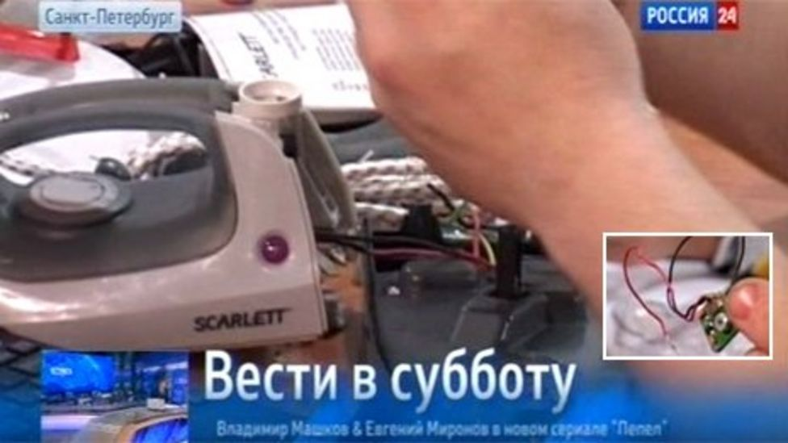



Brilliantly EVIL !


# Russia: Hidden chips 'launch spam attacks from irons'
 

## Cyber criminals are planting chips in electric irons and kettles to launch spam attacks, reports in Russia suggest.
 State-owned channel Rossiya 24 even showed footage of a technician opening up an iron included in a batch of Chinese imports to find a "spy chip" with what he called "a little microphone". Its correspondent said the hidden devices were mostly being used to spread viruses, by connecting to any computer within a 200m (656ft) radius which were using unprotected Wi-Fi networks. Other products found to have rogue components reportedly included mobile phones and car dashboard cameras.
 
 The report quoted one customs brokerage professional as saying the hidden chips had been used to infiltrate company networks, sending out spam without administrators' knowledge. News agency [Rosbalt](http://www.rosbalt.ru/piter/2013/10/22/1190990.html) reports that while the latest delivery of appliances was rejected by officials, more than 30 devices had already been sent to retailers in St Petersburg.
