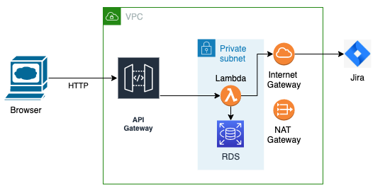
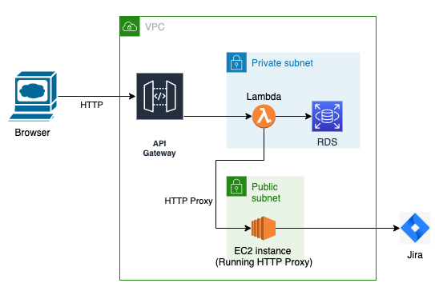

## Background
 Agile principles and strategies such as [Lean Startup](http://theleanstartup.com/) outline how important it is when developing a new product to get user engagement and feedback early and often. To this end, during the early stages of [ovalview.io](http://ovalview.io), we wanted to prove the concept with a very simple [MVP](https://en.wikipedia.org/wiki/Minimum_viable_product#:~:text=A%20minimum%20viable%20product%20(MVP,and%20(ultimately)%20unnecessary%20work.). We needed the quickest and most cost effective way to stand up a backend service that exposed a REST API so that we could allow interested parties to use the app and provide feedback. This article documents the approach we used and some lessons learned for future ventures.

## Iteration 1
 On the surface, FaaS (Function as a Service) using AWS Lambda seemed like a good candidate for this; only pay for what you use and no servers to think about.

 We created our API using NodeJS, the Serverless framework and AWS Cognito for authentication; this allowed us to get a secure, working application quickly. Serverless made deployments simple and it was costing us very little in terms of minimum AWS monthly cost.

 *Estimated minimum monthly cost*:

 * API Gateway, Lambda, Cognito, Cloudfront, Route53: Negligible
 * RDS: ~$20
 * Total: ~$20 per month

 

## Iteration 2
 The jump in cost came when our service needed to make HTTP calls to the outside world, in this case to update Jira; an important proposition in Ovalview.

 Making outbound HTTP calls from a Lambda attached to a VPC (needed for RDS access) requires a NAT Gateway. NAT Gateways are surprisingly pricey in AWS and all of a sudden our minimum AWS bill per month had tripled to over $65 a month.

 *Estimated minimum monthly cost*:

 * API Gateway, Lambda, Cognito, Cloudfront, Route53: Negligible
 * RDS: ~$20
 * NAT Gateway: ~$45
 * Total: ~$65 per month

  

## A more cost effective alternative?
 On reflection, although not an architecture that is advisable for any long term product, for our initial prototype, we could have just run a small EC2 instance in a public subnet which would have avoided the need for a NAT Gateway and therefore been significantly cheaper.

 *Estimated minimum monthly cost*:

 * Cognito, Cloudfront, Route53: Negligible
 * RDS: ~$20
 * EC2 instance: ~$5
 * Total: ~$25 per month

 

## A Hybrid solution
 One of the trade-offs with the single EC2 instance approach above is the scalability afforded by using Lambdas. A possible, but more involved alternative, would be to continue using the Lambdas but configure the code to use a HTTP proxy sitting inside a public subnet as per the diagram below. The EC2 instance would need to have one of the following:

 * a HTTP proxy service using something like TinyProxy as documented [here](https://medium.com/@yurysmykalov/aws-lambda-with-static-outgoing-ip-a-complete-no-vpc-tutorial-8b994229dee4)
 * Networking configuration to make it act like a NAT Gateway

 *Estimated minimum monthly cost*:

 * As above
 * Total: ~$25 per month

  

## Conclusion
 This article proposes 2 methods to avoid incurring the expense of using a NAT Gateway for projects that are in their infancy, where the goal is a low cost method to demonstrate an idea and gain quick feedback. Once the proposition was deemed to have value, work would then need to be done to create a scalable, resilient architecture, following industry best practices.

 *A note on pricing estimates*:

 * Accurate as at time of writing (Feb, 2022)
 * Based on eu-west-2 (London). Tax at 20% (UK VAT)
 * Leveraging ‘always free’ tier of Lambda, Cognito & Cloudfront
 * Based on services running for a whole month (730 hours in an average month)
 * [Lambda](https://aws.amazon.com/lambda/pricing/) / [API Gateway](https://aws.amazon.com/api-gateway/pricing/) pricing (effectively free for our initial usage)
 * [Cognito](https://aws.amazon.com/cognito/pricing/) pricing (effectively free for our initial usage)
 * [RDS](https://aws.amazon.com/rds/postgresql/pricing/?pg=pr&loc=3) pricing. Based on a Postgres db.t3.micro instance @$0.021 per hour (plus some storage costs)
 * [NAT Gateway](https://aws.amazon.com/vpc/pricing/) pricing @$0.05 per hour
 * [EC2](https://aws.amazon.com/ec2/pricing/on-demand/) pricing. Based on a t3.nano instance @$0.0052 per hour

  
