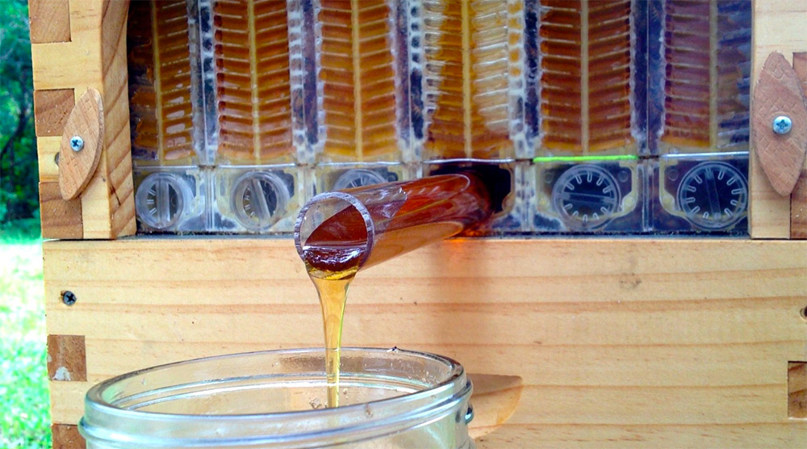

# Honey on Tap: A New Beehive that Automatically Extracts Honey without Disturbing Bees






It's the beekeepers dream, turn a tap right on your beehive and watch pure fresh honey flow right out of your FLOW hive and into your Jar! No mess no fuss and the bees are hardly disturbed.
Join the Flow Revolution at https://go.honeyflow.com​ 



    start: 0,
    allowfullscreen: 1,
    autoplay: 0,
    hl: en,
    cc_lang_pref: en,
    cc_load_policy: 1,
    color: white,
    controls: 1,
    disablekb: 0,
    enablejsapi: 1,
    fs: 0,
    iv_load_policy: 3,
    loop: 0,
    modestbranding: 1,
    playsinline: 0,
    privacy_mode: yes,
    rel: 0,
    showinfo: 0,
    origin: blog.richiebartlett.com,
    widget_referrer: blog.richiebartlett.com



The [Flow Hive](http://www.honeyflow.com) is a new beehive invention that promises to eliminate the more laborious aspects of collecting honey from a beehive with a novel spigot system that taps into specially designed honeycomb frames. Invented over the last decade by father and son beekeepers Stuart and Cedar Anderson, the system eliminates the traditional process of honey extraction where frames are removed from beehives, opened with hot knives, and loaded into a machine that uses centrifugal force to get the honey out. Here is how the Andersons explain their design:


The Flow frame consists of already partly formed honeycomb cells. The bees complete the comb with their wax, fill the cells with honey and cap the cells as usual. When you turn the tool, a bit like a tap, the cells split vertically inside the comb forming channels allowing the honey to flow down to a sealed trough at the base of the frame and out of the hive while the bees are practically undisturbed on the comb surface.

When the honey has finished draining you turn the tap again in the upper slot resets the comb into the original position and allows the bees to chew the wax capping away, and fill it with honey again.


It’s difficult to say how this might scale up for commercial operations, but for urban or backyard beekeeping it seems like a whole lot of fun. It wouldn’t be hard to imagine these on the roof of a restaurant where honey could be extracted daily, or for use by kids or others who might be more squeamish around live bees. You can see more on their website and over on [Facebook](https://www.facebook.com/flowhive).