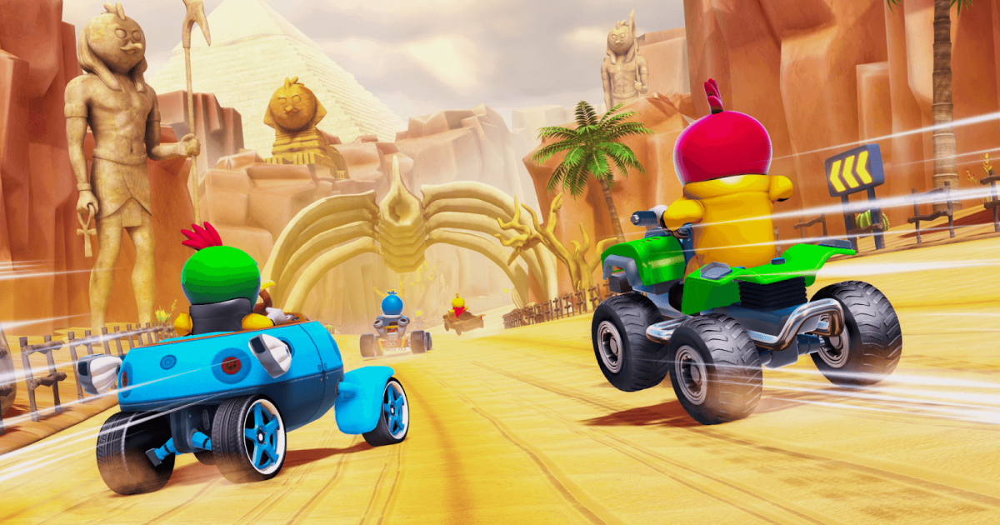
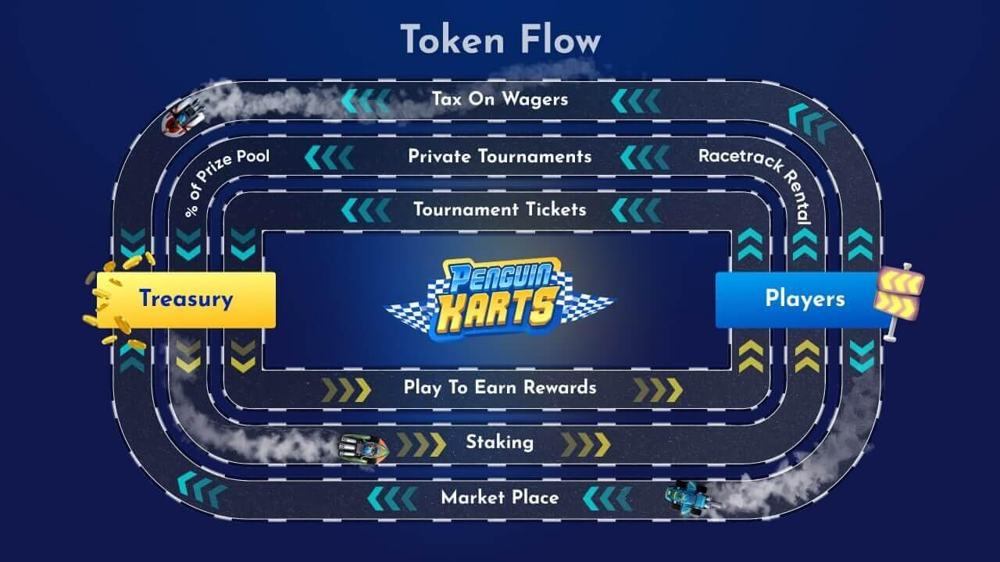

 

 Today, we wanted to highlight what we believe makes Penguin Karts special and (if you’ll excuse the pun) how it really drives forward the blockchain gaming scene.

 _This post is brought to you by Penguin Karts._

 A lot has happened since the idea of [Penguin Karts](https://penguinkarts.com) was first conceived. Who would have thought that a nostalgic memory would spawn the development of a blockchain project, let alone one that has been gaining steam like this.

## The Game
 For those who don’t know, **Penguin Karts is an immersive 3D battle-racing game built on the blockchain**. Essentially, it takes the arcade-style kart racing you know and love and seamlessly introduces NFT dynamics alongside a Play-to-Earn system. 

 Here’s what that means for you, as the player: you **race** against up to **eight opponents** across a selection of tracks while **earning** prizes and **NFTs**, which can be **used in game** (skins for your character and kart, for example) or **sold** for **profit**. 

 

 There are also **leaderboards** to contend with, **tournaments** to take part in and even a **wager system** to try out where you can predict the outcome of races. Start small or go all in – the wager system offers a high risk, high reward sort-of scenario, if that’s what you are after.

 That’s great and all, but one element that we really wanted to highlight is how it makes the **crypto market more accessible for newcomers**. Blockchain games in general are a great way to dip your toes in the crypto scene, but the **fun, addictive and universally-accessible gameplay of kart racing takes it to another level**. 

 This is where another important aspect comes into play – we’re balancing the game to make it suitable for everyone. We follow the mantra of ‘**easy to play, hard to master**’. Basically, everyone should be able to play without issues thanks to intuitive controls and the like, but skilled players will be incentivized to master the art of kart racing. That’s why the biggest prizes are given out in tournaments for the top three places.

 As you can see, there’s a lot to do in Penguin Karts. Now, let’s turn our attention to the blockchain elements.

## Player-Friendly Tokenomics
 $PGK has an initial supply of 2,941,200 $PGK (1,47%) and is hard-capped at 200 million $PGK. This means the initial market cap with a token price of 0.04$ is 117,648$. The full 200 million tokens will be pre-minted and locked with various vesting schedules, slowly releasing more of the pre-minted supply into circulation. No additional tokens will be created. This means $PGK is **not subject to inflation**. We recommend you check out [Whitepaper](https://penguin-karts.gitbook.io/penguin-karts-whitepaper/) for the full details.

 In addition to captivating gameplay, the platform adopts a player-friendly tokenomics approach. For example, a **healthy 48.53%** of the total token supply is set aside for the **Play-to-Earn** and **staking** rewards. This makes sure the players can earn play-to-earn rewards as soon as the first version of the game is live.

 Most importantly, we built tokenomics from the ground up to nurture a **sustainable economy**. The allocated token supply to our ecosystem will be plenty to sustain the project by itself for 2 years. 

 The **marketplace** offers a space for players to **buy and sell their NFT assets**. The medium of exchange is naturally the native token of the project: the Penguin Karts token ($PGK), which automatically increases demand for the token as it adds a use case.

 

## Team and Backers 
 It’s incredibly important, especially in crypto, for successful breakthrough crypto projects to be backed by a strong team. Penguin Karts is made up of experienced professionals who are passionate about gaming. CEO [Tommy Dahlberg](https://www.linkedin.com/in/tommy-dahlberg-911390158/), COO [Rhiannon “Ri Ri” Fletcher](https://www.linkedin.com/in/rhiannon-fletcher-b9b22433/), Business Development Manager [Mert](https://www.linkedin.com/in/mkcrypto/) and CMO [Baz Furby](https://www.linkedin.com/in/bazfurby/) each bring their own strengths to the project, building an amazing community around it. 

 That’s not to mention the significant contribution of the development team and the many partners who are contributing to the game in some way or another. 

 To top it all off, Penguin Karts has been in hot demand as it builds out its ecosystem of partners ranging from VCs including Black Edge Capital, Fairum Ventures & Cryptology; Key Opinion Leaders such as Krypto Playboy, CryptoFomo & CryptoDaku, and Launch Pads for $PGK token launch event on FantomStarter, TrustPad, and KingPad.

 Join our [community](https://t.me/penguinkartsannouncements) to get a spot in the $PGK public rounds of the tokensale. 

## Looking Forward
 With all that said, the game is currently in development, with the first playable demo scheduled for Spring 2022. But don’t worry – there’s still a lot going on and plenty to get involved with, even now.

 We recently **completed** two rounds of **2D NFT minting**. These were the [Genesis collection of 10K Penguin Profile Pictures](https://opensea.io/collection/genesis-penguins), each with unique traits that ensure no two are alike. They can not only be used on your profile and across your social media channels but also will be able to be staked for earning potential and provide holders beta access to the game ahead of launch.

 Several more NFTs are planned for release in the near future. Namely, these are the **3D NFTs**. These come in the forms of kart skins, characters and items so you can customize your racing experience. Allowing your Penguin to express themselves in the Penguin Karts Metaverse. 

## Get closed Beta Access before the public! Get Rewards! 
 All the beta testers that connected their web3 wallet will be eligible to start collecting $PGK rewards right from the start with rewards built into the game as racers complete more and more races. 

 Rewards in $PGK will be especially valuable to early beta users as they can then be staked on the Penguin Karts site and traded on various DEXs.

 Given that our community is so important to our success, we will be providing early closed Beta access to anyone who holds one of our NFTs or is a member of the [Discord](https://discord.com/invite/penguinkarts) community prior to the launch. Join [Telegram](https://t.me/penguinkartsannouncements) or [Discord](https://discord.com/invite/penguinkarts) for updates on early Beta access.

 

 