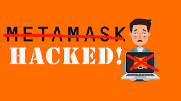

# How Your Metamask Got Hacked (Probably)
 

 I readily admit I love DeFi crypto investing — finding new yield-generating projects and identifying the legitimate projects from the heaps of *garbage* projects and *ponzi schemes* is an enjoyable and profitable challenge. But there is a glaring downside to DeFi — you have to use a non-custodial wallet like Metamask to interact with DeFi exchanges. Yes, Metamask runs fine and does exactly what you want it to do, but sadly it is seriously lacking in terms of security. Crypto Facebook groups, Reddit, Discord and Telegram are chock full of people who tell stories of having their wallets hacked and drained, often to the tune of thousands of dollars worth of crypto. In fact, I have one online contact who, despite being a highly educated and nationally renowned professional in his field, allowed himself to be fooled into exposing his Metamask security information to a hacker. My online friend admitted to losing over **$100,000** in this hack. And sadly enough, even this large amount was not large enough to get any online forensics company or law enforcement agency interested in trying to recover the funds. With non-custodial wallets like Metamask, you truly are on your own with protecting your funds.
 
 If you read these stories online, you get the sense that almost everyone who uses Metamask gets hacked. The good news is that this generally is not true — only a small percentage of Metamask users actually do get hacked. Furthermore, most of the users who get hacked are users who are fairly new to DeFi trading and have not yet learned all the important steps one must take to secure a Metamask wallet. Yes, hacks still do occur for more sophisticated users, but these are much more rare and usually involve one user mistake that a hacker exploits. In this sense, using Metamask is much like engaging in an adventure sport like skydiving or hang gliding — you must make sure 100% of the time that you do everything correctly. One mistake can wipe out your account.

 And yes, it happened to me too, because I made a stupid mistake. More on that later.

 In order to avoid getting hacked (or getting hacked again if you have already been hacked), it is essential to know all the steps you must take to secure your account: what to do, what not to do, and how to keep scammers from getting anywhere near your account. So let’s take a look at the most common ways that Metamask users get hacked, and how to avoid them.

## Downloading a scam version of Metamask
  This is actually somewhat rare but it does indeed occur and *must* be avoided. The official website for Metamask is https://metamask.io/ . This is only site where you should download and install Metamask. Hackers have been known to create fake Metamask sites and use Google Ads to show those websites at the top of Google search results. The fake site has a hacked version of Metamask that lets a user create a wallet and add funds just like the real thing, but then sends the user’s funds to the hacker’s wallet. So always use the official version of Metamask!

## Exposing your seed phrase
 The most common way people get hacked, the 800 pound gorilla of “don’t do that,” is allowing the wallet’s seed phrase to be exposed. As you know, when you create a Metamask wallet, Metamask shows you a 12 word seed phrase that allows you to recover your wallet in an emergency. This 12 word seed phrases is actually a human readable representation of the private key securing this wallet. To secure your wallet, you must make absolutely positively certain that you never show this to anyone. This means the following:

 * When Metamask shows you the seed phrase, sketch it down ONLY on a piece of paper (wood or metal plate) that you store securely somewhere where you live, or somewhere safe. You can store it in a safe, or in a safe deposit box at your bank, or somewhere where ONLY YOU know where it is. If you have anyone else living in your residence, anyone that you do not have 100% trust in, do not let that person anywhere near your hardcopy seed phrase.
 * DO NOT store your seed phrase digitally, *i.e.* on your computer or your phone. All it takes is for a hacker to get access to your file system or to your cloud backup and your seed phrase is revealed.
 * DO NOT take a photo of your seed phrase with your camera phone. Hackers can (and have) gotten access to a phone’s photo collection (either by hacking the phone or by hacking an online backup) and just searching for any photos with seed phrases in them. Once the seed phrase is found, game over.
 * The ONLY exception to not storing a seed phrase in digital form is a trustworthy highly secure password manager or secrets manager service like ~~Dashlane or~~ [^1]  1Password. That is probably ok, although there are many knowledgeable people who shy away from this practice as well. I think it is probably ok, but it is up to you.

 [^1]: Dashline saves your info *in the cloud* and has questionable security habits. You *cannot* be guarranteed security while your data is in-transit nor at rest.

 But just securing your seed phrase when you create your wallet is not enough! You must be constantly vigilant against hackers and phishing scammers trying to steal your seed phrase in other ways. One common way that users get hacked is when they join a Discord or telegram server for some new project they find. There are loads of scammers who lurk on these places, just waiting for a new person (like you) to start asking questions. As soon as they see you, they will try as fast as they can to DM you or even call you, to offer you “technical support.” They have account names that make them look like they are the official technical support for the project, often stealing and using the names of real project founders. You must remember that **NO LEGITIMATE TECH SUPPORT OR PROJECT FOUNDER WILL EVER DM YOU!** Seriously, do not EVER respond to anyone pretending to be any kind of support for a given project — just delete the message and move on (or feel free to tell the scammer to fuck off, it’s up to you).

 The way these fake tech support scammers operate is to first give you the impression that they are legitimate. Then convince you to connect to some special site to “verify your wallet” or take some similar-sounding action. **NEVER EVER DO THIS!** Of course, if you read the previous paragraph you’d know not to chat with these people in the first place. However, if by some lapse of judgment on your part you do end up in a conversation with someone like this, do not ever connect to any site they give you and **NEVER, FOR ANY REASON, GIVE OUT OR ENTER YOUR SEED PHRASE!** A huge percentage of Metamask hacks are a result of an inexperienced user getting scammed in this way.
 
 Note these sorts of phishing-scams can occur through several communication channels including: email, Telegram, and Discord. Telegram and Discord are especially risky as the anonymous nature of these platforms make them ideal platforms for unscrupulous scammers. It is fine to chat on these services to discuss legitimate project issues and ask questions, just don’t ever click on any links or answer and DMs that look at all shady. I rarely answer DMs on Telegram and only from people I have interacted with in a Telegram chat. I absolutely never answer any DMs of any sort on Discord.

## Malware and Keyloggers
 It is also very important to make sure your computer is protected against viruses, malware, and keyloggers. Most of us use our computers for a variety of purposes, with some of these purposes a bit shadier than others. A computer is a great tool for work, education, writing, emailing your family, *etc.*, but it is also a great platform for playing games, watching porn, sharing files, *etc.* Some of these latter websites may attempt to infect your computer with viruses or malware. It is crucial to use antivirus software and anti-malware software like Malwarebytes to keep your computer clean at all times. Some/many serious crypto investors will even have one computer dedicated entirely and solely to crypto trading, and use another computer for all these other risky uses.[^2]

 [^2]: Even better, **lock-down your browser** so that by default it has javascript, images, and cookies disabled! Use a whitelist feature (like that found in Google Chrome) to allow only trusted websites to show images, run Javascript, and store data (*e.g.* cookies) on your system. 

 There are several ways in which an infected computer can cause your wallet to be hacked:
 * A scammer can install keylogger software on your machine and can record your keystrokes, including your password. If the user can get access to your password, your wallet is now available to the scammer and is likely to be drained.
 * Even if the scammer does not use a keylogger to get your password, it is possible for a scammer to get access to the encrypted file where your seed phrase and private key is stored. If the scammer downloads this file onto his/her own machine, then brute force password guessing software can be used to get your password if you have not selected a very secure password. It still boggles my mind how many people will use easily guessable short passwords like `12345` or `Joe123`.

 One key takeaway from this is that it it imperative to make your password un-guessable — always use a long password that has a mix of upper and lower case letters, numbers *and* symbols. Always make sure your password is 12 or more characters long, more is better. Each additional character in your password makes it exponentially harder to guess. As you can see in the chart below, even using both cases and numbers and symbols, it is quite easy to brute force a password that is 7 or 8 characters long, but would take an eternity to brute force a password 15 characters long. Always use a long password!

 

## Scam transactions
 Another trick some scam sites use is to first get you to connect to their site and then ask you to sign one or more transactions that allows them to spend your coins. Yes, all legitimate distributed exchanges (DEXes) ask you to do this as well. But just realize that each of these requests by default asks you to authorize the site to *spend an unlimited amount* of coins or tokens from your wallet. Some scam sites use this to drain your wallet and send your tokens or coins to their own wallets. Some scam sites trick you into allowing the site to spend all the other coins in your wallet, not just the coin you are trying to exchange.
 
 To avoid this, you must first make sure you are interacting with a legitimate site. Do not sign any transactions until you have thoroughly researched it and have become convinced that the site is legitimate. You can always edit the transaction to allow the site to only spend a small fraction of your available coins. This [Pro Tip on twitter](https://twitter.com/bobbyong/status/1355516570332614662) explains the process in a little more detail but there are tons of tutorials on this on Youtube and elsewhere. If you provide a custom spending limit like this, at the very least you are limiting the damage that a hacker can cause.



## Fake/Scam airdrop promotions on Discord or Telegram
 When you find a new DeFi project that you might be interested in investing into, you will often join the project’s Discord or Telegram channels to get more information. These can be a great source of information, but they also expose you to a flood of potential scam offers unless you are careful. I can GUARANTEE that day after day, you will open up your Discord app and will see a bunch of DMs promoting some “airdrop” or “token giveaway” or some other promotion, asking you to connect your wallet to some site to claim your free rewards. The DM promotion and fake website will have a domain similar to, but not the same as, the domain of your project. *THESE DMs & PROMOTIONS ARE ALWAYS A SCAM!* Far too many people are still getting scammed by these things. The only thing you should ever do with these DMs is delete them immediately. I never open DMs on Discord, except in the very rare case where I am chatting with someone on the main channel enough to know they are genuine and they ask to DM me. And the moment they start asking me to go to random links or connect to another site, I stop & delete the conversation. The same is true of Telegram. **DO NOT OPEN RANDOM DMs AND DO NOT CONNECT YOUR WALLET TO ANY AIRDROP OR GIVEAWAY SITES! OTHERWISE YOU WILL GET SCAMMED!**

## Dust attack
 Another way people get scammed is called a “dust attack” where a scammer sends you some number of little-known shitcoin tokens. These tokens are associated with malicious smart contract code that drains your wallet when you try to sell these shitcoins or try to dispose of them in any other fashion. I suspect this is one reason why Metamask does not show tokens in your account unless you explicitly add them. You would only see them if you type your wallet address into the appropriate blockchain explorer (etherscan, bscscan, snowtrace, etc). If you discover unknown or unfamiliar tokens in your wallet, it is best to just ignore them unless you are certain that these are from a legitimate project.

## Avoid these problems with hardware wallets
 Of course, any serious crypto investor will tell you that the above issues can be almost be completely eliminated by connecting a hardware wallet to your account. It is important to note that the wallet address to use in Metamask is the hardware wallet address, NOT a Metamask address. Connecting a new hardware wallet to an existing Metamask wallet offers virtually no added protection — always import the hardware wallet address into Metamask and use that address. Again, there are numerous tutorials on Youtube and elsewhere on how to do this properly.
 
 The hardware wallet I prefer is the Trezor Model T. Yes it is slightly more expensive than its main competitor (the Ledger Nano X) but I find it to be infinitely more user friendly. The Ledger is clunky and often fails to work properly while the Trezor "Just Works." ⚠️ Additionally, as Ledger is notorious for it's lackluster security regarding it's online shop (via shopify), you _will_ be bombarded by phishers (&  exploiters) to reveal your seed phrase within seconds of purchasing anything from Ledger[^3].
 
 [^3]: This is from experience. 🤬 I simply can't trust any &ldquo;security&rdquo; product from any company that doesn't care about the security of your data while visiting their official website... 🖕🏻 Their shop has been hacked so many times, I question why they are still in business.

 

## Be vigilant
 It's an excellent idea to follow [best-practices](https://coincodecap.com/how-to-secure-your-crypto-wallet) when it comes to managing your wallets. First, don't keep all your "eggs in a single basket." Creating a wallet is _free_. You can limit the amount you keep in a single wallet. And, keep each wallet dedicated to a single coin. This way, if you are somehow exploited, you minimize the loss. Use both "cold" and "hot" wallets. 

 Sadly, scammers continue to devise new ways to hack you, and it is up to you to keep abreast of how to best protect your wallet. I would love to say that if you take all the above actions you will never have your wallet hacked. All I can say is that the above steps make it much much less likely. There is a never ending war of escalation between hackers and security experts (and users), so you must continue to be cautious and make sure you never do anything dumb.

 Which leads me to…

## When I did something dumb and got hacked
 Yes, it happened to me too... because I did something dumb. I’m a long time software developer and now a blockchain developer. I was honing my skills last year by going through the Udacity Blockchain Developer Nanodegree program. As part of this program, we created several projects involving blockchain technology. I actually created a blockchain-based supply-chain tracking system for the legal cannabis industry, or at least a skeleton version of one. With all of these Udacity projects, student must upload their project files to Github. Because I wasn’t paying much attention and was only using a Testnet wallet, one of the files I uploaded contained the seed phrase to the Metamask wallet I was using for development on my development computer. This never had any funds in it so I wasn’t worried.

 But a year later, for reasons I can’t remember, I decided to send some real AVAX to that Metamask wallet on that computer. I had long since forgotten that this was my development wallet and development machine and the wallet was probably compromised. In the year or so between the time I uploaded that file and the time I sent the AVAX, a hacker had found the exposed seed phrase and had hooked up some software to that wallet address. The hacker software just checked that wallet address in the off chance that I would do something stupid like sending real coins to it. The hacker’s patience paid off when I did indeed do something stupid. The AVAX arrived but quickly disappeared to some unfamiliar wallet address within minutes or seconds of arrival. It took me a few minutes of digging to find out what happened. Now, I am embarrassed to admit it's my own stupidity that caused the exploit.

## The importance of discovering what you did wrong
 And this leads me to my final point — in the event that you do get hacked, it is important to put your ego aside and figure out what you did wrong. I see too many people online that want to blame Metamask and/or blame everyone except themselves for getting exploited. These are the people who don’t figure out what they did wrong and end up getting hacked again. Do yourself and the rest of the crypto community a favor — *ALWAYS* spend the effort it takes to figure out what you did wrong. The more we all work together to figure out how these hacks happen, the easier it will be to help each other and ourselves avoid getting hacked in the first place.

## Footnotes
