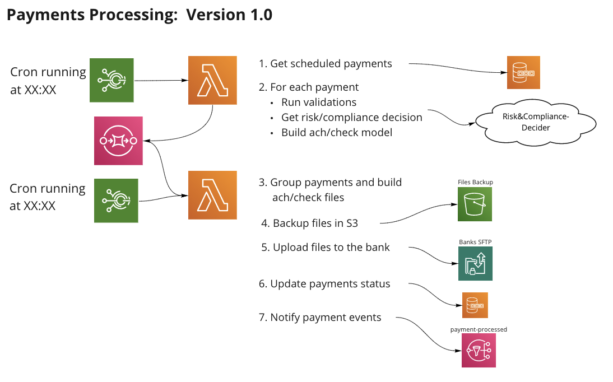
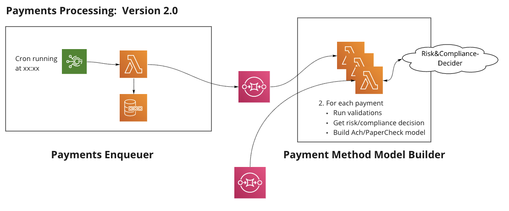
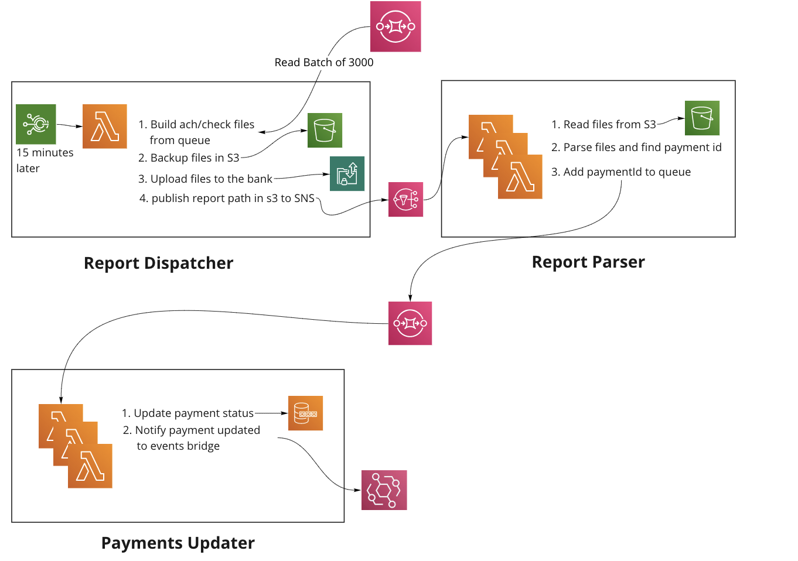
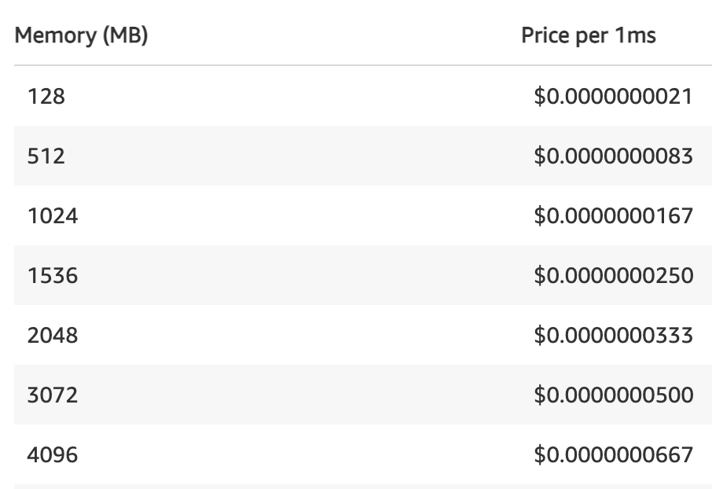
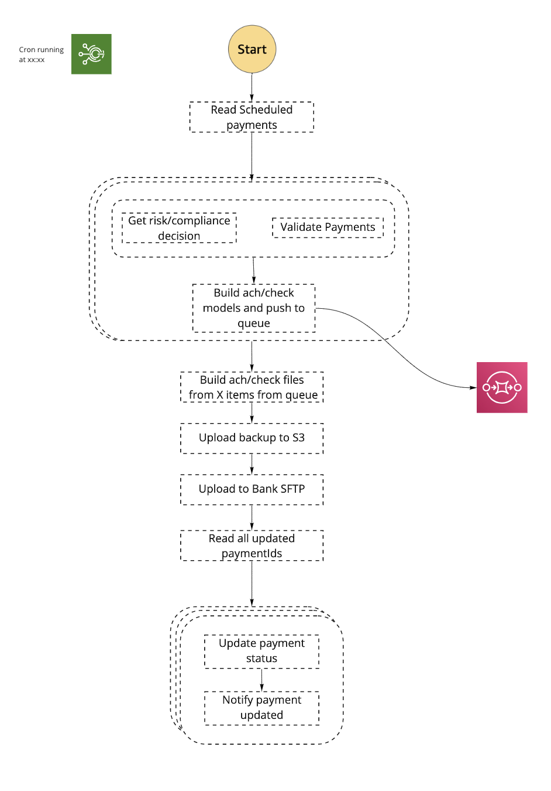
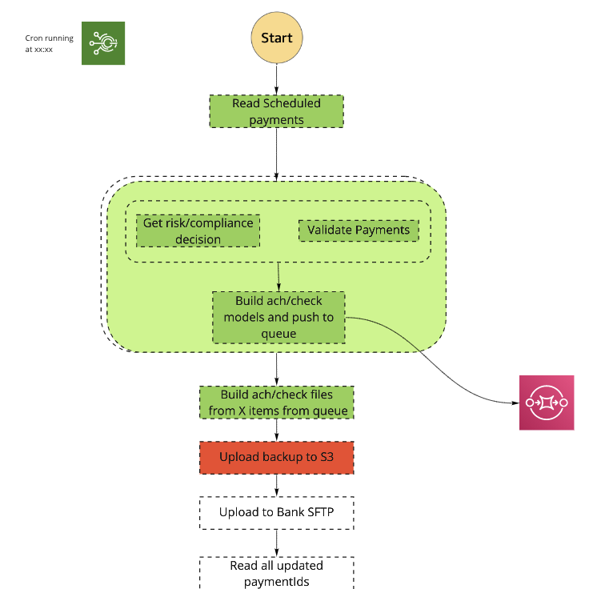
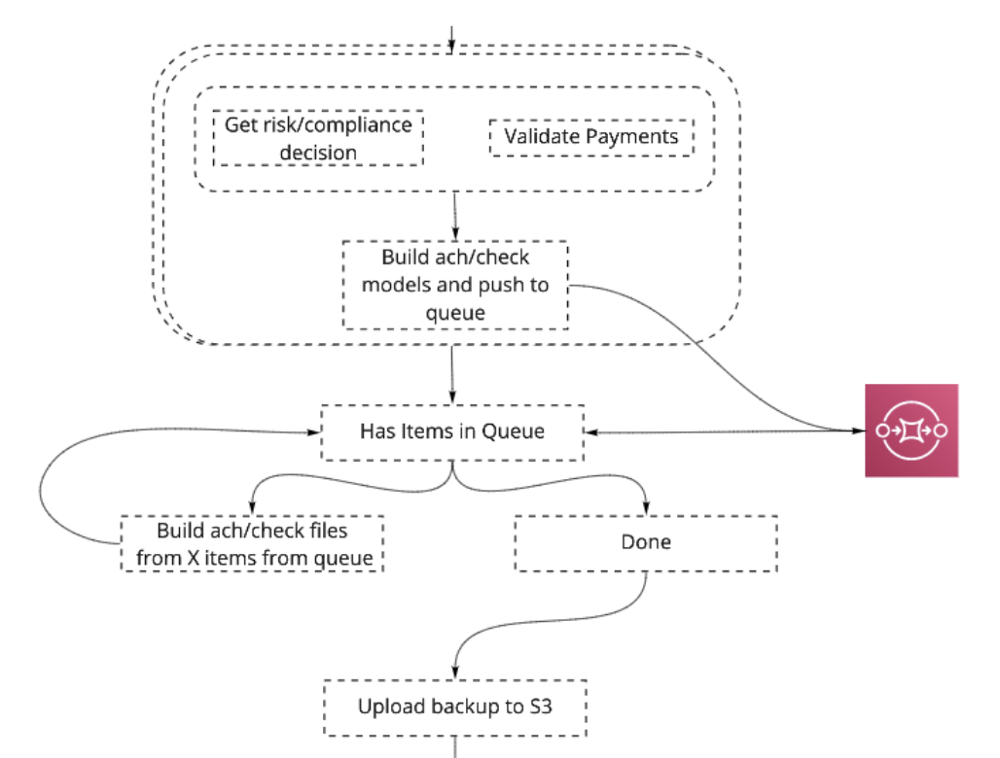

 

 In this post, I’d like to share the evolution of Melio’s Payments Platform system built on AWS serverless architecture — why we chose this technology, the ups and downs we encountered, how it enables us to make gradual changes and our next steps.

 Melio is a B2B payments platform startup aiming to digitize payments between businesses that are currently paying 10 trillion dollars a year in paper checks.

 Since I joined Melio in May 2020 to lead the Payments Platform group, the company’s growth has been around 3,000% — moving from processing a few million dollars to billions of dollars every year.

## A little bit about how banks work
 It may come as a shock to you, but banks are kind of old fashioned. Their networking system is mainly based on file transfer. Our VP of Client Services famously once said:

 

    The job of the payments platform is to build a Ferrari on top of bicycle wheels.
 
 

 Transferring files is done in specific time windows, where X amount of files with up to 3,000 payments in each file can be transferred.

## Ok, but why serverless?
 One of my observations, after encountering this question several times from friends and colleagues, was that I found it strange that this question is not asked about K8 or EC2s. So another question could be “Why NOT serverless?”

 I think it’s safe to say that, like in most cases, the right answer lies somewhere in the combination of the different services, depending on the use case. Nonetheless, I’ll try and answer it with valid examples for the following points:

 * The overhead of starting with serverless is significantly lower — AWS SAM gives developers freedom to build, scale and deploy applications faster, without high dependency on DevOps teams.

 * Payment jobs are done in **bursts** — a fast auto-scaling service is needed.

 * Ability to optimize **cost** by having different cloud configurations for different tasks, like memory, duration, etc — one could say that cost is an interesting metric to estimate the efficiency of your serverless architecture.

 * Bank transactions are done in specific **time windows** — services don’t need to run continuously.

 * Ability to make architectural changes in **small steps** — breaking down small parts of the Business Logic units helps us move fast without the consideration of making big changes.

 * **Ability to test** on staging environments and debug services on AWS personal accounts — working with CloudFormation, as our infrastructure configuration tool, enabled us to deploy any stack to different AWS accounts.

## How we started out
 In order to implement the bank’s requirements and upload aggregated files of 3,000 payments in fixed scheduled windows, we needed to build a system that could manage these scheduled jobs:

 * Get all payments that were scheduled to be processed.
 * Gather all related details of each payment (company names, addresses, etc.)
 * Run data validations and risk & compliance checks.
 * Aggregate all data into ACH/PaperCheck format files — ACH is basically bank transfer protocol, you can read about [nacha](https://www.nacha.org/content/what-is-ach) format if you’re interested.
 * Upload to bank’s SFTP.

 This is how it breaks down to a serverless components flow:

 

 As I mentioned, it’s easy to deploy the service stacks to different AWS accounts. This enables us to replicate staging and development environments that increase the developers’ ability to deliver faster and maintain high quality code. They can debug different flows on dedicated personal AWS accounts and run end to end tests on the staging environment.

## Idempotency is critical
 It’s not seen in the diagram above, but one of the important aspects in working with payments is that the processes should happen at most once. Meaning we don’t want to charge/pay twice, but we still want to be able to retry the flow in case it fails at some point.

 In order to do that, idempotency is critical, meaning the flow can run several times and still perform the action only once. If, for example, the step of updating the payment status fails, then when the process re-initiates, it first needs to check if the files were already created for these payments.

 I’m raising this point because when we need to break down the flow to support scale, we’ll need to maintain this principle.

## Reaching the 15-minute limit
 This service worked great for a while and was simple enough to monitor and maintain. When the payment volume grew 10x, we were starting to get close to the lambda **timeout limits of 15 minutes** — so we began planning for a more scalable solution.

 Since this task was a batch process, we needed to get all payment details into memory, requiring higher memory usage. Combining that with an extended running time is when serverless starts to be **more costly**.

## Breaking the flow into smaller services
 We decided to break the flow into multiple lambdas, so that each performs a single, minimal job. We wanted to make the transition in small steps, so that at each step, we took part of the flow and extracted it into a new lambda and connected them with SQS/SNS.

## Making the change in small steps
 The first thing we wanted to do was stop the batch process of all payments in a single run. So we decided to simply split the job of the first lambda into 2 tasks:

 * Read all payment details and add them to the queue.
 * Process each payment in a dedicated lambda.

 

## But there’s still a batch process to be done
 We still had a batch process, where we needed to aggregate all payments into files of up to 3,000 payments each. We tried to keep this action to a minimum, so we broke the report creation and DB updates into 3 different tasks:

### Report Dispatcher Lambda
 * Run lambda that will read a batch of 3,000 payments and create file format.
 * Upload to the bank’s SFTP and save in S3.

### Report Parser Lambda
 * Read files from S3 and get all payments.
 * Upload payments into the queue.

### Payments Updater Lambda
 * Each lambda handles one payment, updates to DB and notifies it was updated.

 

## Results
### Time to run
 All in all, the average run time of payment processing in version 1.0 took about 20 minutes.

 Version 2.0 processed 10 times the amount of payments and took an average of 3–4 minutes.

### Cost
 There’s a big difference in the cost of running the lambdas with less memory, as seen in the AWS pricing model.

 Cutting down the duration of the lambda with high memory usage, minimized the pricing by over 60%.

 

### Scale
 Breaking down the flow this way allowed us to scale the number of payments to almost unlimited. The weakest link in this flow is actually the banks, which are limited in the amount of files they can process daily (depending on the bank).

## What’s still missing?
 The downside of this new architecture is that it is harder to **monitor** and **maintain**.

 * There are many more components to monitor.
 * The orchestration is managed externally — we need to validate that no contract is breached within the flow.
 * It’s harder to find the failure point.
 * It’s harder to retry from that failure point.

 Another critical issue in the current flow is the dependency between the sections of the flow. We have 2 cron jobs that run 15 minutes apart but ideally, we’d want the 2 sections to be part of the same flow, so file creation will simply run after all payments are inserted into the queue.

 That’s why our next step was to move to **AWS step functions**.

## Moving to an orchestrated solution using step functions
 We are currently in the process of migrating our infrastructure to step functions. I’ll describe our plans and update on our experience in part 2 of this post.

 Step functions are really tailormade for payment flows. The transition from version 1.0 to 2.0 kind of hints at that direction.

 The main reason to move to an orchestrated solution is the fact that the payment process flow described above, is not the entire flow of payments processing. There is an additional flow that gets reports back from the bank, acknowledging files received. I’ll list the advantages of step functions and how it helped us resolve this issue.

## So, why not use step functions to begin with?
 Even though we knew this would be the right framework to choose, we felt that refactoring the initial version into step functions would be too big a transition.

 There were some **risks to consider**:

 * Urgency to support scale — the bigger the refactor, the more time needed to complete it.
 * Unknown territory — we feel it was best to first integrate with new frameworks on flows that are not the primary business channel of the organization.
 * Cost — step functions have a lot of advantages, but it’s more costly than running the lambdas we did in version 2.0. In step functions, there’s an additional fee for each state transition.

## Connecting it all to a single flow
 

 The advantages of using step functions:

 * **Visibility** — here is a clear indication of the failure point and the specific error that caused it.
 * **Idempotency** — it’s easy to retry the flow from the last failure point, with the assurance that past steps were successfully completed.
 

 * **Avoiding lambda self invocations** — the part of creating aggregated files is done in a single lambda. In version 2.0 the lambda continuously calls itself until the queue is empty. This is not a good pattern as the flow can terminate in the middle. Instead we can use the step function “Choice”, to repeatedly call the function until the queue is empty, ensuring the action will be completed.
 
 
 * **Payment methods level [IOC](https://en.wikipedia.org/wiki/Inversion_of_control)** — this architecture allows us to create a loosely coupled support of new payment methods. Each payment method has its own dependencies and lifecycle.

 * **Flow extensibility** — as I mentioned earlier, the payments flow has additional steps, receiving reports from the bank. For each file uploaded to the bank, we receive an ACK file back 15 minutes later. Instead of managing it in a dedicated lambda, we extend the existing flow and add additional steps to handle the ACK files.

## Next steps
 Once we rollout version 3.0, we’d be happy to share more of our experience with step functions and update on our next steps.

 In the meantime, watch out for part 2 of this post where I’ll describe our plans and update on our experience.

 Thanks for reading!