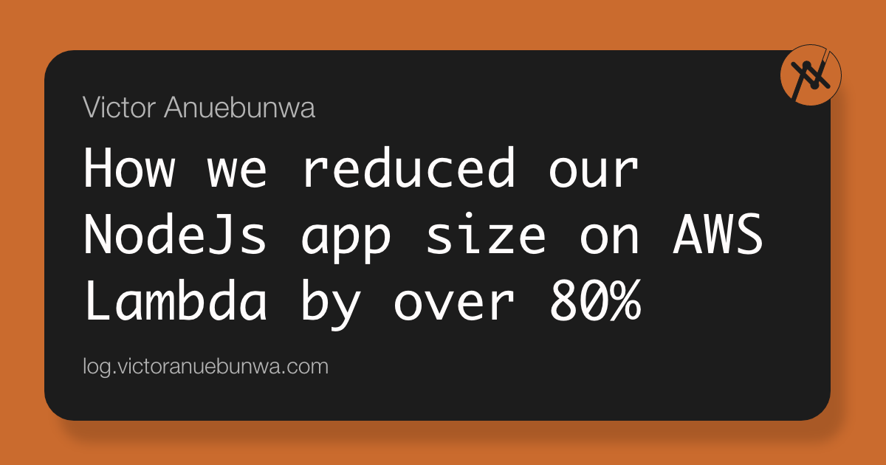
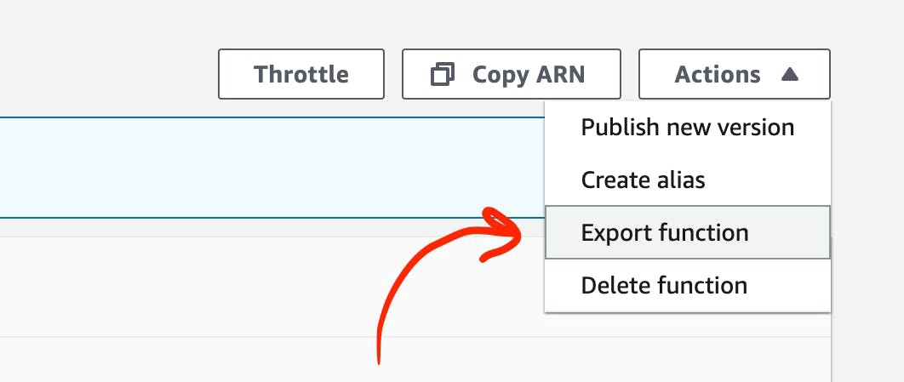
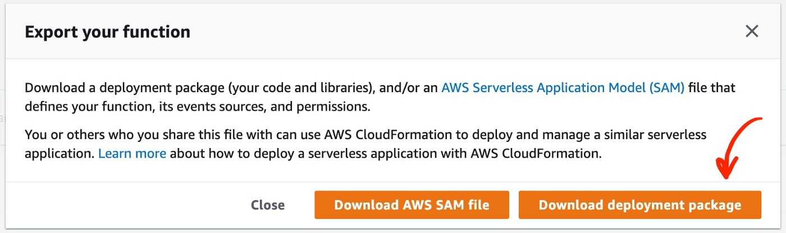
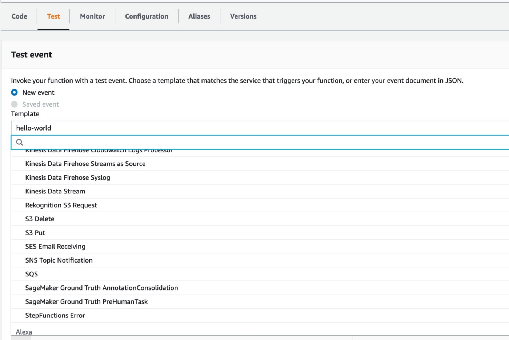

 

 This article highlights the steps we took to reduce the size of our NodeJs apps running on AWS Lambda but it still relates to any Node app running anywhere. In the end, you’ll find out how we dropped our 50MB-75MB (compressed) node apps to 8MB -10MB. Awesome, right?

 But first, How did we get here?

 How did this set of software developers exhaust the 75GB AWS Lambda storage limit? Oh yes, we did. 🙈


## The Mistake
 Deploying microservices on AWS lambda could mean you have to work with other AWS services like SQS, SNS, API Gateway, etc., and using the [Serverless Framework](https://www.serverless.com/framework/docs/), the default practice will be to define handlers for events coming from each of these services.

 Under the hood, the Serverless framework creates new lambda functions for each of the handlers you define.

 Let’s say you want to handle events from SNS, SQS, S3, and API Gateway, four Lambda functions will be created for each of those events using the same code base. This means that our 50MB app when deployed, becomes a huge 200MB app in total.

 Here’s the interesting part, this was only on our staging environment. Considering the number of microservices we had running, we were already at 50% usage, pushing our microservices to a new environment immediately doubled our storage usage and our deployments broke. Wahala 🙆🏽‍♂️


## The Fix: How we reduced our AWS lambda size
 

### Set AWS-SDK as dev dependency
 This is the mother of all. I won’t even be bothered if you quit reading after this point.
 
 The ```aws-sdk``` package alone is over 60MB (uncompressed). This is huge!

 This was almost everything about our app size issue, our misfortune and also our miracle. The good news is that the ```aws-sdk``` comes pre-installed in your Lambda runtime, so you don't need to install it again. Only set it as a dev dependency.

 Only if we knew this. I’m in severe pain now 😭


### Remove unnecessary packages
 

 There is a good chance you’ve done this already. However, for large projects mostly, some unused packages can go undetected easily.

 Try packages like ```depcheck```. It helps you scan your app for unused and missing dependencies.

 The ```-g``` flag is important, please. Let's not complicate things here.


### Cross-check for dev packages
 Just like the ```aws-sdk```, there are other packages that could disguise as production dependencies such as ```serverless``` and its plugins like ```serverless-offline```.

 These packages, in combination with the extra packages it installs for you, is over 100MB (uncompressed) in size, that is including ```aws-sdk```. Hence, removing ```aws-sdk``` without removing these guys won't make any difference. It will be re-installed.

 Since these types of packages are used for deployment and need to be installed while deployment is ongoing, one can easily mistake them as production packages. The best approach will be to set them as dev dependencies in your app and install them globally in your CI/CD Docker image. This approach also buys you more deployment time as you won’t need to reinstall them every time your CI/CD pipeline runs.

 Created this Docker image [avonnadozie/serverless](https://hub.docker.com/repository/docker/avonnadozie/serverless) for this purpose, feel free to reuse. It comes with ```serverless-offline``` plugin and other necessary packages you need to deploy to lambda successfully.


### Use ```--production``` flag
 This should be a common step as well, however, It doesn’t hurt to repeat it.

 Always remember to use the ```--production``` when running npm on production or in your CI/CD script to not install dev dependencies.
 

### Reuse available Lambda runtime packages
 Just like ```aws-sdk```, there are other packages such as ```uuid``` and ```dotenv``` that are already available in the lambda runtime which you can reuse.

 You can refer to this [list of node packages in lambda runtime](https://log.victoranuebunwa.com/list-of-node-packages-pre-installed-on-aws-lambda-runtime).


### Inspect deployment
 The crude way works well too. Download your live code and inspect it manually.

 To download, go to your Lambda console, click on the function and choose “Export function” from the “Actions” dropdown.

 

 Then click on “Download deployment package” afterwards.

 

 Once the download is complete, go to the ```node_modules``` folder, rank the folders by size and take a look. It reveals a lot.

 This was how we found out ```aws-sdk``` was still installed even after we've set it as a dev dependency.

### Move out large non-js files
 Consider hosting large files such as images, or JSON on a private CDN (most likely S3) and read it from there.

 This will cause a trade-off in speed but it could be worth it for you depending on the design of your app.


### Merge serverless handlers
 This is completely up to you and your app architecture, but you can consider reusing lambda functions where necessary to prevent serverless from creating additional and unnecessary functions for you.

 For us, we found a way to merge SQS and SNS handlers given that their event input data and the way they work is similar and it saved us a whole lot of MBs.

 The lambda console provides you with sample event input data on its test tab you can work with. Choose from the list.

 


## Benefits to reducing your application size
 You might not be deploying multiple apps that will exhaust your AWS limit as we did, but there’s still more you stand to gain by dropping your app size regardless.

 * Faster [cold start](https://aws.amazon.com/blogs/compute/operating-lambda-performance-optimization-part-1/) time
 * Faster deployment with CI/CD as the zipping and upload process will be faster
 * Less cost on storage and memory