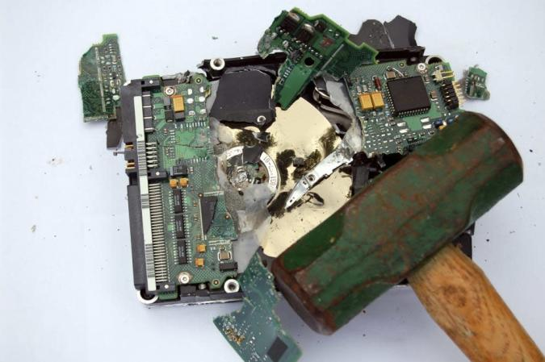


So... When do I get my 25TB flash/Thumb drive?


Saving files to memory is something that's supposed to be mostly invisible for the end user. We don't need to think about it; it just has to work. But whether it's a solid-state or hard disk drive, conventional storage solutions have their limitations -- namely, speed, rewritability and durability. A team at [IBM Research's Almaden facility](https://www.engadget.com/2014-08-07-ibm-synapse-supercomputing-chip-mimics-human-brain.html) in California has a cure for all of that and it's called "[racetrack memory](https://www.engadget.com/2010-12-27-ibm-makes-racetrack-memory-breakthrough-which-could-come-in-han.html)."

Stuart Parkin, an IBM fellow heading up research into the field of magnetoelectronics and [spintronics](https://www.engadget.com/2012-08-13-ibm-creates-consistent-electron-spin-inside-semiconductors.html), is the man overseeing the creation of this new storage solution that's poised to kill your hard drive. Which is ironic because IBM *invented* the HDD back in the mid-1950s. So what exactly is racetrack memory? Imagine a series of tiny magnets, all built one atomic layer at a time by Parkin's team, that can be moved up and down along a (figurative) racetrack "in a highly coherent fashion" with the application of a simple current. That arrangement not only guarantees increased read/write speeds, but it's also cheaper to produce, is incredibly resilient due to the lack of moving parts and boosts storage capacity significantly.

Already, Parkin's team has been able to demonstrate the advantages of this new storage solution by applying it to existing flash memory chips. His team was able to generate about "250 of these magnetic domain walls in one racetrack" which, when applied to flash, could increase storage capacity by a factor of 100. And, what's more, it won't ever wear out, meaning it'd be infinitely rewritable. That's something flash memory simply cannot do in its current state.

Watch as Parkin explains how racetrack memory could pave the way for more efficient, more compact computing devices.