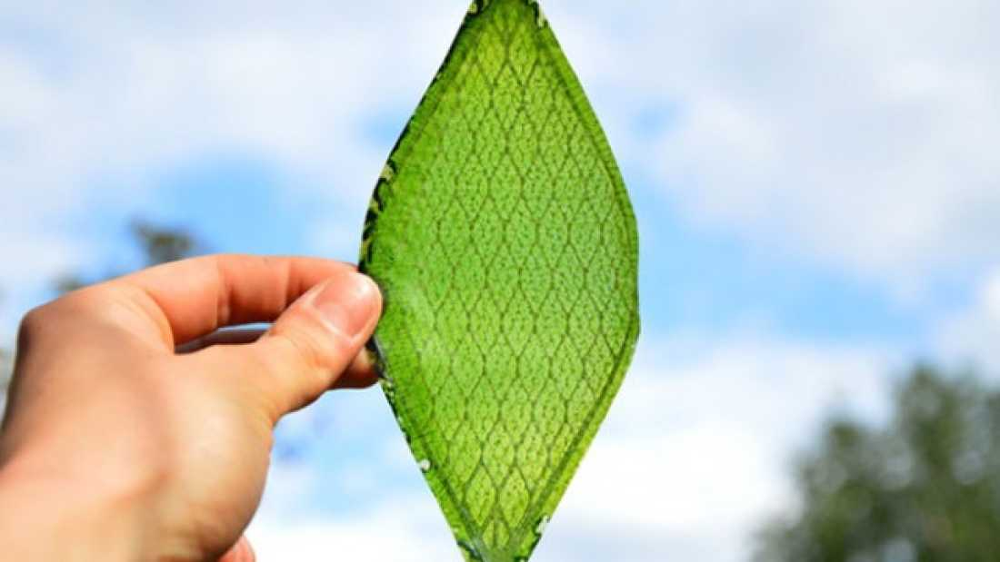

[Julian Melchiorri](http://www.julianmelchiorri.com), a graduate of the Royal College of Art, claims to have developed a silk leaf that could create oxygen for space travel as well as make the air nicer here on Earth. The leaf was developed in conjunction with a silk lab from Tufts University.

The leaf is created from a matrix of protein extracted from silk and chloroplasts, the organelle that allows plants and algae to perform photosynthesis. When provided with light and water, the synthetic leaf allegedly acts just like a real leaf and produces oxygen. 

“It’s very light, low energy-consuming,” he [explains](http://www.dezeen.com/2014/07/25/movie-silk-leaf-first-man-made-synthetic-biological-leaf-space-travel/). “It’s completely biological and my idea was to use the efficiency of nature in a man-made environment. I created some lighting out of this material, using the light to illuminate the house but at the same time to create oxygen for us.”

Malchiorri isn’t content to just think of a few small fixtures within the house as the only use for this product. His dreams for Silk Leaf are *out of this world*. 

"NASA is researching different ways to produce oxygen for long-distance space journeys to let us live in space,” he continued. “This material could allow us to explore space much further than we can now."

In addition to meeting the breathing demands of astronauts and the first colonists of Mars and beyond, the material could be used on the facades of buildings and inside ventilation systems in order to generate fresh oxygen.

Check out this video:
 

All of this does sound pretty great, but does not account for photosynthesis in its entirety. Let’s take a look at the equation:

6CO2 + 6H2O + --(Sunlight Energy)--> C6H12O6 + 6O2

The Silk Leaf accounts for the input of carbon dioxide, water, and light as well as the oxygen product, but what about all the sugar? Plants don’t perform photosynthesis purely as a public service; it is done so they can create food for themselves. There isn’t an explanation as to what happens to the carbon and hydrogen that the leaf takes in. Silk Leaf lacks the vacuoles, stems, and roots that store food in plants. 

The video also claims that plants don’t grow in space, which isn’t true. There have been concerns in the past that roots require gravity in order to develop properly, but [experiments from the ISS](http://news.nationalgeographic.com/news/2012/121207-plants-grow-space-station-science/) have shown that plants can grow in space. However, it would take a considerable amount of soil, water, and plants to generate enough oxygen for astronauts or a, so a lightweight alternative like Silk Leaf would be beneficial in that regard.