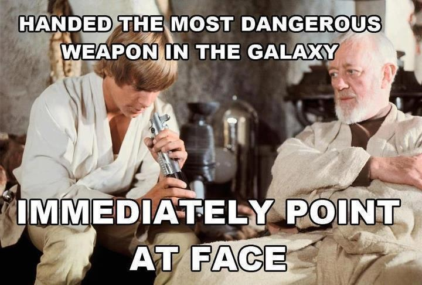

# MIT and Harvard Just Made a Real Lightsaber. So That’s Done.

 Cross another dream off the bucket list, because [the Harvard-MIT Center for Ultracold Atoms just created a new form of matter that could potentially be used to create real lightsabers](https://phys.org/news/2013-09-scientists-never-before-seen.html). (They report no progress on The Hoverboard Initiative, however, and the clock is ticking…)

 Scientists at the lab are reporting that they’ve successfully managed to get two photons to interact with each other and form a “photonic molecule” that acts as if it has mass but maintains the properties of light. Photons as a rule contain no mass and don’t interact with each other, which is why two beams of light pass right through each other. Lightsabers aside, the creation of a “photonic molecule” is actually a Pretty Big Deal.

 The lab achieved the creation of the molecule by reducing a cloud of rubidium atoms to near absolute zero (0 degress Kelvin). Particles, atoms, and molecules do very weird things when brought to this low-energy state, allowing for such oddities as near-cessation of entropy, superconductivity, superfluidity, and condensates.

 This temperature is achieved by a process called laser cooling, ~which means that anything that uses lasers is automatically cool~, which can reduce the temperature of atoms to a billionth of a Kelvin. (Outer space is a relatively balmy 2.73 Kelvin in comparison.) The lab then passed two photons through the supercooled cloud of rubidium atoms. The energy of those photons excites the cloud of rubidium because the photon just pulled up into the driveway with grandpa and OMG the backseat is FULL of presents yay grandma’s here!, and slows the photons as their energy passes from atom to atom.

 Where it gets really weird is when the two photons interact with the atoms at the same time, producing an effect known as a “Rydberg blockade.” This behavior means that the atoms get a little overwhelmed (like, emotionally) and can only interact with one of the photons at a time. This means that the photons have to essentially push and pull each other along as they travel through the cloud of atoms imparting their energy.

 That means the photons are interacting with each other by using an atom as an intermediary, forming a structure that acts like a molecule but probably looks like a sandwich. A delicious sandwich made of light.

 Photonic molecules could conceivably interact with each other, opening up the possibly of creating two beams of photonic molecules that would interact with each other. Figure out a way to make those beams stop when they’re about two feet long and you’ve got yourself a sword!

 

 Maintaining this lightsaber presents its own difficulties, since the molecules have to be constructed in a supercooled vacuum, which is presently beyond the reach of handheld devices such as lightsabers. There’s also the matter of containing the photonic molecules within a shortened beam, which might require a containment field of some variety and/or a better understanding of the photonic molecules themselves.

 And in the end, photonic molecule lightsabers just might not be as satisfying as the lightsabers we’re accustomed to. You could bash at things with it, but a beam made of these molecules wouldn’t cut anything. On the upside, there’d be no chance of accidentally cutting your limbs off, or doing that to anyone else.

 It’s also far more safe than the other option we have for making lightsabers: [trapping superheated plasma in beam form](http://www.howstuffworks.com/lightsaber.htm). Photonic molecules wouldn’t burn your face off just by being in proximity to them, so that’s a big upside.

 

 In terms of practical uses for photonic molecules, researchers aren’t really looking at lightsabers. More practically, the creation of photonic molecules might ease the way towards quantum computing, at which point we will all have to buy new phones.

 But we were going to do that anyway, weren’t we? The future is here!