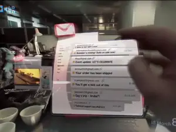


If only this were true...


Magic Leap, the mysterious [augmented reality startup with $542 million in funding by Google](http://www.businessinsider.com/magic-leap-google-investment-2014-10), just released a video that gives a glimpse into what its technology can do.

Titled "Just another day in the office of Magic Leap," the short clip shows augmented reality graphics in a real-life setting, which in this case, seems to be the actual office space of Magic Leap.

Titled "Just another day in the office of Magic Leap," the short clip shows augmented reality graphics in a real-life setting, which in this case, seems to be the actual office space of Magic Leap.

In the video, the user scrolls down his email inbox pops up right in front of him as holograms and sifts through different folders to find the video game he wants to play. Once he clicks on the video game icon, the game automatically loads up and the user is placed in a virtual reality game setting instantly. 

After a few seconds of jam-packed action gaming, the video ends with the logos of Magic Leap and Weta Workshop, the special effects team behind movies like "Lord of the Rings" and "The Hobbit." The founder of Weta, Sir Richard Taylor, [sits on Magic Leap's board](https://www.businessinsider.com/magic-leap-recruits-science-fiction-writer-neal-stephenson-2014-12).

It's unclear when or how this is going to be released, but it's pretty cool to see someone working on technology that could radically change the way we consume things.

## Magic Leap | Original Concept Video | Video (1:35)
Back in the day it was tough to explain to our friends what we were building. So we made this concept video with our partners at Weta Workshop to show what a mixed reality could be.

 

    start: 0,
    allowfullscreen: 1,
    autoplay: 0,
    hl: en,
    cc_lang_pref: en,
    cc_load_policy: 1,
    color: white,
    controls: 1,
    disablekb: 0,
    enablejsapi: 1,
    fs: 0,
    iv_load_policy: 3,
    loop: 0,
    modestbranding: 1,
    playsinline: 0,
    privacy_mode: yes,
    rel: 0,
    showinfo: 0,
    origin: blog.richiebartlett.com,
    widget_referrer: blog.richiebartlett.com

