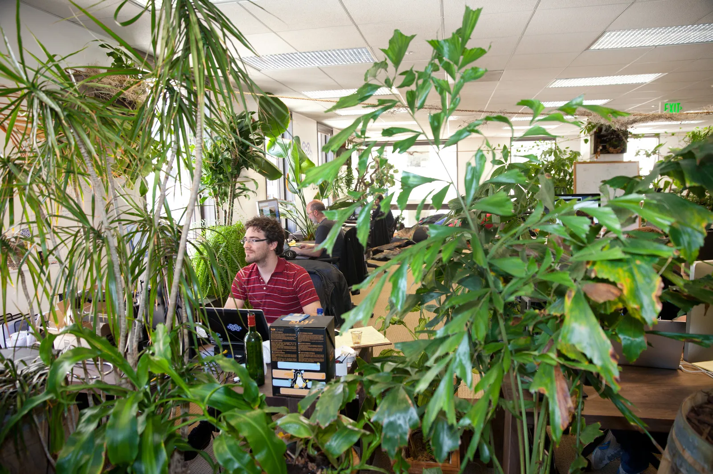

 With a new open source software project called Docker, Solomon Hykes wants to build a computer the size of the internet.

 

 GOOGLE RUNS ITS web empire on computers the size of warehouses.

 Inside the [massive data centers](https://www.wired.com/wiredenterprise/2012/10/ff-inside-google-data-center/all/) that drive things like Google Search and Gmail and Google Maps, you'll find tens of thousands of machines -- each small enough to hold in your arms -- but thanks to a [new breed of software](https://www.wired.com/wiredenterprise/2013/03/google-borg-twitter-mesos/all/) that spans this sea of servers, the entire data center operates [like a single system](https://www.wired.com/wiredenterprise/2012/01/google-man/), one giant computer that runs any application the company throws at it.

 A Google application like Gmail doesn't run on a particular server or even a select group of servers. It runs on the data center, grabbing computing power from any machine than can spare it. Google calls this "warehouse-scale computing," and for some, it's an idea so large, they have trouble wrapping their heads around it.

 Solomon Hykes isn't one of them. He aims for something even bigger. With a [new open-source software project known as Docker](https://www.docker.io/), he wants to build a computer the size of the internet.

 With a new open-source software project called Docker, Solomon Hykes wants to build a computer the size of the internet

 Sitting in his company's offices, on the 16th floor of a high-rise in downtown San Francisco, Hykes is wearing a t-shirt with a whale on it. This is a [whale of the cartoon variety](https://www.docker.io/). It's grinning slightly as it floats on a wavy blue sea, and on its back, it carries a stack of shipping containers -- the sort you'd see towering over the docks in Oakland, across the bay from San Francisco, or on the train cars heading north towards Sacramento.

 That may seem a little odd. But the whale is a metaphor for the way Hykes hopes to remodel the internet. Just as, in the 1950s, shipping containers reinvented the way we move goods across the globe -- giving us a standard means of shifting massive amounts of stuff from boat to train to truck and into stores and factories -- Hykes wants to create a standard means of moving software applications across the internet and the world's private company networks, from machine to machine to machine.

 That cartoon whale is the logo for Docker, which Hykes and his 18-person company, [dotCloud](https://www.dotcloud.com/), unveiled earlier this year. Docker is a way of packaging software applications into their own shipping containers, so you can readily load them and run them on any machine equipped with any flavor of Linux, the open-source operating system that now drives so many of the servers that underpin the internet.

 The goal is to foster a world where anyone can treat any pool of machines in much the same way Google treats its private data centers. If you wrap your software in Docker containers, you can readily spread them not only across the machines in your own data centers, but onto popular cloud services such as Amazon Web Services -- and back again.

 "It all starts with something simple and unimportant. A container is just a box," says Hykes, dotCloud's founder and chief technology officer. "But with this box, you can package up so many software products and platforms and systems that each have their own way of doing things, and in the end, these containers are everywhere, and you can move them anywhere.

 The Docker project is only months old. But it's based on technologies that have long been used on Linux and other server operating systems, including the Solaris operating system built by Sun Microsystems, and because it repackages these technologies into something that's far easier to use, it has quite suddenly caught the attention of software developers across Silicon Valley.

 eBay, the web's online auction house, is now using Docker containers as a means of testing new software inside its data centers. San Francisco startup MemSQL is doing much the same in testing the [database software it sells to other businesses](https://www.wired.com/wiredenterprise/2013/07/memsql/), a database that runs across dozens of machines. And another startup, CoreOS, offers a new Linux operating system specifically designed for use with Docker containers.

 

    Docker is the toolkit you need to get this idea right. It makes it incredibly easy to take an application -- any process that runs on a computer -- and stick it in its own container
 
 

 "Docker is the tool kit you need to get this idea right," says eBay engineer Ted Dziuba. "It makes it incredibly easy to take an application -- any process that runs on a computer -- and stick it in its own container."

 This idea is particularly appealing because so many of today's software applications no longer run on standalone machines. Like Google's web services, they run across dozens upon dozens servers, and Docker provides a means of quickly spreading software across such an enormous collection of systems -- and onto new systems as time goes on.

 "These days, software developers have thousands of languages and frameworks to choose from, and they're looking to deploy across larger numbers of servers and larger numbers of environments, whether it's inside their four walls, or outside their four walls," says dotCloud CEO Ben Golub. "If you picture all of the languages and applications as rows, and all the environments as columns, you have this huge matrix that is always expanding.

 "With Docker, we're trying to make that matrix go away, letting developers just worry about putting whatever they need into containers -- and letting the people who run the servers worry about nothing but moving containers around."

 
 

## The Biological Imperative
 Hykes and the rest of the dotCloud team work in an open office space that looks like a jungle. Inside this 16th floor space, the desks and the laptops and the massive flat-screen displays are all but hidden by the ferns and the green bamboo and the rest of the plant life that stretches nearly from floor to ceiling. If you peek through a hole in this jungle, you might even see a small turtle munching on yet another piece of green.

 At first, the motif seems all wrong. Solomon Hykes and his cohorts are software engineers intent on rethinking the fundamental tools we use to build and run the massive web services that have come to define our modern world, and here they are camped out in a place that reminds us what our world was like before the rise of the machines.

 Even Hykes struggles to explain why his tech startup is teeming with plants and animals. "We're an engineering shop, so we like having something that gives a sense of privacy," says Hykes, with the faintest hint French accent that lets you know where he grew up and first launched dotCloud. "But we didn't want walls or plastic separators, and plants seemed like a good compromise."

 

     Each Docker container is a "cell" in the planet-sized organism that is the internet. The physical machines, cables, routers, and hard drives -- those are simply vessels for the cells to compute, store, and exchange messages

 

 But as he describes Docker, you begin to realize the plants and the animals are completely appropriate. The shipping container metaphor laid out on his t-shirt goes a long towards explaining what Docker is all about, but you may need another metaphor to take you the rest of the way. You can also think of Docker as an effort rebuild the internet so that it behaves more like a living organism. Just as plants and animals are made up of millions of cells that each perform their own function yet seamlessly communicate with each other, Docker divides software into cells of code.

 A Docker container holds not only a software application but just about everything else that application needs to operate, all the software libraries and other application-related code normally included with an operating system. These additional software libraries are known, in developer parlance, as "dependencies."

 Basically, this means a Docker application doesn't rely all that much on code that's tied to the operating system. All the OS provides are simple hooks into the Docker containers, and that means a machine -- or, better yet, a collection of machines -- can behave more like an organism, where cells operate on their own but also in tandem with each other.

 This is -- quite simply -- the right way to build software. It means you can easily add new cells to the whole, and it means that individual cells can die without bringing down the entire operation.

 At the famed Xerox PARC research center in the 1970s, Alan Kay pioneered this approach with a programming language he called SmallTalk. Rather than build software as a monolithic piece of code, Kay divided tasks into cells, or objects, that could talk to each other. With this object-oriented programming, he could expand an application by adding new objects, and mix and match objects as he saw fit.

 Since then, this same idea has gradually spread across the entire software ecosystem, from programming languages to operating systems and beyond. In many ways, the history of computing is about a progression towards software that [behaves more and more like biological systems](http://www.pcmag.com/article2/0,2817,32905,00.asp). With Docker, Solomon Hykes wants to expand this idea across the software that drives the internet -- not to mention the world's private networks.

 "In what we're trying to do, there is DNA -- legacy -- from the efforts of people like Alan Kay," says Hykes. "Each Docker container is a 'cell' in the planet-sized organism that is the internet. The physical machines, cables, routers, and hard drives -- those are simply vessels for the cells to compute, store, and exchange messages."

 

## So Long, Virtual Machines
 Remember the days when installing software on your PC was such a pain? When it was so difficult for one PC to read files created on another? Over the past 20 years, we've solved these problems, and that's thanks to Alan Kay's biological paradigm.

 When you install software on an Apple Macintosh, you simply drag and drop an icon into a folder and it runs. That's because the application is packaged up with all its dependencies, and it communicates with the operating system through the thinnest of interfaces -- much like a cell.

 "The application includes everything it needs to run," says Alex Polvi, the founder of CoreOS, the operating system created with Docker in mind. "You don't have to run some fancy installer. You just use it. It's ready to go." In much the same way, you can easily install new software on your iPhone or your Android tablet.

 

     The application includes everything it needs to run. You don't have to run some fancy installer. You just use it. It's ready to go
 
 

 Docker then takes these ideas and applies them to computer servers. Hykes and crew want to provide tools that let engineers install and run server software as easily as you and I install and run software on our phones.

 Google does much the same thing inside its own operation, with a tool called Borg. And at Twitter, engineers use a similar, open source creation called Mesos. "We can run services inside a container, and then we can move the services across multiple machines, replicate them across multiple machines, and not worry about the interactions between containers," says Raffi Krikorian, a vice president of engineering at Twitter.

 But Borg and Mesos are incredibly complex systems, built and maintained by some of the planet's brightest computer science minds. Hykes wants to give any company the tools it needed to setup and run the same type of operation -- even if the company lacks the engineering savvy of a Google or a Twitter.

 Originally, Hykes' company offered a cloud service along the lines of Microsoft Azure or Google App Engine or Heroku -- an online service where software developers could build and host applications. It created Docker as a better way of running this cloud service, and somewhere along the way, Hykes and crew, including CEO Ben Golub, a veteran of the open source game, realized it was something that could help any online business.

 This spring, as they planned to open source the technology, word leaked to Hacker News, the preeminent online hangout for Silicon Valley engineers, and the idea immediately caught fire. Today, after five months in the wild, the Docker software has been downloaded 60,000 times, 80,000 people a month are visiting the project's website, and according to Golub, over 150 other projects are already using the software, including cloud services [Flynn](https://flynn.io/) and Dokku.

 As CoreOS founder Alex Polvi points out, Docker is hardly a mature technology, but the project has taken off like few others, and it's now a big part of a trend towards massive online systems that operate without server virtualization, an older means of separating applications from an underlying system and readily moving them from machine to machine.

 

    If you believe that what makes life easier for developers is where things are moving, then this containerization thing is where things are moving
 
 

 Docker containers are less complex than server virtualization and require less software. They provide the convenience of virtual machines without a lot of the overhead, which means they can potentially run applications at greater speed -- and with fewer servers. According to eBay's Dziuba, Docker containers can be launched far much more quickly that virtual machines, or VMs.

 "To me, working with Docker containers is so much easier than working with virtual machines," says Dziuba. "If you believe that what makes life easier for developers is where things are moving, then this containerization thing is where things are moving."

 Virtualization will serve a need for years to come. It's a mainstay on most cloud services, including Amazon Web Services, and inside so many businesses. "The VM has been proven as a good architectural mechanism," says Pat Gelsinger, the CEO of virtualization kingpin VMware. "Maybe some of the greatest criticism of the VM has been the performance overhead, but what do we focus on? Whacking down that performance overhead with each new generation."

 But tools like Borg and Mesos and Docker will feed a new wave online applications -- applications that operate on such a large number of machines, they need every bit of extra efficiency they can grab. Google sees this. And Twitter. And so does Solomon Hykes.

