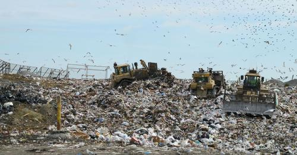



IT dumbass throws away $7,500,000 worth of bitcoins in old hard disk without backup!!


 
 
 As Bitcoin hit $1,000 dollars on Wednesday morning, a lot of early adopters saw their Bitcoin, bought or mined for cheap years ago, turn into a high-return investment. And some forgot they bought Bitcoin years ago, only to realize they were suddenly rich. However, there are also those on the other side of the Bitcoin -- so to speak -- and British IT professional James Howells may be the unluckiest of them all. According to _The Guardian_, Howells mined 7,500 Bitcoin in 2009 and kept it in a hard drive until last summer, when he threw the drive away without realizing he was throwing away a fortune. [see also url="http://mashable.com/2013/04/12/bitcoin-startups/"] At the time, his Bitcoin stash was worth around $675,000. Now, it would be worth $7.5 million. Howells reportedly threw the hard drive in a landfill near Newport, Wales, that is the size of a soccer field, meaning it's now somewhere buried under at least four feet of garbage. Worst of all, he never backed it up. "I'm at the point where it's either laugh about it or cry about it," Howells told The Guardian. "Why aren't I out there with a shovel now? I think I'm just resigned to never being able to find it." He says he won't go and look for the hard drive himself, because authorities told him it would be almost impossible to find; but he has set up a new Bitcoin wallet asking for donations that would go towards funding a recovery effort.

 

     if anyone wants to donate to my Bitcoin recovery fund... **15JHTg6g4zokAM23vJVcL8DbAAjA4BhsLH** - not that I'm expecting anything :)

 
 
 It's hard to blame Howells, who simply forgot the treasure saved on the hard drive he stashed away after rescuing it from a ruined Dell laptop. But perhaps this will serve as yet another lesson on the value of backing up your data. Because, one day, that simple backup could make you rich.
