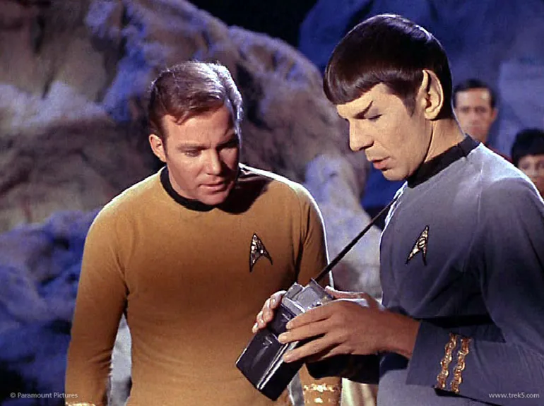


Can't wait to get a fully functional tricorder like Mr. Spock's!


 *Consumer Physics, an Israeli start-up is bringing Star Trek "Tricorder" technology to your mobile devices to open up an entirely new world of chemometrical apps.*

 

 On Monday, an Israeli startup, [Consumer Physics](http://www.consumerphysics.com/myscio/), [successfully completed their Kickstarter campaign](https://www.kickstarter.com/projects/903107259/scio-your-sixth-sense-a-pocket-molecular-sensor-fo) for a device that could completely alter the way we use our mobile phones, PCs and tablets in the future. 

 If you're a classic Star Trek fan, you may recall a fictional device used by the Enterprise crew called a "[Tricorder](http://en.wikipedia.org/wiki/Tricorder)" that is able to, among other things, determine the molecular composition of nearby objects.

 Consumer Physics has figured out how to incorporate this functionality into a Bluetooth-connected sensor the size of a keychain, called the SCiO.

 The technology to determine the molecular composition of objects has been around for many years, as the science of [spectroscopy](http://en.wikipedia.org/wiki/Spectroscopy). Observed under different wavelengths of visible and non-visible light, all matter has a resonance that produces a distinct "fingerprint" on the electromagnetic spectrum.

 By looking at these fingerprints we can determine exactly what something is made of, even from tens of thousands of light years away.

 This is how scientists are able to figure out if the thousands of [extrasolar planets](http://en.wikipedia.org/wiki/Exoplanet) that have been recently discovered are made of gas, or are rocky, like the Earth. Or if there are other stars out there are similar to our sun, and if we could live on those exoplanets that orbit them.

 In addition to astronomy, spectroscopy has many down-to-earth industry applications, including forensics, geology, pharmacology, and in various vertical industries where precise measurement of the composition of matter is required.

 But spectroscopy equipment has been very expensive and not very portable. Until now.

 

 The SCiO differs from a laboratory spectrometer in that it uses a tiny sensor that emits near-infrared light, which causes the molecules on the subject to vibrate and thus reflect the "signature" of its molecular composition.  

 Due to this method and limitations in the sensor tech, the SCiO can only identify concentrations of matter of one percent or higher. The near-infrared technique also makes it difficult to recognize the compositions of gases or metals. So for example, performing precise blood chemistry or self-urinalysis, or determining if there are allergens in food might be challenging for the technology today.

 However, even with these limitations, this still opens up a huge world of applications that never before existed to consumers. Consumer Science is building a huge cloud-based database of materials that the sensor is able to detect, and with the release of the SCiO, it intends to "crowdsource" identification of a lot more substances.

 The device is able to scan and produce a displayable result on the smartphone or tablet in a matter of seconds.

 The SCiO campaign on Kickstarter far exceeded its funding goal of $200,000 -- Consumer Science raised over $2.7 million in total. So clearly there is broad consumer interest for this type of technology. 

 The first SCiO will cost $200 and will come with a number of demo applications for Android. Developers will be able to use Consumer Physics' [chemometrical API](http://www.consumerphysics.com/myscio/developers.htm) for both Android and iOS as well as the web to create all sorts of custom applications.  

 Have you ever wanted your own "Tricorder?" and does the *SCiO* interest you as a consumer?