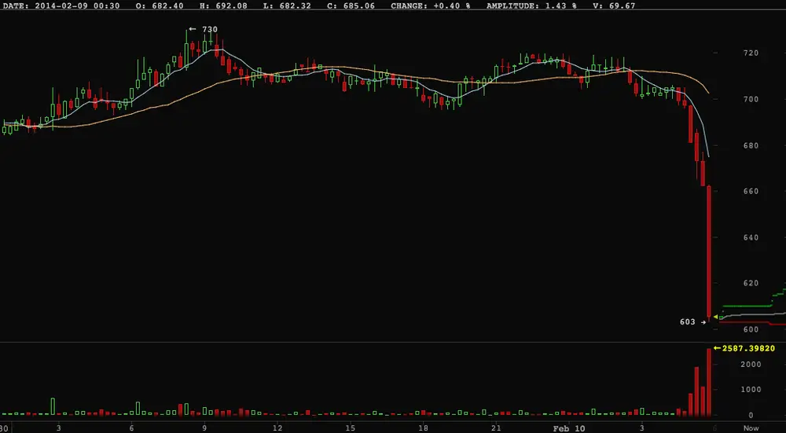



Looks like the bitcoin cookie-jar has been cracked open!


# Bitcoin Just Completely Crashed As Major Exchange Says Withdrawals Remain Halted
 

 Bitcoin just completely fell out of bed. The chart above, via [BitcoinWisdom](http://bitcoinwisdom.com/), shows the move.

 The news comes as major trading exchange Mt. Gox [says in a new press release](https://www.mtgox.com/press_release_20140210.html) that bitcoin withdrawals remain halted. (On Friday, Mt. Gox issued a statement that amid the volume of withdrawals it was seeing, that it was suspending withdrawals until it could address a technical issue). Mt. Gox was at one point the foremost bitcoin market site, though its volume and share of bitcoin activity has declined considerably.

 Withdrawals in actual currency _are_ working, so traders can get cash out of the site, which is good news.

 The bad news is that in addition to the direct matter of users not being able to withdraw bitcoins, they say the technical issue that they're dealing with is something that pertains to the broader Bitcoin community:



 _The problem we have identified is not limited to MtGox_, and affects all transactions where Bitcoins are being sent to a third party. We believe that the changes required for addressing this issue will be positive over the long term for the whole community. As a result we took the necessary action of suspending bitcoin withdrawals until this technical issue has been resolved.



 The letter is long, but here's the conclusion:



    To put things in perspective, it's important to remember that Bitcoin is a very new technology and still very much in its early stages. What MtGox and the Bitcoin community have experienced in the past year has been an incredible and exciting challenge, and there is still much to do to further improve.

    MtGox will resume bitcoin withdrawals to outside wallets once the issue outlined above has been properly addressed in a manner that will best serve our customers. More information on the status of this issue will be released as soon as possible. We thank you for taking the time to read this, and especially for your patience.



And here's the full letter:



Dear MtGox Customers and Bitcoiners,

As you are aware, the MtGox team has been working hard to address an issue with the way that bitcoin withdrawals are processed. By "bitcoin withdrawal" we are referring to transactions from a MtGox bitcoin wallet to an external bitcoin address. Bitcoin transactions to any MtGox bitcoin address, and currency withdrawals (Yen, Euro, etc) are not affected by this issue.

The problem we have identified is not limited to MtGox, and affects all transactions where Bitcoins are being sent to a third party. We believe that the changes required for addressing this issue will be positive over the long term for the whole community. As a result we took the necessary action of suspending bitcoin withdrawals until this technical issue has been resolved.

**Addressing Transaction Malleability** MtGox has detected unusual activity on its Bitcoin wallets and performed investigations during the past weeks. This confirmed the presence of transactions which need to be examined more closely.

_Non-technical Explanation_: A bug in the bitcoin software makes it possible for someone to use the Bitcoin network to alter transaction details to make it seem like a sending of bitcoins to a bitcoin wallet did not occur when in fact it did occur. Since the transaction appears as if it has not proceeded correctly, the bitcoins may be resent. MtGox is working with the Bitcoin core development team and others to mitigate this issue.

_Technical Explanation_: Bitcoin transactions are subject to a design issue that has been largely ignored, while known to at least a part of the Bitcoin core developers and mentioned on the BitcoinTalk forums. This defect, known as "transaction malleability" makes it possible for a third party to alter the hash of any freshly issued transaction without invalidating the signature, hence resulting in a similar transaction under a different hash. Of course only one of the two transactions can be validated. However, if the party who altered the transaction is fast enough, for example with a direct connection to different mining pools, or has even a small amount of mining power, it can easily cause the transaction hash alteration to be committed to the blockchain.

The bitcoin api "sendtoaddress" broadly used to send bitcoins to a given bitcoin address will return a transaction hash as a way to track the transaction's insertion in the blockchain.Most wallet and exchange services will keep a record of this said hash in order to be able to respond to users should they inquire about their transaction. It is likely that these services will assume the transaction was not sent if it doesn't appear in the blockchain with the original hash and have currently no means to recognize the alternative transactions as theirs in an efficient way.

This means that an individual could request bitcoins from an exchange or wallet service, alter the resulting transaction's hash before inclusion in the blockchain, then contact the issuing service while claiming the transaction did not proceed. If the alteration fails, the user can simply send the bitcoins back and try again until successful.

We believe this can be addressed by using a different hash for transaction tracking purposes. While the network will continue to use the current hash for the purpose of inclusion in each block's Merkle Tree, the new hash's purpose will be to track a given transaction and can be computed and indexed by hashing the exact signed string via SHA256 (in the same way transactions are currently hashed).

This new transaction hash will allow signing parties to keep track of any transaction they have signed and can easily be computed, even for past transactions.

We have discussed this solution with the Bitcoin core developers and will allow Bitcoin withdrawals again once it has been approved and standardized.

In the meantime, exchanges and wallet services - and any service sending coins directly to third parties - should be extremely careful with anyone claiming their transaction did not go through.

Note that this will also affect any other crypto-currency using the same transaction scheme as Bitcoin.

**Conclusion**: To put things in perspective, it's important to remember that Bitcoin is a very new technology and still very much in its early stages. What MtGox and the Bitcoin community have experienced in the past year has been an incredible and exciting challenge, and there is still much to do to further improve.

MtGox will resume bitcoin withdrawals to outside wallets once the issue outlined above has been properly addressed in a manner that will best serve our customers.

More information on the status of this issue will be released as soon as possible.

We thank you for taking the time to read this, and especially for your patience.

Best Regards,MtGox Team



---

See Also: [The fall of Mt. Gox](http://www.businessinsider.com/mt-gox-2014-2)