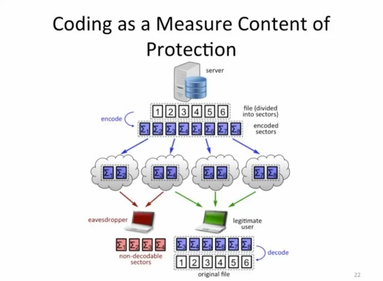


Build it faster & more secure!


Researchers at Aalborg University, MIT and Caltech have developed a new mathematically-based technique that can boost internet data speeds by up to 10 times, by making the nodes of a network much smarter and more adaptable. The advance also vastly improves the security of data transmissions, and could find its way into 5G mobile networks, satellite communications and the Internet of Things.

## The problem with TCP/IP
Data is sent over the internet in "packets," or small chunks of digital information. The exact format of the packets and the procedure for delivering them to their destination is described by a suite of protocols known as TCP/IP, or the internet protocol suite, designed in the early 70s.

Back when it was conceived, the internet protocol suite was a tremendous leap forward that revolutionized our paradigm for transmitting digital information. Remarkably, 40 years on, it still forms the backbone of the internet. However, despite all its merits, few would say that it is particularly efficient, secure or flexible.

For instance, in order for a TCP data transmission to be successful, the recipient needs to collect the packets in the exact order in which they were sent over. If even a single packet is lost for any reason, the protocol interprets this as a sign that the network is congested – the transmission speed is immediately halved, and from there it attempts to rise again only very slowly. This is ideal in some situations and terribly inefficient in others. The issue is that the protocol doesn't have the intelligence to know what the right thing to do is.

Also, although the packets could take a theoretically infinite number of paths to travel between point A and point B in a network, it turns out that data in a TCP connection always travels along the same path – which makes it quite easy for [an eavesdropper](https://newatlas.com/nsa-prism-obama-spying-americans/27831/?itm_source=newatlas&itm_medium=article-body) to spy on your communications.

## Network coding – the solution?
An interesting proposal that might offer the solution to these problems is so-called network coding, which aims to make each node in the network much smarter that it currently is. In TCP/IP, the nodes of the network are just simple switches that can only store data packets and then forward them to the next node along their predetermined route; by contrast, in network coding each node can elaborate packets as needed, for instance by re-routing or re-encoding them.

Adding intelligence at the node level may be a truly disruptive change, because it allows for unparalleled flexibility in the way information is handled. For instance, it can take advantage of [multipath TCP](http://en.wikipedia.org/wiki/Multipath_TCP) (implemented in iOS 7) and, on top of it, add an encoding mechanism that further increases security and speed, or even enable data storage right within the nodes of the network.

In a recent study, a team of researchers from Aalborg University (Denmark), MIT and Caltech have built an implementation of just such a protocol, displaying some impressive speed gains. In a demo, a four minute-long mobile video was downloaded five times faster than with the state of the art technology, and was then streamed without interruptions.

"In experiments with our network coding of Internet traffic, equipment manufacturers experienced speeds that are five to 10 times faster than usual. And this technology can be used in satellite communication, mobile communication and regular internet communication from computers," says Prof. Frank Fitzek, who led the study.

## How it works
Whether the contents of a packet are part of a YouTube video, a text or a song, they are nonetheless encoded by a string of zeros and ones, which can also be seen as a number in binary format.

In TCP/IP, the nodes of a network treat data packets individually by simply storing their content and relaying it to the next node. But in the protocol developed by Fitzek and colleagues, the content of the packet is seen as an actual number, and packets are processed in chunks. Each node builds a set of [linear equations](http://en.wikipedia.org/wiki/Linear_equation), using both the numbers extracted from the content of the packets and a set of randomly generated coefficients.

Each linear equation forms a "coded packet" where the coefficients are stored inside the coded packet's header, and the unknown variables are the actual contents of the packets, treated as a number. In other words, each coded packet contains partial information on several "standard" packets at once, but multiplied by different coefficients.

As you might remember from high school math, you need N linear equations to solve for N unknown variables. Because each coded packet contains a single equation, this means that the recipient will need N packets (with different coefficients) before it can decode the data.

But why go to the trouble of complicating things so much? The answer is that now, unlike with TCP/IP, the recipient doesn't need to receive packets in order. In fact, the order in which packets are received becomes completely irrelevant. All that matters is that the recipient obtains N coded packets, all with different coefficients, so it can solve the equations and obtain the original data.

This flexibility in the order means that the whole system is much more efficient, because all the packets are interchangeable. A lost packet is no longer cause for severe transmission delays as in TCP/IP.

And because the order doesn't matter, the packets can now travel along different paths through the network. This also increases security, because it becomes nearly impossible for anyone to intercept the communication by tapping into a single line.

## What's next?
The technology could find application in 5G telecommunications, the Internet of Things, and software-defined networks. Moreover, the intelligence of the network also opens up the possibility of vastly distributed storage solutions directly within the network.

"I think the technology will be integrated in most products because it has some crucial and necessary functions," says Fitzek. "The only thing that can stop the development is patents. Previously, individual companies had a solid grip on patents for coding. But our approach is to make it as accessible as possible."