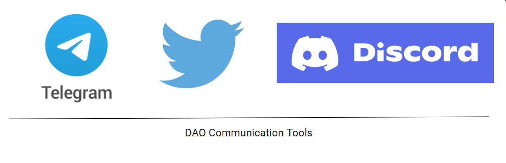
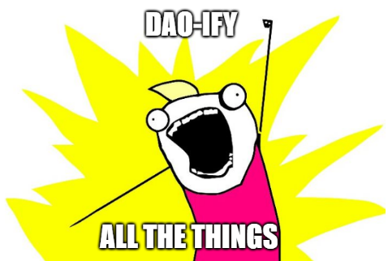

# The Next Big Thing in Crypto is DAOs
 *An beginner’s guide to DAOs (and their explosive growth)*

 

## What do these situations have in common?
 * student-athletes not getting paid
 * Facebook disregarding privacy concerns
 * banks paying no interest on checking accounts

 For starters, all of these situations are not fair.

 And all of these situations involve a rent-seeking middleman — the university, the corporation, the banks — keeping all the value that its customers generate for itself.

 Facebook wouldn’t make money if you didn’t post anything. Universities would remain unknown if it weren’t for their football programs. Banks wouldn’t earn interest if they couldn’t loan out the money from your checking account.

 

 These institutions are worth billions of dollars, accruing value from its constituents’ work. Yet it doesn’t gets distributed out to the people — the people who make them possible.

 And to add insult to injury, if you complain to these centralized entities, they have the power to ban you. Censor your content. Or even seize your assets. Even though you’re the one who makes their platform valuable to begin with.

 

 But it doesn’t have to be this way.

 What if we cut out the middlemen? And gave the value back to you — the person who makes these platforms valuable? What if:
 * student-athletes earned a cut of all ticket and merchandise sales?
 * users were paid a dividend from the ad revenue that their Facebook posts generated?
 * you earned interest from your checking account?

 With the rise of Bitcoin, Ethereum, and the crypto ecosystem is an emerging solution to all of this. A way to automate out the middleman, and distribute the value back to the users. A way to prevent the dangers of concentrated power.

 Enter: the DAO.

## What is a DAO?
 A DAO (or a **D**ecentralized **A**utonomous **O**rganization) is an online community with decentralized rule enforcement.

 Take any online community — a forum, an MMORPG, or your friend group chat. Make sure that no one person can tamper with the rules without community agreement. And you have a DAO.

 For subreddits, rule enforcement is not decentralized because a single mod could wield all the power. That mod could:

 * admit anyone
 * kick anyone out
 * promote anyone to a moderator
 * ban users with no recourse
 * censor posts

 The users give the website most of its value. Yet the users are excluded from ownership or any say in the platform that they make possible.

 DAO’s automate out these centralized powers through code called smart contracts. So imagine instead of a power-hungry mod, we replaced them with a tamper-proof bot that automatically enforced these rules.

 The rules would be transparent to all, as anyone could see how the code was written. And the bot would moderate the community using these agreed upon rules. More on this later.

 And if people disagree, there is always recourse — put the issue to a vote. If enough people agree, the bot’s rules would change, and a user could get unbanned, or an unfair law reversed.

 

## So is a Twitch channel/forum/<insert online community> a DAO?
 So why isn’t a Twitch channel a DAO?

 After all, Twitch channels:
 * are an online community, organized around an interest
 * incentivize participation via upvotes rather than tokens
 * have their own rules (*e.g.* no spamming, flaming)
 * vote via polls
 * allow anyone to participate in the chat

 

 The reason why Twitch chats (and most organizations) aren’t DAO’s is **because they lack decentralized enforcement**. With a Twitch stream, the moderator calls the shots on all the rules. The users can’t do much even if they disagree.

 However if we wanted to convert this Twitch stream into a DAO, we could do so as long as we automate and decentralize the rules. For example, if:
 * users voted on admissions and bans
 * bots scanned comments for rule-breaking behavior rather than moderators.
 * automated polls immediately put into effect community proposals if enough votes pass

 We would have the beginnings of a DAO. And not only that, we would have to program this in a way that not even the streamer or the original creator of the rules could change them without consensus. Only then would we would have converted this Twitch stream into a DAO.

## Why are DAO’s so popular now?
 The idea of a DAO has been around for a long time. It was even referenced in Vitalik Buterin’s initial white paper on Ethereum in 2012 before Ethereum was even launched. **So the idea itself is not novel.**

 

 **But the technology to decentralize rule enforcement never existed before, until the arrival of blockchain technology.**

 Think of the blockchain as a database that everyone has to agree on to modify. In a centralized database, anyone can add an entry to the database. But with blockchains, everyone has a copy of that database. So if you want to change an entry, you’d have to convince everyone to change their copy of the database with you.

 

 And in particular, some blockchain platforms like Ethereum support smart contracts, or programs that you can run on the blockchain. These smart contracts are like automated rules that no one can change.

 A DAO could then just follow the rules as dictated by this program. Anyone can look at the code and verify that it does what it says. Nobody can tamper with these rules because everyone owns a copy of it. Even the creators of the initial rules can’t change them. If you tried to co-opt the rule, you’d have to convince everyone else to change it with you. And it’s unlikely to happen if the members don’t agree to change it with you.

 So while DAO’s have existed for a while, the technology to make them come to life has only just arrived. Hence the renewed interest in them.

## How do I create a DAO?
 Setting up a DAO involves two parts:
 * an online community of people
 * making sure the rules in this group are decentralized

 That’s it! So any existing online community can be converted into a DAO, as long as we make sure the rules are decentralized.



  And setting up a DAO is just setting up the rules for participation, in an automated, and tamper-proof mechanism.


## Tooling for setting up DAO’s
 There are some common automation challenges for forming a DAO. These include:
 * communication
 * joining the DAO
 * proposals for rule changes in the DAO
 * voting infrastructure
 * treasury management

 Fortunately, tools have emerged to automate and decentralize these issues. Let’s walk through how we might set the tooling up in a simple example involving a DAO created to fund a social cause.

## Let’s setup a Crowdfund DAO together.
 Let’s say we want to form a crowdfund DAO, where members all pool their money together for a common cause — like a GoFundMe. Together, we can vote on how the money gets used. We program the rules so that once a simple majority vote is met, the funds automatically get transferred to the agreed upon projects.

### Membership
 We can manage admissions by only allowing people who contribute to the fund to join. The way DAO’s do this is by issuing tokens to represent the dollar contribution.

 Think of the tokens kind of like tickets representing your share of the fund. You can submit some crypto to the DAO’s smart contract. The contract puts it in the communal treasury, and issues you a token, where $1 USD = 1 token. If you own a crowdfund token, you’re a member of the DAO.

 You can implement this in one of two ways:
 * Mint the tokens via tooling with tools like TryRoll.
 * Manually by writing a smart contract yourself that manages this token exchange.

 Essentially you would send some Ethereum to the smart contract’s address and call one of its public API’s, which would move the money into its treasury and issue tokens to your address.

 

### Communication
 Most DAO’s communicate through a combination of Telegram/Discord/Twitter. This part is not hard; create accounts on all 3 platforms, and put all community announcements there.

 Let’s say also that we only want token-holders to join these channels. We can use tools like [Collab.land](https://collab.land) to token-gate these channels.

 If we own the tokens, a bot automatically lets us in. The bot can also check every few hours to see if we still hold these tokens. If we don’t then it can revoke access to former members.

 

### Treasury Management
 We also need a way to manage the funds. One way is to use [Gnosis Safe](https://gnosis.io) to split control of the treasury over many different people. That way if you have 10 people, you could require 6 people together to agree to ever do anything with the funds.

 If you have a full-time team managing this fund, you can support employee payroll from the treasury using [Superfluid](https://www.superfluid.finance). You can also get dashboarding and insights into the state of the treasury via [Llama](https://llama.community/#/).

 

### Voting
 Now we have to decide what to use the money in the treasury for. We can submit a proposal for what to use the project for and allow a way to vote. This vote counting can be done via the tokens, where each token translates to a single vote. Decentralized tools for both proposals and voting exist — [Snapshot](https://snapshot.org/#/) and [Automata](https://www.ata.network) being the most popular ones.

 Compare this to the way this might be done without the blockchain. If a single entity controlled the treasury, then that person alone could steal all the money for themselves. If a single person controlled the votes, they can manipulate vote counts. A single person who controls all communication could censor people. DAO’s eliminate these risks by decentralizing and automating all parts of the organization.

 And one final note: crowdfund DAO’s are actually a thing, and follow this general structure for setup. [Constitution DAO](https://www.constitutiondao.com) most recently tried to pool funds together to win a bid for a copy of the Constitution that went on sale at Sotheby’s. It gave out $people tokens, managed communication via Twitter and Discord, and used Gnosis to control the treasury funds. They ultimately lost the bid, but were a proof of concept of how a DAO could pool funds together quickly for a common cause.

 

## How to make a DAO successful
 Going through the above motions sets up the structure of a DAO. But merely setting up the rules doesn’t take advantage of the biggest benefit DAO’s bring: incentive alignment with its members.

 A DAO’s main power lies in its ability to distribute its value out to its own members. Whereas in web2, the users work (*e.g.* making videos, writing reviews, user engagement, or even their subscriptions) only benefits the centralized org, a DAO’s main advantage is in automating out this central org and distributing the rewards out to its members.

 Rather than the review you write on Yelp getting monetized by Yelp, it is as if Yelp was automated away, and you get a dividend from the revenue your review generates. Instead of Facebook monetizing your data by selling it to advertisers, it is as if Facebook was automated away, and advertisers paid you instead.

 In this way, DAO’s are like virtual co-ops. You capture all the value of your work, and as the co-op grows, you directly benefit as a member of the co-op. It has better economic incentive alignment than existing web2 structures.



  If web2 companies already have sticky user engagement — **imagine the flywheel DAO’s could create if you rewarded members for their contributions with real money, and incentivized them to make even better content by rewarding them even more**.


 

 Thinking through the economics of these incentives is the most important and difficult part of starting a DAO. There are many examples, but common examples of how DAO’s align these incentives include:

 1) **financial gain** — some DAO’s act like decentralized banks and are part of a broader movement called DeFi, or **De**centralized**Fi**nance. Members can pool their money together and lend it out to others. The interest the loaners pay then gets paid out to all the liquidity providers. It is as if the interest that banks earn instead got paid to all the members who had checking accounts.
 DAO’s that do this include Compound DAO, Aave, and Anchor protocol, just for providing liquidity to the DAO — some as high as 20% interest.

 

 2) **game theory** — some DAO’s use game theory to incentivize wealth creating behavior among its members. Think of game theory as issuing out punishments and rewards to incentivize good behavior. An upvote/downvote system is a simple game theory example that promotes good content, since others will approve it via upvotes, while discouraging bad content since the downvotes will hide it.

 One example of DAO’s using this are a class of DAO’s that utilize cartel economics. Cartel economics is how cartels — oil companies, diamond companies, drug cartels, make money. The commodity they sell is often not actually scarce. Diamonds aren’t rare for example, but miners collude to artificially restrict supply to drive up prices. This benefits all members, since they are all incentivized to restrict the supply together to keep prices high.

 Several DAO’s use this style of game theory cartel economics to create wealth for its members. These protocols mint tokens for its members that it distributes, but then incentivizes everyone to restrict supply of their tokens to the public via staking. Since the DAO’s token supply has shrunk, the few tokens on sale in the market will have its price spike up.

 Some prominent examples of game theory DAO’s include [Olympus DAO](https://www.olympusdao.finance), [Time Wonderland](https://www.wonderland.money), and [Rome DAO](https://romedao.finance).

 

## Not everything should be a DAO
 DAO’s have emerged for every kind of purpose you can imagine. Like the way people combined existing business with other use cases to start new businesses (*e.g.* Uber for X or AirBnB for Y), people are doing the same with DAO’s.

 Just combine a DAO with &lt;insert crowdfund&gt;  or  &lt;insert community&gt; and you have a new DAO right?

 

 But not so fast. Always ask yourself two questions when starting a DAO:

 * What is the DAO’s web2 equivalent?

 * Are there any centralized parts of the DAO?

 These two questions could reveal weaknesses in the DAO or that a DAO wasn’t necessary at all.

### DAO vs its web2 equivalent
 **Before starting a DAO, always consider the web2 equivalent of a DAO first (*i.e.* how you would build it in a centralized fashion).**

 To give some examples:
 * For crowdfund DAO’s — what if we just started a crowdfund using a GoFundMe instead?
 * For business DAO’s — what if we just made a company with a typical CXX structure instead of having a headless org?
 * For social DAO’s — what if it was just a group chat?

 For most use cases, it wouldn’t be that bad. Factors to consider include:
 * Slowness — imagine how slow-moving if everything in an organization required a vote. That’s what DAO’s are like. This makes changes hard and rapid innovation difficult. If an organization had more centralized power (*e.g.* a CEO or a dictatorship) then the org could move faster.
 * No need for decentralization — most things operate just fine in the web2 version. For crowdfunds, a GoFundMe might work just fine without a DAO. Or for a Twitch stream, the owner SHOULD have ultimate power since they own and create it. In fact without a strong moderator, the community could have too many spammers, leading to a degradation in community quality over time.
 * No recourse for issues — Because DAO’s don’t have a single power responsible, there’s no one to turn to if something goes wrong. For example, for financial DAO’s, what if I accidentally send funds to the wrong person? Or want a refund?

 Customer service is a big plus of centralized businesses, but DAO’s can’t have that when there is no single person responsible. In fact the responsibility is even more dispersed, because everyone could be anonymous — you might not even know who your fellow DAO members are! The only thing unifying you with others is the automated rules enforced by the smart contract of a DAO.

### The weakest link of a DAO
 If all parts of a DAO were decentralized (the communication, treasury management, governance, etc) a DAO would be bullet-proof. But in reality, most DAO’s are a combination of decentralized and centralized parts.



  A DAO is only as decentralized as its most centralized part.


 

 It is this centralized part that could be coopted by bad actors. Especially if it is a critical part of the DAO, such as the treasury management, that is centralized, then this might not be much of a DAO to begin with.

 For example, many DAO’s use multi-sig wallets, requiring several leaders to agree to move the funds. Although it is decentralized in that several people have the power, if this minority decided to collude together, they could siphon off the money from the community treasury in a rug-pull. In this case power was centralized in the signers of the multi-sig wallet, and this centralization presents a risk to the entire DAO.

 While it is natural for a DAO to start off in some centralized way, they tend to decentralize over time as the leaders cede more power to the collective group as it grows bigger. This is also why the best DAO is one where all parts of the DAO tooling stack is decentralized, so that no one can co-opt any part of it, and hold the rest of the DAO hostage.

 Sometimes it comes down to a matter of trade-offs. Certain parts of a DAO are more important to be decentralized than others. Handling of funds is always critical to decentralize. Voting is critical to decentralize — what good is it if you vote but a few people count the votes behind closed doors? Communication is not as critical to decentralize since the DAO’s smart contracts can still run without it. Thus things like communication can be outsourced to centralized web2 tools like Twitter or Discord.

## Summary
 1. A DAO is an online community where the rules of enforcement are decentralized.
 2. Setting up a DAO is just setting the up rules of a community in a decentralized fashion.
 3. You’ll start hearing about DAO’s more because the technology to implement one has emerged recently with the rise of blockchain.
 4. There exists many tools for setting up a DAO, and common solutions have started to appear for common DAO problems — communication, voting, and treasury management.
 5. Setting up the rules of a DAO is the mechanical action. The hard part of a DAO is setting up the incentives to reward participation.
 6. Not everything needs to be a DAO. Always compare it with its Web2 equivalent.
 7. A DAO is only as strong as its weakest (*i.e.* the most centralized) link.

## Further reading
 * [Crypto Startup School](https://a16z.com/crypto-startup-school/)
 * [A Beginner’s Guide to DAO’s](https://linda.mirror.xyz/Vh8K4leCGEO06_qSGx-vS5lvgUqhqkCz9ut81WwCP2o)
 * [DAO’s: Absorbing the Internet](https://www.readthegeneralist.com/briefing/dao)
 * [DAO of DAO’s](https://www.notboring.co/p/the-dao-of-daos)
 * [Useful Twitter Thread on DAO use cases](https://twitter.com/albiverse/status/1372263045842485257?s=20)
 * [The Future is DAO — A primer on DAO’s and their explosive growth](http://the-future-is-dao-a-primer-on-daos-and-their-explosive-growth/)
