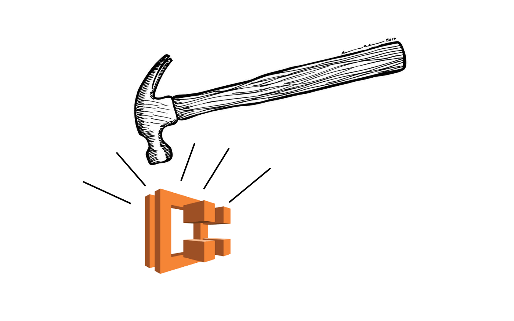
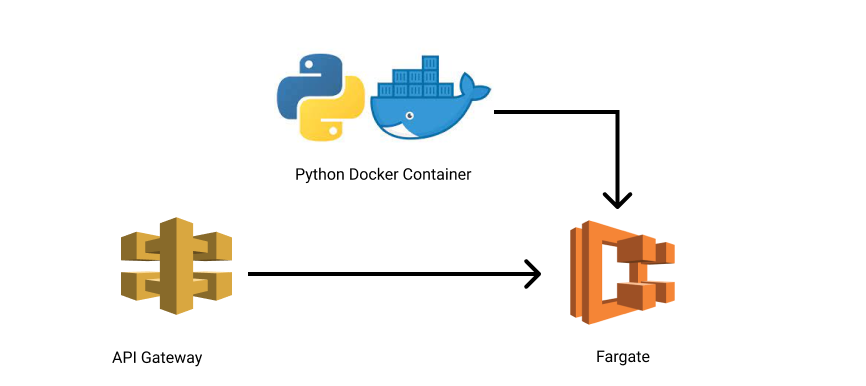
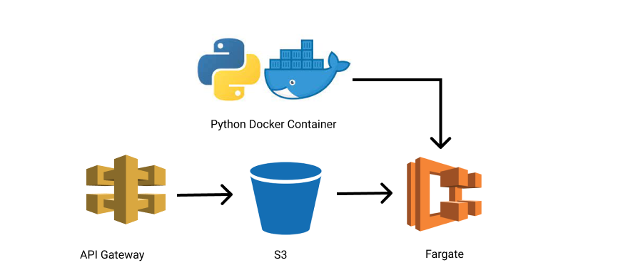
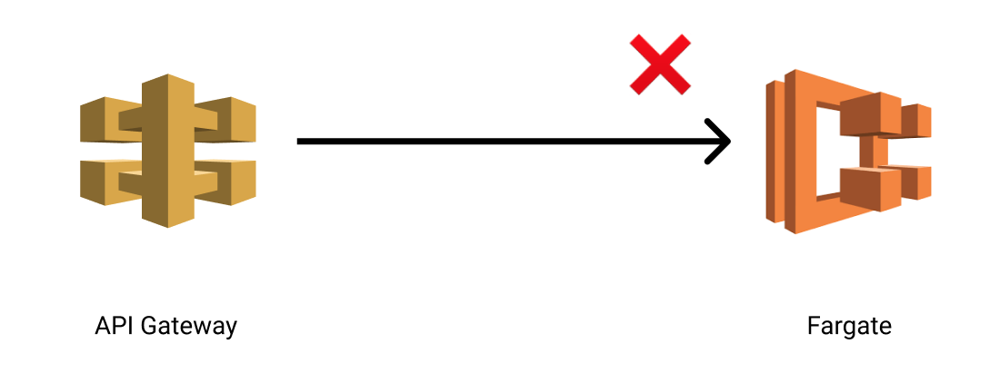
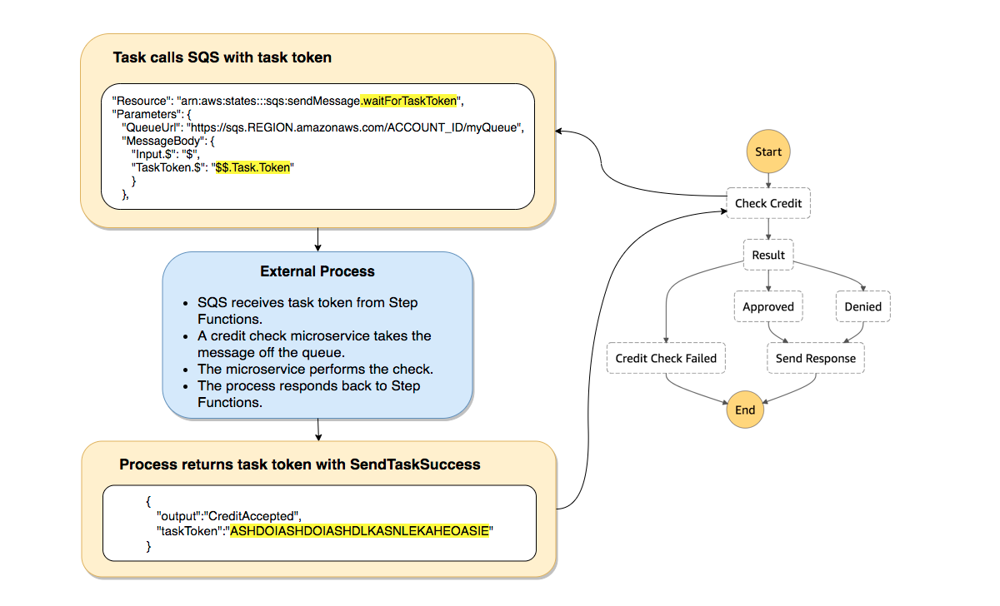
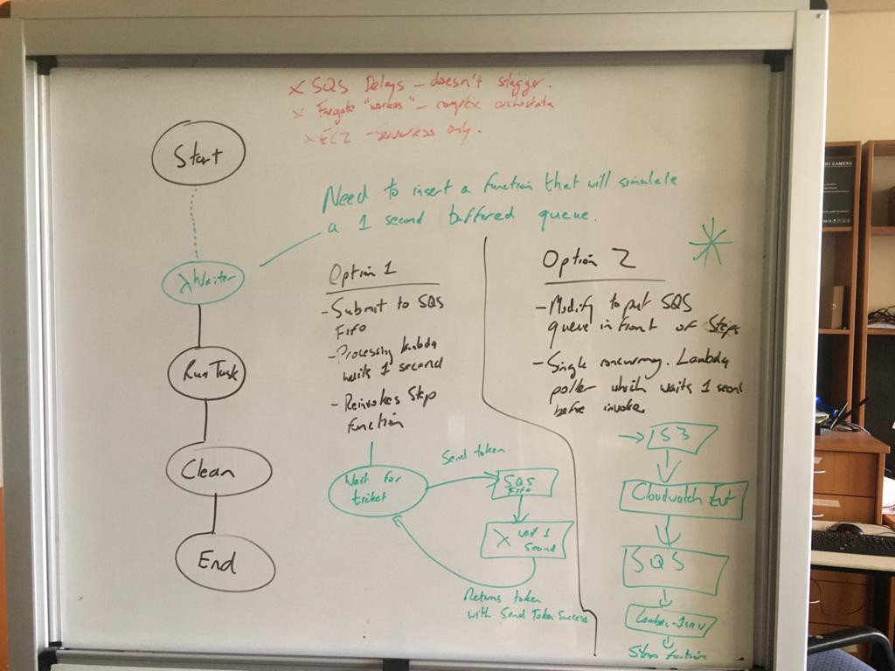
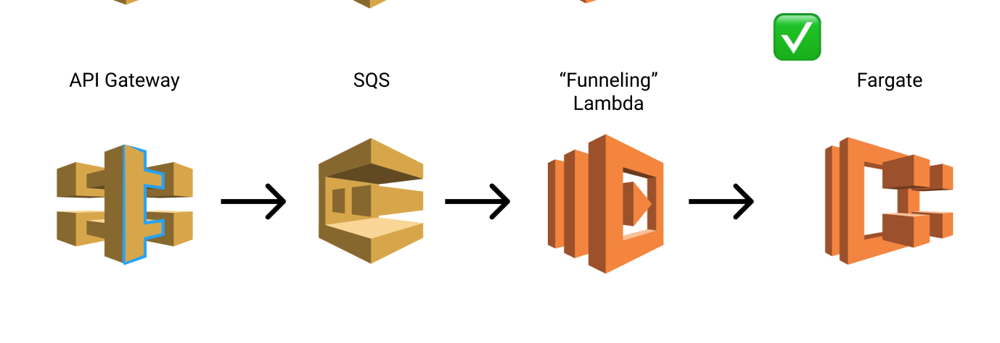
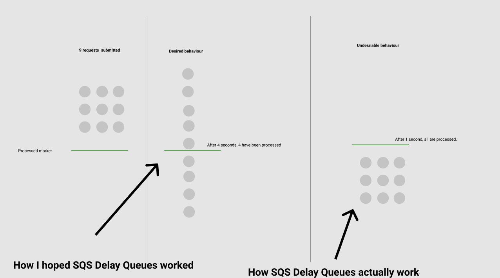
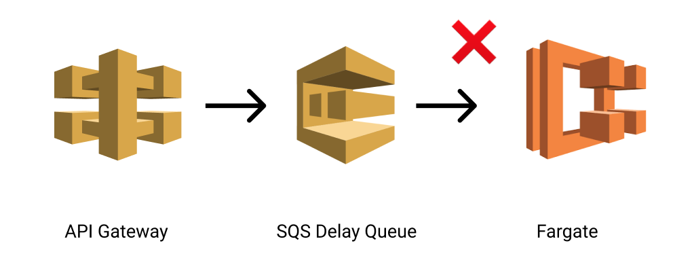

 A story of being foiled by AWS Fargate in production and how we recovered.
 
 

## Intro
 The technology development team at [Austal](http://austal.com/) recently kicked off a program of work on computational fluid dynamic simulations for optimising vessel designs.

 As the cloud lead I was approached to design an API that could host the simulations for a third party to integrate with.

 The API would need to scale to handle significant load horizontal load, long running tasks and provide some beefy compute requirements.

 "Yes yes yes," I retorted nonchalantly. No problem. We’ll bundle the python simulation code as a docker container, throw it on Fargate and then wrap an API gateway around it. Easy peasy.

 

 Having never worked with Fargate before what I needed was someone to cuff me around the back of the head at this exact point. Overconfidence is rarely rewarded in cloud land.

 But nobody did and so we waded ahead with confidence that Fargate would handle this task easily.

## Fargate Architecture
 One of the differences between Fargate and Lambda is that you can’t pass in the API request as a JSON event we’re used to.

 All you can pass in is environment variables. So the API needs to persist the data in S3 then invoke the Fargate task with the S3 file location as an env.

 

 Roughly the architecture looks like this;

 API Gateway ➡ Save to S3 ➡ Kick off step function ➡ Run Fargate Task ➡ Verify S3 file saved ➡ End

 The request is saved in S3, a step function workflow is invoked to kick off and supervise the Fargate execution and then has some final verification that everything worked as expected before ending.

## Going swimmingly
 I have to give credit to AWS for most of this. And to [Dylan](https://au.linkedin.com/in/dylanrjohnston), who led the development on the API.

 Everything worked really smoothly and having beefy instances spin up to handle requests for a grand total of $0.02 felt simply ridiculous.

 And in many ways the success of it led to our primary issue. We started ramping up load on the API and in turn experienced throttling exceptions when invoking the Fargate task.

 I requested AWS bump up our concurrent executions even further but it had no impact. Throttling exceptions when batches of requests were submitted.

 

    “We have increased the number of concurrent executions to 500” , but we still had issues.
 
 
  
  I raised another support ticket and that’s where we found the real issue.

 

    Fargate, without documenting it anywhere on the internet, has a hidden limit on the number of RunTask API calls that can be executed per second.
 
 

 

 This overrides the concurrent execution limit making them a liability for bursty load.

 Our API passed (admittedly limited) load testing so I can only guess that the actual throttling is not as simple as 1 per second but instead x amount over y time period.

## The fix
 So before I tell you how we fixed it I’ll let you design your own solution. How would you redesign our original architecture to handle bursts in load knowing the limitations of Fargate?

## Queue before process
 I played around with the idea of modifying the actual step function workflow to do a callout to an SQS queue with a task token and then have a single concurrency lambda process those with a 1 second wait before calling back with the token to allow it to proceed.

 Sort of like a parking entry where you wait for your ticket.

 

 After consulting with AWS though we decided that leaving the robust step function workflow intact was the better approach.

 

 We decided to hook the S3 puts directly up to an SQS queue for processing as this could be configured entirely through infrastructure as code

 A single concurrency lambda would then process it by waiting a second before invoking the step function, ensuring Fargate didn’t get throttled on Run Tasks.

 

 After that everything starting working smoothly.

## A potential future optimisation
 We thought about optimising this by using SQS Delay queues to process the messages and then connecting that directly to Fargate, removing the need for the Lambda.

 However SQS delay queues only delay each message by a fixed amount meaning that if a flood of requests comes through, all of them would be pushed after 1 second, triggering the RunTask throttling.

 

 So for now this potential optimisation is not possible until AWS make delay queues support the “funneling” option.

 

## Takeaways
 This was a nasty issue. The fact that our load testing passed but over time Fargate throttled makes it a latent issue most companies will not find until the worst time possible. Under heavy traffic.

 Being honest it feels like AWS are trying to be sneaky here and market Fargate as something that can handle any volume of load by some internal trickery, even though they are obviously constrained in how quickly they can respond to these requests.

 Really all it does though is introduce a horrible ticking time bomb into their customers architectures. This is the first time I’ve felt “deceived” by AWS.

 I hope they will either remove the RunTask constraint and honour the concurrent execution limit or be honest with all Fargate customers and get them to introduce queueing in front of their workloads.

 For a customer centric company, the current approach leaves much to be desired.

## Shoutouts
 Thanks for [Even Zhang](https://au.linkedin.com/in/even-zhang-2a95a511a) at AWS for quickly supporting us with our refactor and providing a raft of potential solutions.

## About Me
 An AWS Certified Solutions Architect Professional with a passion for accelerating organisations through Cloud and DevOps best practices.
