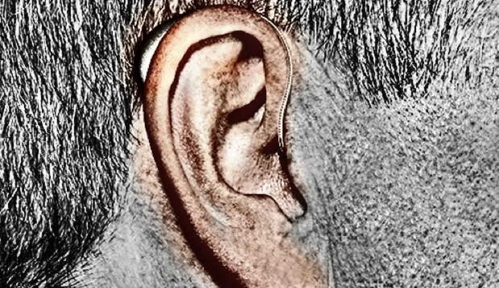


Cool feature!
Now to get an iPhone-enabled hearing aid for my right ear.


*Apple supports the FCC's hearing-aid compatibility standard to current iPhone models. This summer, developers have released apps supporting Cupertino's Made For iPhone hearing aids.*

An [Apple Support list of iOS and hearing aid combinations](http://support.apple.com/kb/HT4526) shows that the currently-shipping iPhone models, the iPhone 4S and greater, support the FCC's hearing-aid compatibility standard (HAC) and Apple's own Made For iPhone hearing aids. There are two types of support M (enabling acoustic coupling with hearing aids that don’t operate in telecoil mode) and T (supporting inductive coupling with hearing aids operating in telecoil mode).


iPhone and hearing aids generally work best together in "M" or acoustic coupling mode. To use your hearing aid in this mode, make sure that your hearing aid is set to "M," or acoustic coupling mode, and position the iPhone receiver near the hearing aid’s built-in microphone (or microphones). In other words, hold your iPhone against your head as you would naturally hold the phone when making a telephone call. The hearing aid will receive audio from the iPhone through its built-in microphones.

For the best results, try using the iPhone in different positions relative to your hearing aid—for example, placing the receiver slightly above the ear may result in better performance for hearing aids with microphones positioned behind the ear.


[Starkey Laboratories](http://www.trulinkhearing.com) this summer updated its hearing aid app [TruLink Hearing Control](https://itunes.apple.com/us/app/trulink-hearing-control/id775168025?mt=8); the software works with Made for iPhone hearing aids from Starkey, Audibel, NuEar, MicroTech and AGX Hearing. The software can deliver optimized music from the iOS device, and lets users create stored and geo-tagged settings, called memories, that can be automatically switched depending on location. Users can also change the volume settings on the hearing aid from their iOS device. 

A recent post by Allyson Kazmucha at iMore runs through the [steps of pairing an iPhone with a hearing aid](http://www.imore.com/how-connect-hearing-aids-auditory-accessibility-your-iphone-or-ipad) in iOS's hearing Aid Mode. It's straightforward.

Show Comments
