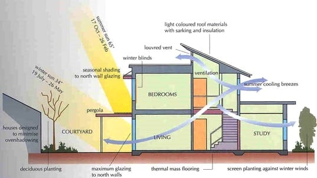

Last year, I [started researching](/2021/0715/Science_科学/Technology_技術/Researching-Smart-Home-Design.html) technology advances around carbon-neutral housing. When looking at the Japanese standard for construction in Hokkaido, I find it disappointing. While Hokkaido standards[^1][^2][^3][^4] are far better than those of the main island, it still seriously lags behind the rest of the advanced world in terms of energy efficiencies, clean-renewable energy sources, and political will. Japan doesn't offer any major subsidies[^5] nor much in the way of incentives to build truly Zero-Energy-Buildings. Nevermind constructing an Energy-Plus house where you sell your excess energy to the grid.

[^1]: [Japan Building Standard Law](https://www.bcj.or.jp/upload/international/baseline/BSLIntroduction201307_e.pdf)
[^2]: [Kutchan Building Regulations](https://www.nisekorealtysales.com/owning-property-mainmenu-71/kutchan-building-regulations-mainmenu-74?showall=1)
[^3]: [Application and notification flow](https://www.town.kutchan.hokkaido.jp.e.acx.hp.transer.com/Living_Information/sumai-koutu/kenchiku/shinseitodokede/)
[^4]: [Snowfall Flying Distance and Number of Parked Vehicles](https://www.town.kutchan.hokkaido.jp.e.acx.hp.transer.com/Living_Information/sumai-koutu/kenchiku/kenshiku_tasetu/)
[^5]: [ZEH支援事業 公募情報 offers upto １４０万円 subsidy](https://sii.or.jp/moe_zeh04/support/public.html)

## What is Passive House?
 
 - Passive Solar home construction: https://www.ecohome.net/guides/passive-solar-home-design/

## What is ZEB/ZEH?
 

### What is a Zero Energy Building? | video (2:03 minutes)
 Most buildings today use a lot of energy -- to keep the lights on, cool the air, heat water, and power personal devices. Even installing solar systems will not significantly counter the heavy energy load.
 There are, however, some buildings that strike a balance; or even tip the scales the other way! These are called zero energy buildings.


  allowfullscreen: 1,
  autoplay: 0,
  hl: en,
  cc_lang_pref: en,
  cc_load_policy: 1,
  color: white,
  controls: 1,
  disablekb: 0,
  enablejsapi: 1,
  fs: 0,
  iv_load_policy: 3,
  loop: 0,
  modestbranding: 1,
  playsinline: 0,
  privacy_mode: yes,
  rel: 0,
  showinfo: 0,
  origin: blog.richiebartlett.com,
  widget_referrer: blog.richiebartlett.com


## Future House design
### 4 steps to NZE home
 We *must* proceed in this order:
 1. Passive solar design
 2. Efficient exterior envelope
 3. Efficient electric systems
 4. Electricity generation on-site

 

### Insulation goals
 5 / 10 / 20 / 40 / 80

 * R5+: Windows (U = 0.2)
 * R10: Below slab
 * R20: Walls below grade
 * R40: Walls above grade
 * R80: Roof

 NOTE: R10 ~ R17 windows are possible with [LiteZone&reg; windows](https://www.litezone.ca).

### Insulation methods
 * [SIPS](https://www.sips.org/what-are-sips#:~:text=Structural%20insulated%20panels%20(SIPs)%20are,oriented%20strand%20board%20(OSB).) (Structural Insulated Panels)
 * [ICF](https://en.wikipedia.org/wiki/Insulating_concrete_form) (Insulated Concrete Forms)[^6]
 * [Double stud walls](https://www.buildingscience.com/documents/enclosures-that-work/high-r-value-wall-assemblies/high-r-value-double-stud-wall-construction)
 * [Continuous exterior rigid insulation](https://www.buildingscience.com/documents/building-science-insights-newsletters/bsi-120-understanding-walls)
 * [ZIP System&reg; coated sheathing](https://www.qualitybuilt.com/resources/tech-alert-zip-system-vs-tyvek-homewrap-pros-and-cons/#:~:text=ZIP%20System%20is%20manufactured%20by,%2Dimpregnated%20polymer%2Dmodified%20material.)
 * [Straw bale](https://en.wikipedia.org/wiki/Straw-bale_construction)

[^6]: [ICF vs SIPs vs Framing - Pros and Cons](https://youtu.be/C3KX8c3UVo4)

### Efficient all-electric systems
 1. Space heating (& cooling)
 2. Hot water
 3. Cooking
 4. Clothes dryers

### Heating & Cooling
 GSHP (ground source heat pump):
 * Expensive system (install); check for tax rebates and subsidies in your region
 * Can be air-based system
 * Or, water-based system with in-floor heat
 * In-floor radiant cooling is also possible

 Mini-Split heat pump systems:
 * Can be used for smaller homes
 * Don't provide heat below -14&deg;F (-25.5&deg;C), so backup heat source required

 Heat recovery ventilator
 * Provides fresh-air exchange in an air-tight house

 Passive solar slabs
 * Flooring that absorbs the heat during the day and releases during the night.
 * Carpet does NOT work here.

 Hot Water:
 * Electric heat pump water heater
 * COP = 3.0+
 * No longer recommend solar thermal water panel systems

 Cooking:
 * Induction cooktop - mimic benefits of gas cooktops

 Clothes drying:
 * Heat pump dryers

### Photovoltaics
 Only after completing those first three steps are we ready to generate electricity. Photovoltaics are a bad idea on an inefficient building. There is more "bang for the buck" in making buildings efficient first, then investing in PV or other renewables.

 Typical system has:
 1. Solar Panels 
 2. Inverter
 3. Service panel
 4. Smart meter
 5. Utility grid

## Net-Zero Home
 This system produces as much energy in a home as it consumes over the course of a year.
### Net-Zero 101 - The secret of building super energy efficient net-zero homes | Video (8:21 minutes)
 Net-zero homes first appeared in 2007, but they are taking North America by storm. In part 1 of our Chasing Net-zero series we talk to net-zero pioneer Peter Amerongen about the amazing history of these super energy efficient solar-powered homes and Mike Turner about the secrets of building a net-zero home. https://www.greenenergyfutures.ca/episode/78-chasing-net-zero-net-zeo-101



    start: 0,
    allowfullscreen: 1,
    autoplay: 0,
    hl: en,
    cc_lang_pref: en,
    cc_load_policy: 1,
    color: white,
    controls: 1,
    disablekb: 0,
    enablejsapi: 1,
    fs: 0,
    iv_load_policy: 3,
    loop: 0,
    modestbranding: 1,
    playsinline: 0,
    privacy_mode: yes,
    rel: 0,
    showinfo: 0,
    origin: blog.richiebartlett.com,
    widget_referrer: blog.richiebartlett.com


### Twelve Essential Steps to Net Zero Energy | Video (8:21 minutes)
 http://www.cliftonviewhomes.com/
 http://zero-energyplans.com/

 Clifton View Homes and Zero Energy Plans founder/CEO Ted Clifton walks us through the twelves steps of building planning and construction that have helped him to design and build the most energy efficient homes in the world.  Video shot and edited by Kyle Porter, http://porterworks.com/

#### 12  Essentials
 1. Building Orientation
    (In northern hemisphere) South facing house. [In other words, facing the equator.]
    Overhangs and extended roofs can minimize the amount of sunlight that penetrates inside the house.
 2. Simple design
    As square as possible. Or, rather maximize the amount of the house that faces the sun but mitigates excessive absorption in the summer time.
 3. Window Orientation
    Most of the windows should be on the south side of the house. There should be minimum number of windows on the North side of the house. If possible, the north-side can have zero windows to reduce heat-loss and reduce costs. 
 4. Thermal mass
    By allowing thermal energy to reach the interior floor and counter-tops (in kitchen), the space can accumulate "thermal mass" and release that energy through the night.
 5. Tight building envelope
    Minimize or eliminate all thermal bridges and air-leaks in the walls.
 6. Balanced Insulation levels
    The exterior walls and roof must have good insulation values that retain your interior temperatures. Install windows with an R rating as close to the wall's R rating.
 7. Balanced ventilation
    Bath & kitchen fan exhaust needs to be balanced with in-flow of air. If possible place the exhaust fans outside the home (to minimize fan sound) and match the exhaust fan speed with the in-flow fan speed.
 8. Heating & Cooling
    Employing a GSHP is very effective at extracting heat from the ground. 
 9. Domestic Hot water
    Again GSHP or solar thermal panel to heat up the water.
 10. Efficient appliances
     Take the time to find appliances that don't require as much energy to perform the same function. For example, installing a refridgerator that draws less current than the standard model will help you achieve a net-zero efficiency.
 11. Efficient lighting
     Employ more LEDs that draw significantly less wattage &mdash; especially when compared with fluorescent light bulbs. You only need to light the surfaces where you are present. No need to light up the entire house.
 12. Alternative Energy sources
     - Solar electic panels
     - Wind turbines
     - [Geothermal energy](/2022/0430/Science_科学/Technology_技術/Geothermal-electricity.html)
     - Hydroelectric - if you have a constanct water stream nearby your property; or, can store it in a water tank and capture the energy as it drains.
     - Electric vehicles - some electric cars can act as a temporary battery for your house.
     - Battery panels - storage for excessive energy to be discharged when natural sources are scarce. 



    start: 0,
    allowfullscreen: 1,
    autoplay: 0,
    hl: en,
    cc_lang_pref: en,
    cc_load_policy: 1,
    color: white,
    controls: 1,
    disablekb: 0,
    enablejsapi: 1,
    fs: 0,
    iv_load_policy: 3,
    loop: 0,
    modestbranding: 1,
    playsinline: 0,
    privacy_mode: yes,
    rel: 0,
    showinfo: 0,
    origin: blog.richiebartlett.com,
    widget_referrer: blog.richiebartlett.com


## Net Zero Homes Webinar A Behind the Walls Tour | video (1:05:33 hours)
 Join Green Builder’s Editor-in-Chief Matt Power on a tour of a half-dozen recently completed net-zero homes, comparing and contrasting material choices, design concepts and priorities.


  allowfullscreen: 1,
  autoplay: 0,
  hl: en,
  cc_lang_pref: en,
  cc_load_policy: 1,
  color: white,
  controls: 1,
  disablekb: 0,
  enablejsapi: 1,
  fs: 0,
  iv_load_policy: 3,
  loop: 0,
  modestbranding: 1,
  playsinline: 0,
  privacy_mode: yes,
  rel: 0,
  showinfo: 0,
  origin: blog.richiebartlett.com,
  widget_referrer: blog.richiebartlett.com


## Passive House vs. Net Zero House | video (1:28:44 hours)
 A live presentation in Seattle as part of the NW Ecobuilding Guild's ongoing speakers series.
 There are many paths, certifications and techniques to building Net-Zero buildings. The Passive House design helps achieve great efficiencies in buildings, reducing long-term costs and stacking functions in the living area, but is it the best? The Northwest is rich with styles, knowledge and experts, creating buildings that produce energy to power themselves and beyond. Join us as our presenters discuss their experiences developing Passive House and other Net-Zero designs, highlighting the ups and downs of each model in the Northwest environment, and what has helped their buildings achieve this sustainability goal.


  allowfullscreen: 1,
  autoplay: 0,
  hl: en,
  cc_lang_pref: en,
  cc_load_policy: 1,
  color: white,
  controls: 1,
  disablekb: 0,
  enablejsapi: 1,
  fs: 0,
  iv_load_policy: 3,
  loop: 0,
  modestbranding: 1,
  playsinline: 0,
  privacy_mode: yes,
  rel: 0,
  showinfo: 0,
  origin: blog.richiebartlett.com,
  widget_referrer: blog.richiebartlett.com


## Passive Home Tour with Architect/Homeowner Jane Wilson | video (18:55 minutes)
 Architect and homeowner Jane Wilson gives us a tour of their completed passive home built in 2016 with the Conscious Builder

 Visit Jane Wilson's website here: http://www.ejwarchitect.com/

 Jane Wilson showcased her Passive Home  in the 2018 Green Energy Doors Open Event.


  allowfullscreen: 1,
  autoplay: 0,
  hl: en,
  cc_lang_pref: en,
  cc_load_policy: 1,
  color: white,
  controls: 1,
  disablekb: 0,
  enablejsapi: 1,
  fs: 0,
  iv_load_policy: 3,
  loop: 0,
  modestbranding: 1,
  playsinline: 0,
  privacy_mode: yes,
  rel: 0,
  showinfo: 0,
  origin: blog.richiebartlett.com,
  widget_referrer: blog.richiebartlett.com


### 5 most important factors in an Passive House
 1. Wall Assembly: R-value & Air Tightness
 2. Windows: Performance, placement & size
 3. Fresh air system
 4. Overhangs (roof & windows)
 5. Orientation (of house in relation to the Sun)

## How to Design and Build Affordable Zero Energy Homes | video (1:00:13 hours)
 If you can afford a new home, you can afford a zero energy home.  You can build and design a zero energy home that cost less to own from the minute you walk in the door. Bruce Sullivan shows you how.  

 Bruce Sullivan, a building energy efficiency consultant and trainer, has been helping people improve the energy efficiency and reduce the environmental impact of their homes for more than three decades. He has provided training to builders, designers, code officials and others around the Northwest; and he has built his own low cost zero energy home; and is the energy consultant and blogger for the Zero Energy Project at https://zeroenergyproject.org.


  allowfullscreen: 1,
  autoplay: 0,
  hl: en,
  cc_lang_pref: en,
  cc_load_policy: 1,
  color: white,
  controls: 1,
  disablekb: 0,
  enablejsapi: 1,
  fs: 0,
  iv_load_policy: 3,
  loop: 0,
  modestbranding: 1,
  playsinline: 0,
  privacy_mode: yes,
  rel: 0,
  showinfo: 0,
  origin: blog.richiebartlett.com,
  widget_referrer: blog.richiebartlett.com


## Tools
Carbon Footprint Calculator (B.E.A.M) for Builders with Chris Magwood:
- https://www.buildersforclimateaction.org/beam-estimator.html

## Related terms
 * Zero Carbon or [Carbon Neutral](https://en.wikipedia.org/wiki/Carbon_neutrality)
 * [Energy Positive](https://en.wikipedia.org/wiki/Energy-plus_building) (generating more than you use)
 * HPB = [High Performing Building](https://en.wikipedia.org/wiki/High-performance_buildings)
 * LB = Living Buildings ([Living Building Challenge](https://living-future.org/lbc/basics4-0/))

