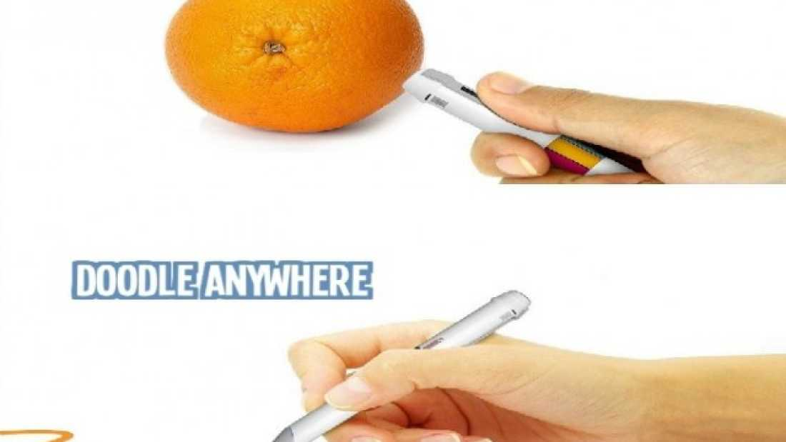

A pen that combines an RGB sensor and a five-color ink cartridge allows artists to match any pigment they can see.

The pen is known as Scribble, and it's not yet available for sale. However, if you can't wait to get your hands on it, and the $150 pricetag does not deter you, you can sign up to [an alert](http://www.getscribblepen.com/#newsletter) (and be encouraged to contribute to their Kickstarter campaign).

“For the color-blind, kids, interior decorators, homeowners, teachers, artists, photographers, designers and students the Scribble color picker pen will make copying an exact color, any color from any object and absolute breeze,” an anonymous company spokesperson said in a [media release](http://getscribblepen.com/Scribble_Press_Kit.zip).

The scanner is located at the top of the pen, and when pointed at any consistent color will allow the pen to save the shade and match it with an appropriate combination of inks. 

Scribble's manufacturers claim it is capable of storing 100,000 colors in its internal memory, and runs on a lithium-ion (and therefore rechargeable) battery. The weight is just 39grams, making it easy to operate.

For those who consider paper passe, there is a stylus with the same capacities that can be used on digital devices at little more than half the cost.

