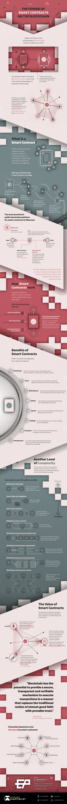

## Power of Smart Contracts on the Blockchain

The world is waking up to the impressive capabilities of the blockchain.

As a foundational technology that things can be “built on top” of, the potential applications of the blockchain go way beyond just payments or cryptocurrencies. In fact, the blockchain could revolutionize how we interact with intellectual property, capital markets, insurance, healthcare, government, and many other sectors.

## Introducing Smart Contracts
In particular, an exciting enabler of blockchain technology is the concept of self-executing “smart contracts”.

Today’s infographic comes from [Etherparty](https://etherparty.io), a smart contract creation tool, and it helps provide a welcoming introduction to how smart contracts work on the blockchain.

Smart contracts are going to change everything from the legal industry to the [backbone of the stock market](https://www.visualcapitalist.com/blockchain-backbone-stock-market/).

Here’s how these self-executing contracts actually work.

## The Anatomy of a Smart Contract
Smart contracts help you exchange money, property, shares, or anything of value in a transparent, conflict-free way while avoiding the services of a middleman. Built upon the blockchain, a smart contract is usually:

1. Pre-written logic in the form of computer code
2. Stored and replicated on the blockchain
3. Executed and run by the network of computers running the blockchain
4. Can result in updates to accounts on the ledger (*i.e.* payment for an executed contract)

Using the Ethereum platform, smart contracts can be programmed using basic logic. On the most basic level, they can:

* Perform calculations (*i.e.* calculating interest)
* Store information (*i.e.* membership records)
* Send transactions to other accounts (*i.e.* payment for a good or service)

But most importantly, it is important to know that smart contracts are autonomous. They are not controlled by anyone – instead, they self-execute based on a set of instructions that two parties have agreed to (ie. the code).

## Benefits of Smart Contracts
Smart contracts are appealing for a variety of reasons:

* **Autonomy**: There is no need to rely on third parties, which could be biased or not have your interests at heart.
* **Trust**: Your documents are encrypted on a shared ledger, and all parties can have access to them.
* **Redundancy**: Documents are duplicated many times over on the blockchain, and can’t ever be “lost”.
* **Safety**: Documents are encrypted, making them near-impenetrable by hackers.
* **Speed**: These contracts automatically self-execute, saving you precious time.
* **Savings**: Smart contracts save you money by taking out the middleman.
* **Precision**: Smart contracts execute the exact code provided, ensuring zero errors.
* **Transparency**: For organizations like governments, they could add another level of transparency to dealings.

The blockchain is already a disruptive technology, and with these benefits – the potential behind smart contracts is another facet to be excited about.

