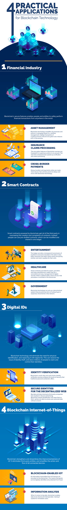

## Infographic

## Major Practical Applications of Blockchain
### Financial Services
Recent numbers show that the **asset management** industry could cut costs by [$2.7 billion](https://www.ft.com/content/b6171016-171f-11e8-9e9c-25c814761640) every year by moving to blockchain tech. Practical applications of blockchain in the financial services industry include client screening and onboarding, recordkeeping, data privacy and security, and trade processing.

Similarly, the **insurance** industry is fraught with errors and costly mistakes. The FBI estimates that over [$40 billion](https://www.fbi.gov/stats-services/publications/insurance-fraud) a year is lost through fraud across all non-health insurance industries.

*Example solution*:

* RiskBlock, a proof-of-insurance product, helps insurers save time and money through automated processes, and it helps insured individuals validate their insurance claims securely and quickly.

### Smart Contracts
Blockchain and [smart contract](/2022/0617/Science_科学/Technology_技術/Power-of-smart-contracts.html) technologies function well in instances where legal contracts are required to maintain ownership rights and data privacy laws. These customizable, self-executing smart contracts on the blockchain can be easily managed by all parties.

Issues with **ownership rights** and **royalties** are commonplace within the entertainment industry. To navigate these issues, blockchain technology offers an unchangeable, traceable, real-time distribution and reporting network for all involved.

*Example solution*:

* Ujomusic is one such application that is helping artists track their royalties worldwide.

### Digital IDs
According to the World Bank, over [1.1 billion people](https://blogs.worldbank.org/voices/global-identification-challenge-who-are-1-billion-people-without-proof-identity) worldwide still have no way to prove their identity. At the same time, companies and financial institutions in both traditional and digital markets are being required to follow more stringent know-your-customer (KYC) initiatives.

Despite this, many providers are still not sufficiently meeting these standards; to further complicate things, regulations vary widely from jurisdiction to jurisdiction.

*Example solution*:

* Companies like [IBM, Microsoft, and Cisco](https://cointelegraph.com/news/blockchain-based-digital-id-systems-are-increasingly-finding-real-world-use) are migrating to the blockchain to securely and privately verify users.

### Blockchain Internet of Things (IoT)
Gartner [predicts](https://www.otarris.com/on-trend-20-4-billion-iot-devices-by-2020/) that 20.4 billion IoT-connected devices will be active by the end of 2020, with some estimates showing the IoT market will reach **$3 trillion annually by 2026**.

Blockchain-enabled IoT devices would operate faster and more securely for both users and businesses─enabling less centralized control over the financial industry, internet usage, and ownership rights.

*Example solution*:

* Helium uses a decentralized machine network to simplify connecting anything to the internet through a blockchain, wireless network, and open-source software.

## A Blockchain-enabled Future
Blockchain technology promises to be the next major tidal wave of innovation. While still in its infancy, practical blockchain applications are becoming more mainstream.

As blockchain adoption spreads, it can become a driving force for promoting equitable societies, solving complex economic issues, and transforming how we live and work every day.

## Blockchains: how can they be used? (Use cases for Blockchains) | Video (7:07 minutes)
 We've all heard about Blockchains but how can they be used in the real world? How can we apply them? What problems can they solve?

 Well, in this video I'll give you 9 examples of use cases. Let's go!

 

    start: 0,
    allowfullscreen: 1,
    autoplay: 0,
    hl: en,
    cc_lang_pref: en,
    cc_load_policy: 1,
    color: white,
    controls: 1,
    disablekb: 0,
    enablejsapi: 1,
    fs: 0,
    iv_load_policy: 3,
    loop: 0,
    modestbranding: 1,
    playsinline: 0,
    privacy_mode: yes,
    rel: 0,
    showinfo: 0,
    origin: blog.richiebartlett.com,
    widget_referrer: blog.richiebartlett.com

