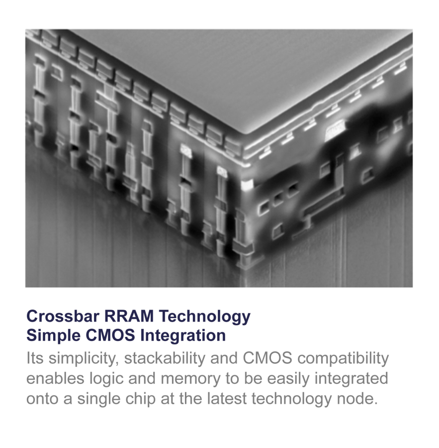
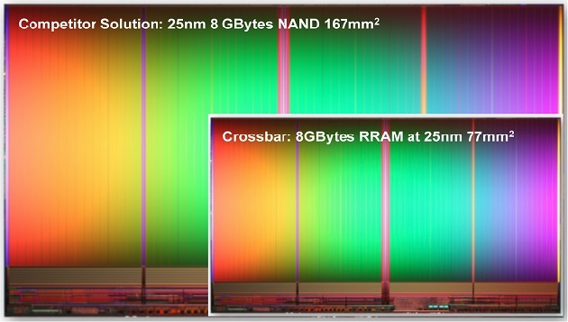

 


Can I get this at [Yodobashi.com](Yodobashi.com) ?


---

 Emerging from stealth mode, Crossbar serves up a new memory tech which it says can outperform NAND Flash by orders of magnitude on "an IC smaller than a postage stamp."

 

## Crossbar RAM Technology - Simple CMOS Integration
 Its simplicity, stackability and CMOS compatibility enables logic and memory to be easily integrated onto a single chip at the latest technology node.

 A California startup called Crossbar is working on an alternative to current NAND Flash memory chips like those used in mobile devices and other consumer electronics products which could serve up a terabyte of storage and playback capacity on "an IC smaller than a postage stamp."

 Crossbar, which came out of stealth mode on Monday, calls its "new category of very high capacity and high-performance non-volatile memory" technology "Crossbar Resistive RAM," or RRAM, though several tech sites are dubbing it "ReRAM."

 "This new generation of non-volatile memory will be capable of storing up to 1TB of data on a single 200mm2 chip, enabling massive amounts of information, such as 250 hours of HD movies, to be stored and played back from an IC smaller than a postage stamp," Crossbar said in a [statement announcing its presence](http://www.crossbar-inc.com/events/press-releases/crossbar-emerges-from-stealth-mode.html).

 The startup also said it has already built a "working Crossbar memory array at a commercial fab, a major milestone in the development of new memory technology, signaling its readiness to begin the first phase of productization."

 

 Crossbar is touting some pretty impressive performance metrics for its RRAM memory. Crossbar RRAM chips that are half the size of current best-in-class NAND Flash memory modules have 20 times the write performance, use 20 times less power, and last 10 times as long, according to the company.

 
 
    Non-volatile memory is ubiquitous today, as the storage technology at the heart of the over $1 trillion electronics market—from tablets and USB sticks to enterprise storage systems. And yet today's non-volatile memory technologies are running out of steam, hitting significant barriers as they scale to smaller manufacturing processes.

    With our working Crossbar array, we have achieved all the major technical milestones that prove our RRAM technology is easy to manufacture and ready for commercialization. It's a watershed moment for the non-volatile memory industry.
    
 

 The key benefits users will get from Crossbar's RRAM technology and the capability for "3D-stacking" of multiple chips in a System-on-a-Chip (SoC) package, per the company, are:

 * **Highest Capacity:** Up to 1TB of storage on a single chip; multiple terabytes with 3D stacking
 * **Lowest Power:** Extends Battery Life to Weeks, Months, or Years
 * **Highest Performance:** 20x faster write than NAND
 * **Easiest SoC Integration:** Simple stacking on logic in standard CMOS at most advanced nodes
 * **Most Reliable:** 10x the endurance of NAND, approaching DRAM reliability

 One thing to note is that while Crossbar makes a big deal out of capacity and write performance, the startup hasn't drawn a lot attention to read-only speeds. And as ZDNet's Robin Harris [points out](http://www.zdnet.com/flash-successor-announced-7000018981/), spooling up semiconductor fabrication plants to pump out product in volume is a costly business. He figures Crossbar's use of currently used technologies and materials "bodes well for their ability to come to market quickly at a competitive price," but he doesn't expect RRAM products to be produced in volume until 2016.

 Still, "[o]nce they get off the ground, we may be carrying phones with a terabyte of permanent storage," Harris adds.

 And not just phones. Crossbar is billing its technology as a potential player in all sorts of other consumer electronics devices, as well as having applications in enterprise storage, cloud computing, wearable tech, secure payment systems, and the "Internet of Things."