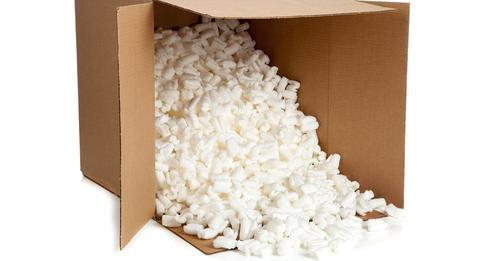


If I were an Angel, I would fund this guy's research! 👼🏻💰


Many of us have shared the guilty twinge of pouring a box of packing peanuts into a trash bag, knowing that our convenient foam waste will end up sitting in a landfill for the next few thousand years. Soon, however, we may be able to juice these little nuts for energy.

That's because chemical engineers Vilas Pol and Vinodkumar Etacheri of Purdue University have just developed a method to turn foam peanuts into components for rechargeable batteries. Like the rest of us, Pol felt guilty about tossing foam nuts whenever his lab received new equipment. He decided to do something about it, and with Etacheri's assistance, devised a way to turn peanuts into carbon microsheets and nanoparticles that can serve as anodes in lithium ion batteries. According to Pol, the new anode outperforms graphite-based anodes currently on the market, with 15 percent higher electrical storage capacity.

A video explains how Pol and his research team are turning packing peanuts into rechargeable battery components:

Made from polystyrene—the same poorly degradable material found in Styrofoam—only about 10 percent of packing peanuts made in the United States are recycled today. According to Pol, both traditional packing peanuts and newer, "environmentally friendly" alternatives can pose risks:


Outside in a landfill, potentially harmful substances in the peanuts, such as heavy metals, chlorides and phthalates, can easily leach into the environment and deteriorate soil and water quality. The starch-based alternatives also contain chemicals and detergents that can contaminate ecosystems.


Pol is optimistic that his new process could be scaled up and says that foam-based carbon microsheets and nanoparticles may be ready for commercial use within two years. He's also working on applying the method to the more-degradable starch based nuts. So hold onto those little foam nuts for now—soon, they may find a new home in all your favorite devices.

## Packing Peanut Power Supply | Video (1:47)
They’re in just about every box you get in the mail… and they almost immediately get thrown in the trash. Now one group of scientists wants to turn those packing peanuts… into power. 

Vilas Pol and his team of students at Purdue University will present research on their packing peanut power supply at a meeting of the American Chemical Society in Denver.

 

    start: 0,
    allowfullscreen: 1,
    autoplay: 0,
    hl: en,
    cc_lang_pref: en,
    cc_load_policy: 1,
    color: white,
    controls: 1,
    disablekb: 0,
    enablejsapi: 1,
    fs: 0,
    iv_load_policy: 3,
    loop: 0,
    modestbranding: 1,
    playsinline: 0,
    privacy_mode: yes,
    rel: 0,
    showinfo: 0,
    origin: blog.richiebartlett.com,
    widget_referrer: blog.richiebartlett.com

