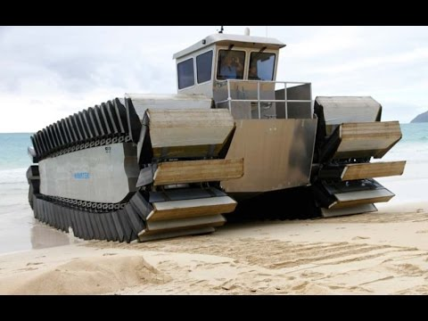


WTF?!

Is your rogue nation or terrorist organization defended by sea walls? If you answered yes to that question, you’d better start praying, because the USA has a motherfucking sea tank now…



## Marines Test Combat Paddle Boat Prototype (UHAC) | Video (04:25 minutes)
 Marines test the Ultra Heavy-Lift Amphibious Connector (UHAC) in Hawaii. The UHAC is a potential replacement for the LCAC hovercraft currently deployed with the U.S. Marine Corps. The UHAC prototype being tested is a ship-to-shore connector and is half the size of the intended final model of the machine. Filmed during RIMPAC Exercise - July 10, 2014.
  
 Film Credits:  MSgt Kyle Olson & GySgt Jeremy Vought

 
  start: 0,
  allowfullscreen: 1,
  autoplay: 0,
  hl: en,
  cc_lang_pref: en,
  cc_load_policy: 1,
  color: white,
  controls: 1,
  disablekb: 0,
  enablejsapi: 1,
  fs: 0,
  iv_load_policy: 3,
  loop: 0,
  modestbranding: 1,
  playsinline: 0,
  privacy_mode: yes,
  rel: 0,
  showinfo: 0,
  origin: blog.richiebartlett.com,
  widget_referrer: blog.richiebartlett.com

