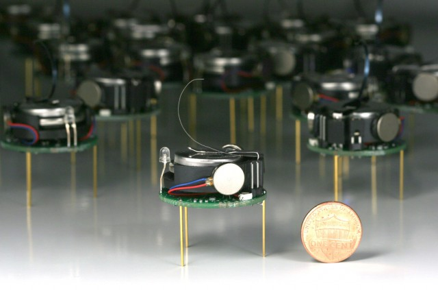


Miniaturize these bad boys and we will have the first step towards the StarGate Replicators!


*A few guide-bots and minimal communications get the job done.*

There is something magical about seeing 1,000 robots move when humans are not operating any of them. And in a new study published in *Science*, researchers have created just that. This swarm of 1,000 robots can assemble themselves into complex shapes without the need for a central brain or a human controller.

Self-assembly of this kind can be found in nature—from molecules forming regular crystals and cells forming tissues, to ants building rafts to float on water and birds flocking to avoid becoming prey. Complex forms emerge from local interactions among thousands, millions, or even trillions of limited and unreliable individual elements.

These self-organized systems have interesting features. First, they are decentralized—that is, they don't need a central brain or leader. Second, they are scalable, so you can add large numbers of individuals. Third, they are robust—individuals that are unreliable don't break the system.

Inspired by self-assembly in nature, Radhika Nagpal, Mike Rubenstein, and Alex Cornejo at Harvard University developed a self-assembling swarm of 1,024 robots. These kilobots—where a kilo stands for 1,024—can form complex 2D shapes including a star, a wrench, and the letter "k."

<!-- Michael Rubenstein, Harvard. -->
  What makes these robots exceptional is that before the kilobot, most swarms were limited to fewer than 100 robots. The first challenge was to build a large swarm that was affordable and easy to use. This required completely rethinking how robots are designed.

The constraints meant that the robot had limited capabilities. They created a coin-sized robot that could move on three stick-legs using two vibrating motors. It could communicate with neighboring robots using infrared light, signal state by changing a color LED, and sense ambient light.

No GPS-like system was available for them to know their location in the environment. Instead, robots had to form a virtual coordinate system using communication with, and measured distances to, neighbors. Manual manipulations of individual robots had to be minimal; imagine pressing the "on/off" button on 1,024 robots. The robots also needed to be easy to charge and reprogram. Charging was initiated by sandwiching all the robots between two conductive surfaces. Reprogramming was done wirelessly through an overhead controller that would send information to all robots about experiments to run.


 Video courtesy of Michael Rubenstein/Harvard/AAAS.



    start: 0,
    allowfullscreen: 1,
    autoplay: 0,
    hl: en,
    cc_lang_pref: en,
    cc_load_policy: 1,
    color: white,
    controls: 1,
    disablekb: 0,
    enablejsapi: 1,
    fs: 0,
    iv_load_policy: 3,
    loop: 0,
    modestbranding: 1,
    playsinline: 0,
    privacy_mode: yes,
    rel: 0,
    showinfo: 0,
    origin: blog.richiebartlett.com,
    widget_referrer: blog.richiebartlett.com



With the robots ready, the Nagpal team had to develop an algorithm which could guarantee that large numbers of robots, with limited capabilities and local communication, could cooperatively self-assemble into user-specified shapes. This is what they came up with.

First, all the robots are put together in a unformed blob and are given an image of the desired shape to be built. Four specially programmed seed robots are then added to the edge of the group, marking the position and orientation of the shape. These seed robots emit a message that propagates to each robot in the blob and allows them to know how "far" away from the seed they are and their relative coordinates. Robots on the edge of the blob then follow the edge until they reach the desired location in the shape that is growing in successive layers from the seed.

The algorithm had to account for unreliable robots that are pushed out of their desired location or had to block other robots performing their functions. The researchers overcame this challenge by implementing strategies that allowed robots to rely on their neighbors to cooperatively monitor for faults. They also avoided relying too heavily on exact positioning within the shape boundaries.

This is the second [*Science* paper](http://www.sciencemag.org/content/343/6172/754) this year on swarm robotics from Nagpal's lab. Their previous work looked at construction of three-dimensional structures without the need for any leader using termite-inspired robots.

After years of research in this area, it looks like we are finally reaching a tipping point where both hardware and algorithms can build large-scale robotic swarms, at least in the labs. These swarms have the potential to help us understand natural self-organized systems by providing fully engineered physical systems on which to do experiments. They also enable the first steps toward creating artificial swarms for real-world applications, including disaster relief, environmental monitoring, and art.

## Reference
* *Science*, 2014. DOI: [10.1126/science.1254295](http://dx.doi.org/10.1126/science.1254295)

First published on [The Conversation](http://theconversation.com/thousand-robot-swarm-assembles-itself-into-shapes-30548).