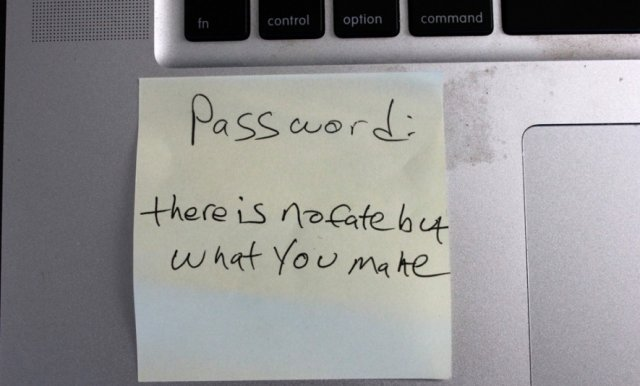



Now where did I save that stolen DB at... 😉


---
 Cracking really long passwords just got a whole lot faster and easier.

 

 For the first time, the freely available password cracker ocl-Hashcat-plus is able to tackle passcodes with as many as 55 characters. It's an improvement that comes as more and more people are relying on long passcodes and phrases to protect their website accounts and other online assets.

 Until now, [ocl-Hashcat-plus](http://hashcat.net/oclhashcat-plus/), the Hashcat version that can use dozens of graphics cards to simultaneously crack huge numbers of cryptographic hashes, has limited guesses to 15 or fewer characters. ([oclHashcat-lite](http://hashcat.net/oclhashcat-lite/) and [Hashcat](http://hashcat.net/hashcat/) have supported longer passwords, but these programs frequently take much longer to work.) Released over the weekend, ocl-Hashcat-plus version 0.15 can generally accommodate passwords with lengths of 55 characters. Depending on the hash that's being targeted and the types of cracking techniques being used, the maximum can grow as high as 64 characters or as low as 24. The long sought-after improvement targets one of the last remaining defenses people employ to make their passwords resistant to cracking.

 

     This was by far one of the most requested features," Jens Steube, the lead Hashcat developer who also goes by the handle Atom, wrote in the [release notes](https://hashcat.net/forum/thread-2543.html) for the new version. "We resisted adding this 'feature' as it would force us to remove several optimizations, resulting in a decrease in performance for most algorithms. The actual performance loss depends on several factors (GPU, attack mode, etc.), but typically averages around 15 percent.

 

 As leaked lists of real-world passwords proliferate, many people have turned to passwords and passphrases dozens of characters long in hopes of staying ahead of the latest cracking techniques. Crackers have responded by expanding the dictionaries they maintain to include phrases and word combinations found in the Bible, common literature, and in online discussions. For instance, independent password researcher Kevin Young recently decoded one particularly stubborn hash as the cryptographic representation of "thereisnofatebutwhatwemake." Such cracks are known as "offline attacks" because they target the hashes leaked as a result of a database compromise, allowing the person who recovers the hashes to try an unlimited number of guesses until the correct plaintext passwords are found. Once the underlying credentials are revealed, a hacker can use them to compromise the online account they secure.

 Yiannis Chrysanthou, a security researcher who recently completed his MSc thesis on modern password cracking, was able to crack the password "Ph'nglui mglw'nafh Cthulhu R'lyeh wgah'nagl fhtagn1." That's the fictional occult phrase from the H.P. Lovecraft short story The Call of Cthulhu. It would have been impossible to use a brute-force attack or even a combined dictionary to crack a phrase of that length. But because the phrase was contained in [this Wikipedia article](http://en.wikipedia.org/wiki/The_Call_of_Cthulhu), it wound up in a word list that allowed Chrysannthou to crack the phrase in a matter of minutes.

 Until now, hackers and security consultants who cracked such words had to use software controlling the central processing unit of their computer or that used one or more graphics cards to crack a single hash. This weekend's update means that for the first time, Hashcat users can achieve speeds as high as eight billion guesses per second on a virtually unlimited number of compromised hashes. Breaking the 15-character limit is just one of several improvements designed to bring increased speed and precision to the password cracking program.

 ***Microsoft Active Directory, anyone?***

 Another enhancement is the support of a new technique that allows crackers to radically reduce the number of password guesses by customizing their attacks to the password policy of company or organization they're targeting. Short for Password Analysis and Cracking Kit, the [PACK toolkit](https://github.com/iphelix/PACK) was developed by researcher Peter Kacherginsky and can save huge amounts of time, particularly when targeting corporate networks.

 
 

     If we're a pentester, and we're to audit an AD [short for Microsoft Active Directory] domain, we typically face a password policy," Steube wrote. "Password policies aren't always very clever; most of the time, they force users to select passwords with predictable patterns... Using a specific set of masks we can avoid candidate passwords that do not match the policy, thus reducing the keyspace efficiently.
     
 

 ocl-Hashcat-plus targets a much wider number of popular cryptographic products and applications, including TrueCrypt 5.0 and beyond, 1Password, Lastpass, the SHA256 algorithm in the Unix operating system, and hashing operations found in the latest version of Apple's OS X operating system. The program also supports a much wider array of video cards from both Nvidia and AMD.

 In all, Hashcat developers spent more than six months modifying 618,473 lines of source code, accounting for more than half of the Hashcat code base. Going up against a typical TrueCrypt configuration, a PC running ocl-Hashcat-plus and two AMD HD 6990 video cards can cycle through 223,000 password candidates each second, fast enough to exhaust all 14.3 million words contained in the seminal RockYou dump of passwords in 65 seconds. In many cases the slowdowns created by the support of long passwords has been offset by enhancements made to other parts of the program. One such improvement arranges passwords continued in user-supplied lists by the number of characters. Under many conditions, this can significantly reduce the time needed for GPUs to process the data.

 The new version of Hashcat came two days after developers for Russia-based ElcomSoft updated the company's [Phone Password Breaker software](http://www.elcomsoft.com/eppb.html). The fee-based forensic tool now supports the selective recovery of certain types of data stored in Apple's iCloud service. The new version allows users to retrieve contacts, call logs, pictures, or other specific types of backed up data without having possession of the original iPhone, as long as the attacker has the user's Apple ID and password.

